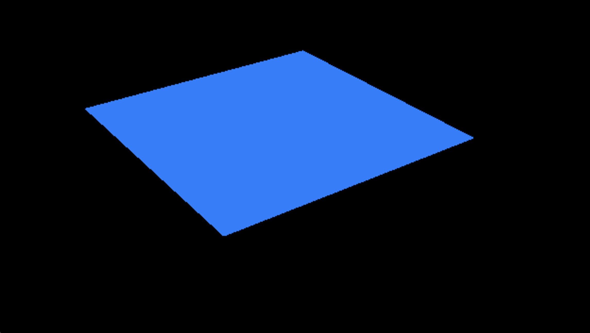
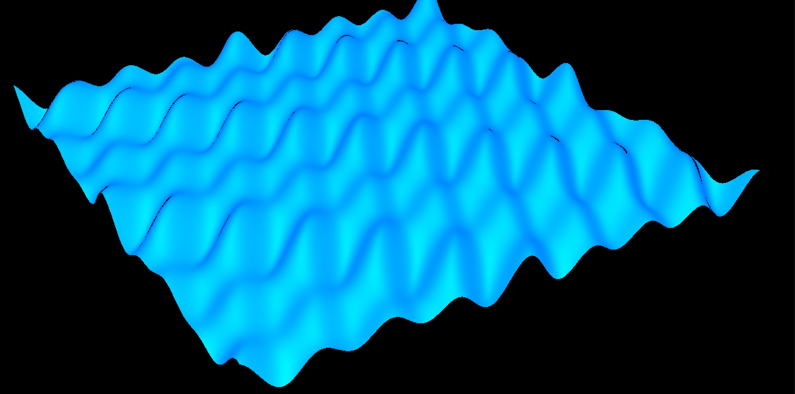
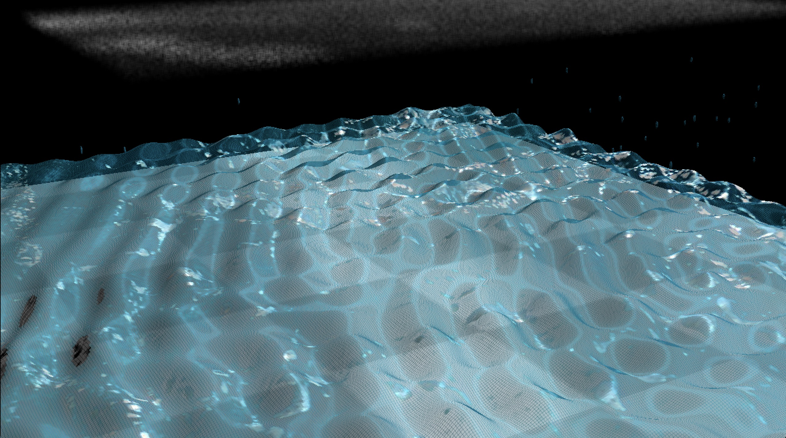
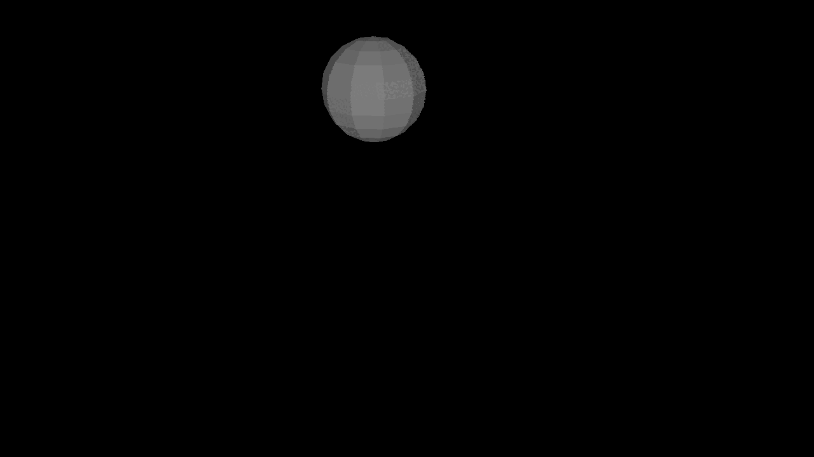
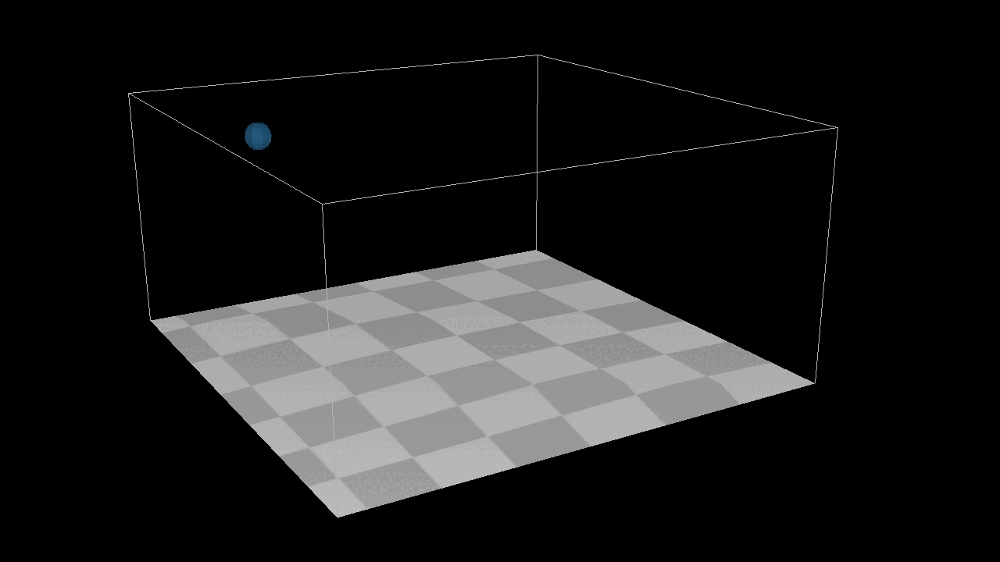
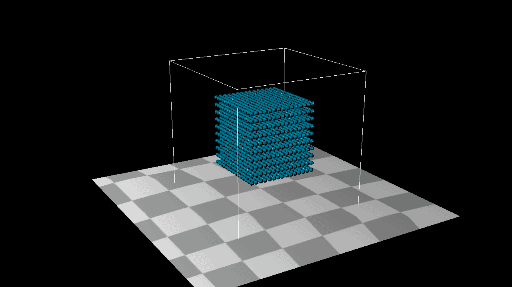

# Overview


Here is a rendering engine that I have completely hand-written in C. Everything is implemented manually by me, from matrix addition and subtraction, memory allocation, rasterization, z-buffer, alpha test, shadow methods, Phong shading, particle systems, importing materials, importing OBJ files, Water Simulation, etc.. 

## Water Surface Simulation


* Phong Shading.
* Multiple cosine waves are used to simulate the water surface.
* A grayscale texture is calculated for alpha testing.
* dynamic particles are simulated to represent water droplets.

## Phyical Based Water Simulation


Based on this paper to simulate water : [Position Based Fluids](https://mmacklin.com/pbf_sig_preprint.pdf).


# 1. Image


## Do something interesting to the image

```bash
../bin/lab1 geraniums.ppm lab1.ppm
```
First, I changed the order of green and red to try to output only the leaves, but there was some noise. To fix this issue, two ideas came to mind:
1. Blur the original image first, then perform the color separation.
2. Use a method similar to shadow mapping’s Percentage-Closer Filtering (PCF), which reduces noise by
sampling a circle of surrounding kernels to compute weights when each point is sampled.
I can do this change in the last section, so leave this method right here.

<div style="display: flex; justify-content: center; align-items: center;">
  
</div>

## Implement green/blue screen compositing
Try to mask the blue and green channel, and try to combine it with the origin background, here is what I got.

```bash
../bin/mask powerpuff.ppm mask.ppm
```

<div style="display: flex; justify-content: center; align-items: center;">
  
  
</div>

Trying to use offset dx and dy now. 


<div style="display: flex; justify-content: center; align-items: center;">
   
</div>

But there are still two problems:
* The front image is so big, trying to add a scale funtion before combine.
* The eyes are missing, because the current blue and green channel blocks much more than except.


### add scale
A new scale function has been added, which now scale the size of the image, the command is below.

```bash
../bin/combine powerpuff.ppm geraniums.ppm mask.ppm 20 -20 0.5 output.ppm
```


<div style="display: flex; justify-content: center; align-items: center;">
   
</div>


### updated mask algorithm

After studying the image carefully, the eyes are composed of black and white, so I changed the algorithm so that if the color of the rgb is black, or pure white, it always counts as white and doesn't count as part of the background. Now the result seems better.

```bash
../bin/mask powerpuff.ppm mask.ppm
```
<div style="display: flex; justify-content: center; align-items: center;">
  
  
</div>


### add blur background
It feels like if you can blur the background, the result should be cool. My algorithm just adds a kernel just like the pcf in shadowmap and samples around the circle to average the blur. And below is my final result

<div style="display: flex; justify-content: center; align-items: center;">
  
</div>

## Concolusion
After this assignment we've got the basic pixel, colour data structures, written all the relevant functions, the memory allocation for c has really bothered me for a long time, I'm relying too much on smart pointers, this class will give me a deeper understanding of stack and heap allocating memory and freeing it.


# 2. Fractals

This assignment explores the implementation of various fractal and noise generation algorithms using C and C++. The primary focus is on generating images of Mandelbrot and Julia sets, as well as creating cloud patterns using Perlin noise. The document details the challenges faced in integrating C and C++ code, particularly for functions specific to image processing requirements. Additionally, it includes animated visualizations of Julia sets and Perlin noise-based clouds, demonstrating the dynamic behavior of these mathematical constructs. The assignment emphasizes the importance of understanding underlying principles and efficient implementation techniques in computer graphics.

## Image Structure

This part the code I writed is totally in C, because some of the functions in the assignment requirements cannot be implemented in C++, they do not meet the requirements. Image.h can be called with c, or with C++'s extern as below:
```C++
extern "C" {
#include "Image.h"
}
```

The result as below:

<div style="display: flex; justify-content: center; align-items: center;">
  
  
  
</div>

I used to set the max\_value as float [0,1] I found the reason why this doesnot work and cause a crash. At last I found that PPM (P6) set max\_value as int [0,255] not as I except.


## Mandelbrot and Julia Sets
based on the requirement below: 
```txt
A picture of the complete Mandelbrot set in an appropriate rectangle.
A picture of a Julia set defined by c = 0.7454054 + i*0.1130063 in an appropriate rectangle.
```
The assignment didn't involve considering colors, so the result as below.

<div style="display: flex; justify-content: center; align-items: center;">
  
  
  
</div>


Here are something I wanna mentioned:  
1. I change the `mandeltest.c`to `mandeltest.cpp`, because the implantation of `fractals.cpp/h` I use c++.
2. Normal equation of this two method to update z is $z^2 + c$ , but the lab instruction is $z^2 - c$. I choose to use the lab instruction.
3. To conform to the coordinate system required for the assignment, I inverted my y-axis.


### add something I am interested in : ImageMagick
I wanna to see the movement of julia function like output a video, there are two method comes to my mind : 1. build a graphic pipeline or output lots of ppm and combine them as a JIF. I am too lasy to select the second method. Click the figure below can jump to the website I store the GIF.

<div style="display: flex; justify-content: center; align-items: center;">
  
</div>


## Fractal Noise: Perlin

### single-level Perlin
Generates a cloud pattern using a single-level Perlin noise algorithm and applies it to an image. In my main.cpp it is generateCloudsPerlin.

<div style="display: flex; justify-content: center; align-items: center;">
  
</div>

### multi-level Perlin
Generates a cloud pattern using a multi-level Perlin noise algorithm and applies it to an image. In my `main.cpp` it is `generateCloudsPerlin2`.

<div style="display: flex; justify-content: center; align-items: center;">
  
</div>


## animation of sky and cloud

Generates a cloud pattern using a multi-level Perlin noise algorithm with time-based animation and distinguishes between cloud and sky regions. In my main.cpp it is `generateCloudsPerlin4`.

<div style="display: flex; justify-content: center; align-items: center;">
  
</div>


# 3. Graphic Primitives

## basic point, line, ellipse and circle

Here are the RESULTS of all the test case, ellipse and circles I used the given template.

<div style="display: flex; justify-content: center; align-items: center;">
  
  
  
</div>


<div style="display: flex; justify-content: center; align-items: center;">
  
  
</div>


## anti-alias: SSAA
I try to implement a anti-alias method: SSAA. Here is the meaning of all the graph.
1. Because our data of ppm is integer 2D array in Image.h. So I try to implement SSAA at integer base, which mean use a filter get random points around the target point, calculate the result. The result is not what I want, so I change the method to float base.
2. Float base SSAA means random up and down 1 to sample. If the random result is $x = x + 0.1 $ 0.1 is the random SSAA, which means $dx = x + 1$. the result as below use 2X SSAA.
3. This image is interesting, I randomized the rgb separately, so it produced the effect below, then I set the random seed of the rgb to one and it didn't produce this error.


<div style="display: flex; justify-content: center; align-items: center;">
  
  
  
</div>


4. The rest 3 image is different level of SSAA sample rate.

<div style="display: flex; justify-content: center; align-items: center;">
  
  
  
</div>


## draw a sphere

### vertex of sphere

build the vertex of sphere by formula.


<div style="display: flex; justify-content: center; align-items: center;">
  
</div>


### triangle of sphere

I added a triangle on top of the original line, point, circles... connect each three point to a triangle and result got below. I rebuilt a new tuple, the triangle, as the most basic tuple for linking the three points so that I could render the entire circle.

<div style="display: flex; justify-content: center; align-items: center;">
  
</div>

### fill the triangle

<div style="display: flex; justify-content: center; align-items: center;">
  
</div>

with the fill method, I can prevent there is a light on the top of the ball, simply by add a rgb change method in for loop of filling the triangles. After completing the whole project and looking back at it as I was finishing up my final project, I realised that this was a simple implementation of shadow depth.


<div style="display: flex; justify-content: center; align-items: center;">
  
</div>


# 4. Scanline Fill


## Basic point, line, ellipse and circle

Here are the RESULTS of all the test case. From this week, I am a little bit busy, I need to work 12 hours a day, The amount of my report will be less, but the work I done is not (I wish).

<div style="display: flex; justify-content: center; align-items: center;">
  
  
  
</div>

## Make primitives move
I attempted to integrate the primitives, including the ellipses, circles, and lines that the professor taught us this time, along with the triangles I previously created and the mesh formula composed of triangles. I combined them all to be called together. Then, I used the same method as before to generate a GIF of my results.

### The explosion
<div style="display: flex; justify-content: center; align-items: center;">
  
</div>

### Sphere mesh
<div style="display: flex; justify-content: center; align-items: center;">
  
</div>

## Real time renderer
This week, I completed the basic structure for graphics and transformed the primitives into dynamic ones that I like. I also attempted to integrate the entire structure into Qt, allowing me to see the changes in real-time. I am very interested in real-time rendering, and this can be considered the first step. It's really fascinating to implement a real-time renderer by myself, I'm excited and starting to try it.

### The basic interface of my UI
The current overall structure is too basic and not very modern. However, I will make this structure more modern in the upcoming assignments.
<div style="display: flex; justify-content: center; align-items: center;">
  
</div>


### Apply anti-anlysis in UI
The current anti-aliasing method is too basic. In the upcoming assignments, I will add additional parameter controls, allowing for toggling on and off, selecting anti-aliasing multipliers, and choosing different methods.

<div style="display: flex; justify-content: center; align-items: center;">
  
</div>

# 5. Transformations and Viewing

## Basic task 
1. The first part of the assignment is to build a matrix library as outlined in the system specification.
2. The second part of the assignment is to create a 2D view matrix function and demonstrate that it works using the test function.
3. The third task is to create a 3D view matrix function and demonstrate it works using the test function.

Note that my third example already incorrect! But I did not notice it at that time! It should be look down to the square not up.

<div style="display: flex; justify-content: center; align-items: center;">
  
  
  
</div>


## The formula of View 2D and 3D
When I review the result I found that at that time my program is already incorrect, my MVP matrix is wrong. This part of the assignment confused me for a long time, and I am summarising all the steps of 2D and 3D MVP matrix transformation in case I kmaek the same mistake in the furthure.

### 2D View Transformation Process

1. **Initialization**:
   - Start by identifying the view rectangle's height in world coordinates based on the screen dimensions and aspect ratio:
     $$
     dy = \frac{view.dx \cdot view.screeny}{view.screenx}
     $$

2. **Translation**:
   - Translate the View Reference Point (VRP) to the origin by applying a translation matrix that moves the VRP to $(0, 0)$:
     $$
     T(-V0_x, -V0_y)
     $$

3. **Rotation**:
   - Rotate the coordinate system such that the x-axis aligns with the given view direction vector \(x\). This is achieved by constructing a rotation matrix that aligns \(x\) and negates \(y\):
     $$
     R(nx, -ny)
     $$

4. **Scaling**:
   - Scale the coordinate system to map the view rectangle dimensions to screen coordinates. This involves scaling the x-dimension by $\frac{screenx}{dx}$ and the y-dimension by $\frac{-screeny}{dy}$ (to account for screen coordinate inversion):
     $$
     S\left(\frac{C}{du}, \frac{-R}{dv}\right)
     $$

5. **Translation to Screen Center**:
   - Finally, translate the coordinate system to center the view on the screen. This is done by translating by half the screen width and height:
     $$
     T\left(\frac{C}{2}, \frac{R}{2}\right)
     $$

6. **Combining Transformations**:
   - Combine all the above transformations in the correct order: scale, rotate, and then translate, to form the final View Transformation Matrix (VTM).

### 3D View Transformation Process

1. **Initialization**:
   - Start by setting the View Transformation Matrix (VTM) to the identity matrix.

2. **Translation of VRP**:
   - Translate the View Reference Point (VRP) to the origin. This is done by applying a translation matrix that moves the VRP to $(0, 0, 0)$:
     $$
     T(-VRP_x, -VRP_y, -VRP_z)
     $$

3. **Constructing the Rotation Matrix**:
   - Calculate the orthonormal basis vectors \(u\), \(v\), and \(w\) from the View Plane Normal (VPN) and the View Up Vector (VUP). Normalize \(w\) (aligned with VPN), then compute \(u\) as the cross product of VUP and \(w\), and finally compute \(v\) as the cross product of \(w\) and \(u\):
     $$
     w = \frac{VPN}{||VPN||}
     $$
     $$
     u = \frac{VUP \times w}{||VUP \times w||}
     $$
     $$
     v = w \times u
     $$

4. **Applying the Rotation**:
   - Form a rotation matrix using the basis vectors \(u\), \(v\), and \(w\), and apply it to align the coordinate system with the view direction.

5. **Translation to COP**:
   - Translate the Center of Projection (COP) to the origin by applying a translation matrix along the z-axis by the distance \(d\) (viewing distance):
     $$
     T(0, 0, d)
     $$

6. **Scaling to NDC (CVV)**:
   - Scale the coordinate system to map the view volume to the Canonical View Volume (CVV), which in normalized device coordinates (NDC) is the unit cube. This involves scaling by the dimensions \(du\), \(dv\), and the depth (distance from VRP to the back clipping plane):
     $$
     S\left(\frac{2d}{du \cdot depth}, \frac{2d}{dv \cdot depth}, \frac{1}{depth}\right)
     $$

7. **Perspective Projection**:
   - Apply perspective projection to the coordinate system to account for perspective foreshortening. This is done by scaling the z-coordinate appropriately:
     $$
     P\left(\frac{d}{depth}\right)
     $$

8. **Scaling to Screen Coordinates**:
   - Scale the coordinate system to map the NDC to screen coordinates. This involves scaling by half the screen width and height, and flipping the y-axis to match screen coordinates:
     $$
     S\left(\frac{-screenx}{2 \cdot (d / depth)}, \frac{-screeny}{2 \cdot (d / depth)}, 1\right)
     $$

9. **Final Translation to Image Coordinates**:
   - Translate the coordinate system to position it correctly on the screen. This involves translating by half the screen width and height:
     $$
     T\left(\frac{screenx}{2}, \frac{screeny}{2}\right)
     $$

10. **Combining Transformations**:
    - Combine all the above transformations in the correct order: translate, rotate, translate to COP, scale to NDC, apply perspective, scale to screen coordinates, and finally translate to image coordinates, to form the final View Transformation Matrix (VTM).


This is extremely important to me.


### First test example animation
<div style="display: flex; justify-content: center; align-items: center;">
  
</div>

### Second test example animation
<div style="display: flex; justify-content: center; align-items: center;">
  
</div>


# 6. Hierarchical Modeling

## basic assignment 
My result of this assignment below.
<div style="display: flex; justify-content: center; align-items: center;">
  
   
</div>


## Polygon Transformation and Rendering Process

### Overview
The process of transforming and rendering polygons is the bug I solved for most of the time. The key problem is in the order of components involved are the Local Transformation Matrix (LTM), Global Transformation Matrix (GTM), and View Transformation Matrix (VTM).

### Transformation Matrices
1. **LTM (Local Transformation Matrix)**:
   - Initially set to identity.
   - Used to transform the polygon from its local coordinate space to a global coordinate space.

2. **GTM (Global Transformation Matrix)**:
   - Combines the LTM with the current GTM to obtain a temporary GTM (`tempGTM`).
   - This combined transformation is used to place the object correctly in the scene.

3. **VTM (View Transformation Matrix)**:
   - Applied to transform the polygon from the global coordinate space to the view coordinate space.
   - Ensures the polygon is correctly oriented relative to the camera/viewer.

### Process Steps
1. **Initialization**:
   - The LTM and GTM are initialized to identity matrices.

2. **Transformation**:
   - For each polygon object:
     - A temporary GTM (`tempGTM`) is calculated by multiplying the current GTM with the LTM.
     - The polygon is transformed using `tempGTM` to position it correctly in the scene.

3. **Shading**:
   - Depending on the shading model (e.g., Gouraud shading), colors are calculated for each vertex.
   - This involves lighting calculations to determine the vertex colors.

4. **View Transformation**:
   - The VTM is applied to the polygon to transform it into the view space.
   - The polygon is then normalized to ensure it fits within the viewable area.

5. **Rendering**:
   - The polygon is rendered based on the shading model which will used in the later project, but now everything is ShadeConst.

6. **Cleanup**:
   - The temporary polygon data is cleared after rendering to prepare for the next object.


## try to make the image move
<div style="display: flex; justify-content: center; align-items: center;">
  
</div>


# 7. Bezier Curves and Surfaces 

When I first started implementing Bezier curves and surfaces, I treated them as separate modules, at the same level as lines and polygons. Later, with Bruce's correction, I realized that Bezier curves are just tools for generating modules or lines. After generating lines or polygons, they still need to be passed to polygons or polylines as basic primitives for rendering, rather than being independent.

In my subsequent code, I found that this approach has the advantage of being easier to maintain. Writing them separately would require duplicating all the polygon methods, which would be cumbersome.

<div style="display: flex; justify-content: center; align-items: center;">
  
  
  
</div>


## Updated the Interface
I have updated my UI to display the antialiasing multiplier and the toggle option, as shown in the image. Additionally, I have integrated module drawing into the real-time transformation Qt UI.

<div style="display: flex; justify-content: center; align-items: center;">
  
</div>
<div style="display: flex; justify-content: center; align-items: center;">

  
</div>

# 8. Z-buffer Rendering
## Basic task
This week you need to implement any z-buffer related functions you've skipped so far. They are interspersed throughout the the graphics system document Download graphics system document, so scan through it to see the various places that need to change.  Otherwise, it has not changed from the last project.

Here are the basic two testfile output.

<div style="display: flex; justify-content: center; align-items: center;">
  
  
</div>


## z-buffer simluate blending

After implemented z-buffer, I had a bold idea, the usual method of blending that people use is to add the alpha channel, could I just run the blending directly on the zbuffer without adding the alpha channel? Here's what I'm going to do. Change the current algorithm: if 1/zbuffer is larger than the zbuffer stored in the image, replace it directly, but instead put the two colours together and press them to a certain weight.

1. For each pixel, if the depth of the new color is less than the current depth in the z-buffer, calculate the blended color using the depth values as weights.
2. Update the z-buffer and color buffer with the blended color and new depth.

<div style="display: flex; justify-content: center; align-items: center;">
  
</div>

The result is a little bit wired, try to find the issue after implement the alpha channel.

## Insert it in my UI
Do the same to the project before 


# 9. Lighting and Shading

Basic light algorithm implementations such as gourand shading, depth shading, etc. were implemented this week. Also accessed the extra api to enable calling ply files, which is really interesting, I'm going to put some notorious graphics content in there now, oh yeah, and fixed a major bug, with Bruce's instructions I realised that my fillscan actually didn't detect if y was out of bounds! No wonder I've been having the inexplicable falling out of memory failure bug before.

## basic result

<div style="display: flex; justify-content: center; align-items: center;">
  
  
  
</div>

## Water Simulation

### introduction
After assignment Lighting and Shading, we already have light, so it is time for me to start building the surface of the sea. I really like things in nature like ocean, moon light, montains and I wanted to realise it in this assignment.

### Mesh the water surface

I made a 50 x 50 size mesh in xz plane, and each set have four points, combine as a polygon, all the normal of polygon initialize as 0,1,0, which is up.



### Simulation the water by Sinusoids Wave
The idea of modelling the undulation of water surfaces using a combination of sequences of sine wave curves of high and low amplitude was first introduced by Max [Max 1981] in 1981. By modelling the surface of a body of water using heights, the general formula for the height y = h(x, z, t) computed at each point (x, z) at time t by the Sinusoids Wave (SW) based method is:
Sinusoids Wave is now rarely used directly in the field of water rendering, and the industry tends to favour the use of its evolution, Gerstner Wave.[1] [2]


$$h(x, z, t) = -y_0 + \sum_{i=1}^{N_w} A_i \cos(k_{ix} x + k_{iz} z - \omega_i t)$$  

* $h(x,z,t)$ : the height `y` of the wave when time `t` and position $(x,z)$.  
* $Nw$: total number of waves which is used to make the system more complex. 
* $Ai$: each wave's amplitude.
* $y_0$: the starting `y` position of each result, I set it as 0.

The formula above is calculate by 1D Sinusoids Wave below, which is easy to understand:
$$y = Asin(k_{ix}x+w_it)$$

Use $sin$ and $cos$ will get same simluation result, the only difference is the position of starting wave. 


<div style="display: flex; justify-content: center; align-items: center;">
  
</div>

Depth Shading and Ground Shading in `real time` below.


The result is not continuous, but it is as expected, because each face is populated by that face's own `normal`, so the two faces don't have the same `normal` so there will be this difference.  
I have two idea to avoid this:  
1. Normal Mapping: I'm going to output the `normal` mapping, by representing the normals of all the points in rgb and thus outputting them.
2. Offline Renderer: I am going to build a offline renderer, and 100 times the amount of the triangles.


Normally normal mapping requires storage and texture, but we don't have texture yet, I'm going to implement this step after texture. So I build a offline renderer and render the image for 1 second and here is the result.


I built a realtime macro, which will change all the function and interface to realtime or offline, make me much more eaiser to control the code. For example, the code below is changing drawing speed of the code.
```C++
    if(realtime) // realtime rendering
        timer->start(10); // 10 ms per draw
    else // offline rendering
        timer->start(1000); // 1000 ms per draw
```


Its really fun, I try to change the formula not directly implement the height by x and y, but input the $\sqrt{x^2+z^2}$ replace x or z.


Then try to put the center point to the center of the water surface, simply calculate the distance by $\sqrt{(x-\frac{width}{4})^2+(z-\frac{height}{4})^2}$, width and height are the number of polygon's vertex in my algorithm.


# 10. Texture

The implementation of textures should be the easiest, as it is done exactly like the colors, using linear interpolation. The only difference is that for textures, I use a 2D texture map, and instead of interpolating colors, I interpolate texture coordinates. I wrote a new function to read the texture, and the test results are as follows.

<div style="display: flex; justify-content: center; align-items: center;">
  
  
</div>


Combining three different kinds of waveforms to make the picture random enough, and also combine the texture we calculate just now. Here is the result of.


# 11. SkyBox

Implementing a skybox, based on our system I have the following ideas. I spend 3 days on this , make me really depressed, it should not that hard, because there are lots of problem of bounding in fillscan of my code before.
1. The skybox doesn't need to introduce a zbuffer, he gets rendered first and all subsequent renders override the skybox just fine. 
2. The skybox should have the same coord as same as camera, should tranlslate to the center point of camera, but should not rotate with it.
3. The skybox in some point is a cube polygon, I can simply use the module_cube algorithm before, but make the normal point to the center of the box.

The image below is the skybox I init, and put it in the center of the camera. 

<div style="display: flex; justify-content: center; align-items: center;">
  
  
</div>

At the beginning, I didn't want to use linear interpolation to compute the skybox because I thought this method would be very time-consuming. In my opinion, the correct approach should be to get the transformation matrix for each surface of the skybox, then apply this matrix to the transformation after reading the image, and map it to each face. This would greatly reduce the computational load since it wouldn't require operations like fillScan. However, I eventually gave up because it was too complicated. I needed to record all boundary conditions and calculate the matrix for each surface. So, I ended up using the simplest method: directly applying the texture to each surface.


# 12.  Phong Shading

Below is the water surface I simulated with phong shading, you can see that there are obvious highlights and diffuse area, but one thing is strange, I tried to give the ks as big as possible as the water surface should be, but the result is very strange, diffuse and specular features are very strong in my code, and I ended up generating a light ambient light = diffuse=specular, R = 100 and got relatively good results.


# 13. Alpha Channel


Then I combine all the staff I have right now together, here is the result 


<!--  -->
I wanna add rain right now !
<!--  -->


# 14. Particle

s

I initially wanted to create fog over the water surface, but I realized that without using volumetric rendering or having shadow volumes, the result was quite poor. I tried using Perlin noise to achieve this, but the outcome was very disappointing. So, I changed my approach and decided to generate clouds instead. The fake result I obtained is as follows.


The result is pretty bad,, I decide not to use it...




Here is my final result


# 15. PBD


There's a very famous paper to simulate water : [Position Based Fluids](https://mmacklin.com/pbf_sig_preprint.pdf). I really want to imply this paper, but after thoroughly understanding what I need to do, I think I'll need half a month to a month, but I've only got several days, so I'm going to implement an basic algorithm of this paper: PBD.

## Force
Build a Particle and give a Gravity to it, the particle only have several faces as you see, this is because I wanna to make my program as fast as possible.



One of the most basic things about PBD is that it `relies on position` to calculate acceleration and velocity, rather than the traditional reliance on acceleration and velocity to find position. So here is the structure of my particle.

```C
    // Particle structure for water simulation
    struct Particle{
        Point position;  // Position of the particle
        Point pred_position; // Next dt position
        Vector v; // Velocity of the particle
        Vector acceleration; // Acceleration of the particle
        Vector vorticity;
        Vector externalForce;
        Vector oneTimeForce; // only use one time and dead
        int oneTimeForceAlive;
        float mass;     // Mass of the particle
        Bin neighbours;
        float lambda ;
        int id ;
        const int size ;
    };
```

I add a new function `Apply One Time Force` and `A Bounding box System` to achieve the image below, here is the thing, I can not simply add a init velocity to the system, because it is `position based system`, I can only add one time force in the system.




After adding 1000 the particles to the system, we found that they can not detect each other, which menas there is no collison in the sytstem. But here is the point, how to detected the particles around each particles ? We need a new structure : Grid[][][], we put all the particles in the gird, if we wanna to find the neighbour particles around the target particles, just get all the particles from grids which around the target particles. After that, we need a new method `distance constraint` to find how to deal with the collsion by a eaiser way.


## Distance Constraint

The most simple constraint which is `distance constraint`, my understanding is that we need to make sure that each point is as far as possible to where we expect it to be, and if that doesn't work then fine-tune until the whole system is close to stable.

$$\nabla C_{ij} = \frac{p_i - p_j}{\| p_i - p_j \|}t$$
$$\lambda_i = \frac{-C_{ij}}{\sum_k (\nabla C_{ik})^2}$$
$$\Delta p_i = \lambda_i \nabla C_{ij}$$
$$p_i' = p_i + \Delta p_i$$
$$p_j' = p_j - \Delta p_i$$


The result is as expected, but for the bottom example there is a problem, the two points merge together when compressed to the extreme, the reason for this problem is because the bounding box detection I did not set as a constraint, because the constraint is to fine-tune the points, but in any case it should not go beyond the bouding box, here you can conditionally check the constraints, but it is too complex I'll leave it here for now.


However, the results were unsatisfactory. After investigating, I identified three key issues:

1. **Precision Issues**: The precision of my calculations was insufficient. With a particle radius of 0.03, using floats resulted in significant errors when particles experienced even slight offsets. To address this, I switched to using double precision.

2. **Constraint Accumulation Method**: My initial approach to constraint distance accumulation was flawed. According to [Müller et al. 2006], the system should be solved using an iterative method similar to Gauss-Seidel for linear equations. In this method, once a constraint is calculated, the particle positions are immediately corrected, and these updated positions are then used in subsequent constraint mappings. While this approach led to faster convergence, the results were still unsatisfactory due to insufficient accuracy. My initial crude method exacerbated these issues, so I introduced a new variable, `buffer_position`, to store the corrected positions before applying them.

3. **Time Step (dt) Problems**: The choice of time step (`dt`) was problematic. Since the system runs on a single thread, I had increased `dt` for convenience, which led to an excessively large search range. This caused too many particles to be affected simultaneously, increasing the likelihood of overlapping positions and, consequently, inaccurate results.


I addressed the issues mentioned above by removing all forces and increasing the distance between points, effectively simulating a situation similar to water droplets in space. Now, the results align with expectations: the distance between each point remains constant, and the overall system maintains precision, meeting our intended outcomes.


And it's really cool! When we reverse the constraint force—meaning that when points detect an incorrect distance, they move closer together—we observe the formation of distinct small clusters, as shown in the image below. Upon closer inspection, you'll notice that each search area forms its own cluster. Each grid in the 3D space seems to gather into a center of mass, almost like gravitational attraction.And it's really cool! When we reverse the constraint force—meaning that when points detect an incorrect distance, they move closer together—we observe the formation of distinct small clusters, as shown in the image below. Upon closer inspection, you'll notice that each search area forms its own cluster. Each grid in the 3D space seems to gather into a center of mass, almost like gravitational attraction.


I generated a series of images, with the one I'm most satisfied with at the end. There's still room for optimization, but the main reason the results aren't perfect is due to the limitations of single-threading. I couldn't significantly reduce the time step `dt` and `constraint strength` to achieve a flawless outcome. However, the image below represents the best result I could achieve with my current single-threading setup.


<div style="display: flex; justify-content: center; align-items: center;">
  
  
  
</div>

<div style="display: flex; justify-content: center; align-items: center;">
  
  
  
</div>


The result above is still bad , but which is the best result I got. 


# PBF 

## Incompressibility


The $\textbf{Poly6 kernel}$ is defined as:

$$W_{\text{poly6}}(r, h) = \frac{315}{64\pi h^9} \cdot (h^2 - r^2)^3$$

where:
- \( r \) is the distance between two particles.
- \( h \) is the smoothing length or influence radius.

For $( 0 \leq r \leq h ):
W_{\text{poly6}}(r, h) = \frac{315}{64\pi h^9} \cdot (h^2 - r^2)^3$

For $( r > h ):W_{\text{poly6}}(r, h) = 0$
  
The $\textbf{Spiky kernel}$ is defined as:  


$$W_{\text{spiky}}(r, h) = \frac{15}{\pi h^6} \cdot (h - r)^3$$

where:
- \( r \) is the distance between two particles.
- \( h \) is the searching range in our system which is the neighbour range.

For $ ( 0 \leq r \leq h ):
W_{\text{spiky}}(r, h) = \frac{15}{\pi h^6} \cdot (h - r)^3
$

For $( r > h): W_{\text{spiky}}(r, h) = 0$


Using the two kernels to calculate the expected density and gravidence of density. Here is the lamada of each particles. Then another for loop to calculate the buffer distances.

$$\lambda_i = -\frac{C_i(p_1, \dots, p_n)}{\sum_k |\nabla_{p_k} C_i|^2 + \epsilon}$$


$$\Delta p_{i} = \frac{1}{\text{restDistance}} \sum_j (\lambda_i + \lambda_j) \nabla W(p_i - p_j, h)$$

Where $\nabla W$ is the $\textbf{Spiky Kernel}$. 


Better results were obtained based on density rather than distance. Even if our particles were denser they wouldn't overlap each other.





## Tensile Instability

When a particle has too few neighbors, it may result in negative pressure and cause particles to clump together. One solution, which adds the effect of surface tension, is to introduce an artificial pressure to the smoothing kernel in order to repulse particles. This corrective term, described by Monaghan:

$$
\text{corr} = -k \left(\frac{W(p_i - p_j, h)}{W(\Delta q, h)}\right)^n
$$


The final position update for particle $i$ is then:

$$
\Delta p_i = \frac{1}{\rho_0} \sum_j \left(\lambda_i + \lambda_j + \text{corr}\right) \nabla W(p_i - p_j, h)
$$

$\Delta q = 0.0


# Reference 
[1] https://github.com/QianMo/Game-Programmer-Study-Notes/blob/master/Content/%E7%9C%9F%E5%AE%9E%E6%84%9F%E6%B0%B4%E4%BD%93%E6%B8%B2%E6%9F%93%E6%8A%80%E6%9C%AF%E6%80%BB%E7%BB%93/README.md    
[2] https://northeastern.instructure.com/courses/180758  
[3] https://wikischool.org/divided_light    
[4] https://blog.csdn.net/knight_lyh/article/details/56282584  
[5] https://mmacklin.com/pbf_sig_preprint.pdf   
[6] https://blog.csdn.net/qq_36383623/article/details/104872438    
[7] https://www.cs.cmu.edu/~scoros/cs15467-s16/lectures/11-fluids2.pdf  
[8] http://jamesjia.com/cs184-fluidsim#spiky  