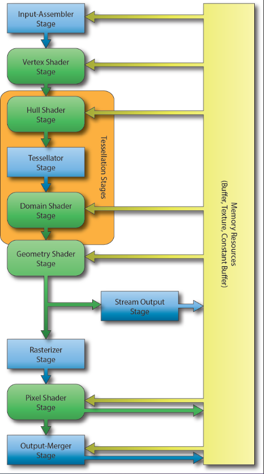
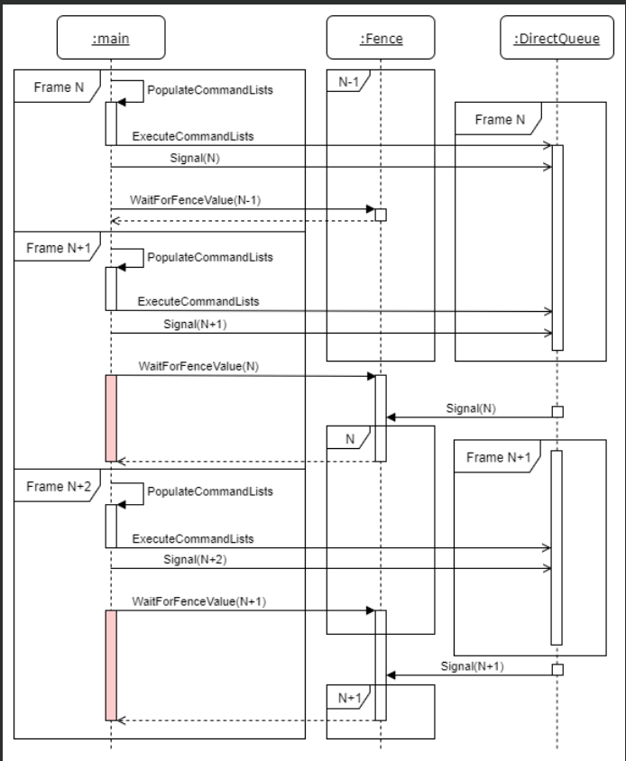
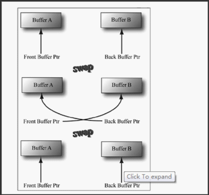
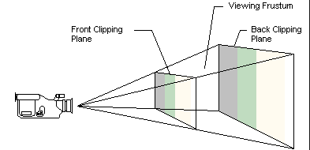
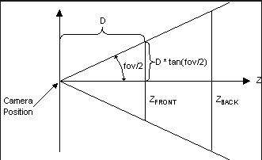
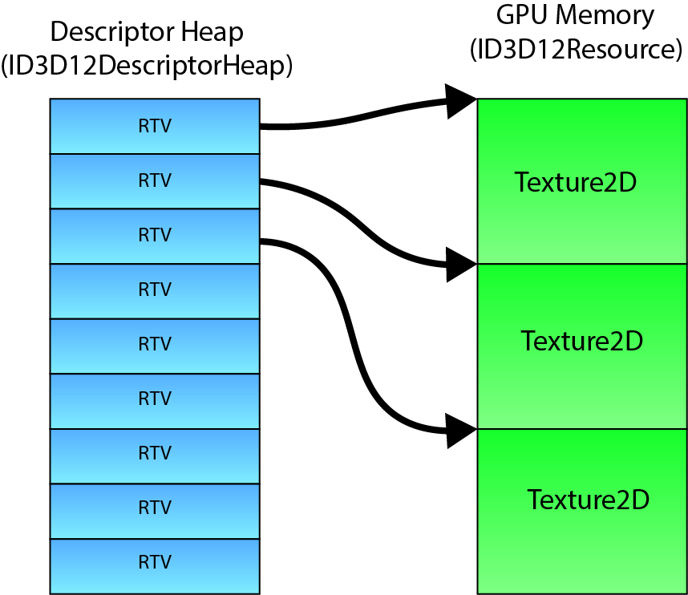

# steps
1. fully understand the meaning of each compoents
2. fully write the code of Hello World
3. build a ray casting
4. build a defered rendering

# graphics pipeline in DirectX 12.

1. Fixed-function stages (blue): cannot change how they process data, but can configure them using the DirectX 12 API. Such as imachines in a factory.
2. Programmable stages(green): can write a shadow program like HLSL to define exactly how data is processed. Such as a program a robot in a factory.

* Input-Assembler(IA) stage: read primitive data from user-defined vertex and index buffers and assemble that data into geometric primitives.

* Vertex Shader(VS) Stage
transform the vertex data from object-space into clip-space.

* Hull Shader(HS) Stage
It is responsible for determining how much an input control patch should be tessellated by the tesslation.

# basics of D3D12

Globaly learning DirectX. 


## useful functions

1. IDXGI Factory (DirectX Graphic Infrastructure)
Enum Adapters and Creating Swap Chain
```C++
	GRS_THROW_IF_FAILED(CreateDXGIFactory2(nDXGIFactoryFlags, IID_PPV_ARGS(&pIDXGIFactory5)));
```


## creating resources

### CreateCommittedResouce

implicit heap: the heap object can't be obtained by the application. Just call the heap and use it directly, do not need to build the heap manually. But hard to control the detail of the heap.


### CreatePlacedResource

### CreatReservedResource


## Heap 

```C++
typedef 
enum D3D12_HEAP_TYPE
{
    D3D12_HEAP_TYPE_DEFAULT            = 1, 
    D3D12_HEAP_TYPE_UPLOAD             = 2,
    D3D12_HEAP_TYPE_READBACK           = 3,
    D3D12_HEAP_TYPE_CUSTOM              = 4
} D3D12_HEAP_TYPE;
```

* DEFAULT: creating buffet when D3Dxx_USAGE = Default, only GPU  could access the data, CPU can not directly access the data. Which means it usually in $\textbf{video memory}$. Always insert some data hard to change in it, such as texture. 
* UPLOAD: GPU can not load the data, so upload heap is using to load the data in DEFAULT heap. For GPU "read only", For CPU "write only". For do not change.
* READBACK: the oppsite of UPLOAD


## Resource Barrier
Handle the parallelism problem between copy engine and graphic command engine. Ep. The texture is large enough and $\textbf{memcopy}$ need some time to copy. But the graphic command engine do not know that and already start $\textbf{Draw Call}$ the texture, which lead the unfinished texture to be rendered.

```C++
//send the command to the command heap of copy something from UPLOAD heap to DEFAULT heap
CD3DX12_TEXTURE_COPY_LOCATION Dst(pITexcute.Get(), 0);
CD3DX12_TEXTURE_COPY_LOCATION Src(pITextureUpload.Get(), stTxtLayouts);

// directly command a list's object.
pICommandList->CopyTextureRegion(&Dst, 0, 0, 0, &Src, nullptr);
 
// Resource Barrier
D3D12_RESOURCE_BARRIER stResBar = {};
stResBar.Type			= D3D12_RESOURCE_BARRIER_TYPE_TRANSITION;
stResBar.Flags			= D3D12_RESOURCE_BARRIER_FLAG_NONE;
stResBar.Transition.pResource	= pITexcute.Get();
stResBar.Transition.StateBefore = D3D12_RESOURCE_STATE_COPY_DEST;
stResBar.Transition.StateAfter	= D3D12_RESOURCE_STATE_PIXEL_SHADER_RESOURCE;
stResBar.Transition.Subresource = D3D12_RESOURCE_BARRIER_ALL_SUBRESOURCES;
 
pICommandList->ResourceBarrier(1, &stResBar);
```

In my understanding, because command heap's excution on GPU is in serial order, which means rescource barrier is just like crossbars at supermarket checkout counters.


## Adapter

used to looking for a adapter(graphic card)
```C++
ComPtr<IDXGIAdapter4> GetAdapter(bool useWarp)
{
    ComPtr<IDXGIFactory4> dxgiFactory;
    UINT createFactoryFlags = 0;
#if defined(_DEBUG)
    createFactoryFlags = DXGI_CREATE_FACTORY_DEBUG;
#endif
 
    ThrowIfFailed(CreateDXGIFactory2(createFactoryFlags, IID_PPV_ARGS(&dxgiFactory)));
   ComPtr<IDXGIAdapter1> dxgiAdapter1;
    ComPtr<IDXGIAdapter4> dxgiAdapter4;

    if (useWarp)
    {
        ThrowIfFailed(dxgiFactory->EnumWarpAdapter(IID_PPV_ARGS(&dxgiAdapter1)));
        ThrowIfFailed(dxgiAdapter1.As(&dxgiAdapter4));
    }
    else
    {
        SIZE_T maxDedicatedVideoMemory = 0;
        for (UINT i = 0; dxgiFactory->EnumAdapters1(i, &dxgiAdapter1) != DXGI_ERROR_NOT_FOUND; ++i)
        {
            DXGI_ADAPTER_DESC1 dxgiAdapterDesc1;
            dxgiAdapter1->GetDesc1(&dxgiAdapterDesc1);
 
            // Check to see if the adapter can create a D3D12 device without actually 
            // creating it. The adapter with the largest dedicated video memory
            // is favored.
            if ((dxgiAdapterDesc1.Flags & DXGI_ADAPTER_FLAG_SOFTWARE) == 0 &&
                SUCCEEDED(D3D12CreateDevice(dxgiAdapter1.Get(), 
                    D3D_FEATURE_LEVEL_11_0, __uuidof(ID3D12Device), nullptr)) && 
                dxgiAdapterDesc1.DedicatedVideoMemory > maxDedicatedVideoMemory )
            {
                maxDedicatedVideoMemory = dxgiAdapterDesc1.DedicatedVideoMemory;
                ThrowIfFailed(dxgiAdapter1.As(&dxgiAdapter4));
            }
        }
    }
 
    return dxgiAdapter4;
}
```


## Command List, Command Allocator, Command Queue

```C++
// DirectX 12 Objects
ComPtr<ID3D12Device2> g_Device;
ComPtr<ID3D12CommandQueue> g_CommandQueue;
ComPtr<IDXGISwapChain4> g_SwapChain;
ComPtr<ID3D12Resource> g_BackBuffers[g_NumFrames];
ComPtr<ID3D12GraphicsCommandList> g_CommandList;
ComPtr<ID3D12CommandAllocator> g_CommandAllocators[g_NumFrames];
ComPtr<ID3D12DescriptorHeap> g_RTVDescriptorHeap;
UINT g_RTVDescriptorSize;
UINT g_CurrentBackBufferIndex;
```


* Comptr: it goes out of scope when COM object is no longer needed, helping to prevent memory leaks.
* CommandAllocator: create and manage the memory that backs(supports) command list. Every command list need a command allocator, and each command allocator can be used with one command list at a time.

* Command List: CPU records a list of commands to be executed by GPU. Such as state changes, resource barriers, drawing operations...
* Command Queue: An interface through which CPU submits the recorded command lists to the GPU for execution. The GPU start excute the command as soon as CPU put command list in it. 


## Fence

A marker let you know when GPU has finished doing its work and tell CPU, so they can be synchronised.
```C++
// Synchronization objects
// a pointer used to ensure the synchronization primitive that the CPU can use to determine the eprogress of the GPU's execution of command lists.
ComPtr<ID3D12Fence> g_Fence;
// the next fence value to signal the command queue
uint64_t g_FenceValue = 0;
// each frame could be 'in-flight' on the command queue, this is used to keep tracked to guarantee that any resources that are still being referenced by the command queue are not overwritten.
uint64_t g_FrameFenceValues[g_NumFrames] = {};
// used to hold on untill the fance has reached a specific value.
HANDLE g_FenceEvent;
```


## Swap Chain

```C++
const unit8_t g_NumFrames = 3;
```
must more than 2 if using flip ppresentation model.


## Transformation Pipeline
1. World Transform: change each 3D model's coordinates into world coordinates.
2. View Transform: $V = T \cdot R_z \cdot R_y \cdot R_z$
3. Projection Transform: 




4. Clip transform: ignore the part not in the camera.


## Render Target View(RTV):
The purpose of it is just tell GPU how to render at back buffer before swap. If without RTV, the GPU will not know where the rendered pixel should be sent.

# glossary of CG

* mipmap: a set of pictures, with different level of pixels. Becasue off-site viewing do not need that detailed.

* SRV(shader resource view): wrapping textures in a format that the shadow can access them. Read Only. For example : a single texture, individual arrays, planes, or colors from a mipmapped texture, 3D texture, 1D texture color gradinets, etc.

* UAV(unordered access view): same as SRV, but can read or write in any order, even could read/written simultaneously by multipl,e threads without generate memory conflicts.

* root signatures: link command to the resources the shaders require. It determines the type of data the shaders should expect, but does not define the actural memory or data. For graphics command list has both a graphics and compute root signature, for compute command list have one compute root signature. These root signatures are independent of each others.

* Resource: all the resource could be excuted by GPU is resource in D3D12. Which is 'ID3D12Resource', such as rendering targets(include back buffers), textures, vertex buffers, index buffers... 
* G-SYNC: refresh screen and graph card together.
* Window Advanced Rasterization Platform(WARP): If did not find a valiable GPU, the system will do the same step of D3D12 by CPU by WARP. It can instead all the rendering method such as rasterization, ray tracing...
