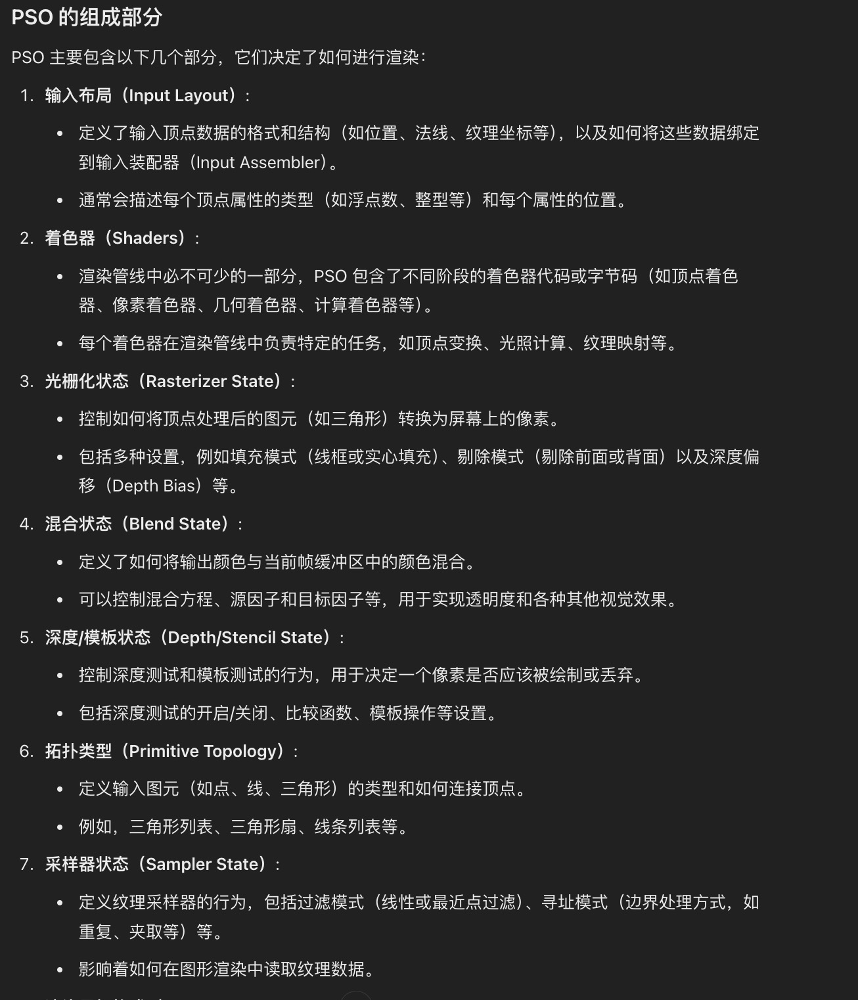

# graphic pipeline 


-------------- 之前写的好乱，重写一遍 ------------

**渲染管线概述**

渲染管线是将三维场景转换为二维图像的过程，通常由一系列步骤组成，每个步骤在图形渲染中都有特定的功能。整个流程可以分为以下主要阶段：

1. **应用阶段（Application Stage）**
2. **几何处理阶段（Geometry Processing Stage）**
3. **光栅化阶段（Rasterization Stage）**
4. **像素处理阶段（Fragment Processing Stage）**
5. **输出合并阶段（Output Merging Stage）**

---

### **1. 应用阶段（Application Stage）**

**功能：**

- **场景管理**：加载模型、纹理和创建场景图。
- **物理和动画计算**：处理物体的运动、变形和碰撞检测。
- **视锥体裁剪（Frustum Culling）**：剔除视野外的物体以提高性能。
- **提交绘制指令**：向渲染API（如OpenGL、DirectX）发送绘制命令。

**要点：**

- 这是CPU主导的阶段，主要负责准备渲染所需的数据。
- 优化此阶段可以减少GPU的负载，例如通过实例化减少绘制调用。

### **2. 几何处理阶段（Geometry Processing Stage）**

**功能：**

- **顶点着色器（Vertex Shader）**：对每个顶点进行变换和光照计算。
  - **模型变换**：将物体从模型坐标系转换到世界坐标系。
  - **视图变换**：将世界坐标系转换到相机坐标系。
  - **投影变换**：将三维坐标转换为二维投影平面。
- **曲面细分着色器（Tessellation Shader，可选）**：细化几何体，提高曲面细节。
- **几何着色器（Geometry Shader，可选）**：可以生成或修改图元（如点、线、三角形）。

**要点：**

- 这是GPU开始介入的阶段，提供可编程性以实现各种视觉效果。
- 变换后的顶点用于后续的光栅化过程。

### **3. 光栅化阶段（Rasterization Stage）**

**功能：**

- **图元组装**：将顶点组装成基本图元（如三角形）。
- **裁剪**：剔除不可见的部分，减少后续处理。
- **屏幕映射**：将坐标转换到屏幕空间。
- **光栅化**：将图元转换为片段（像素级别的潜在数据）。

**要点：**

- 光栅化是从矢量到像素的转换过程。
- 效率在此阶段非常关键，因为涉及大量数据处理。

### **4. 像素处理阶段（Fragment Processing Stage）**

**功能：**

- **片段着色器（Fragment Shader）**：计算每个片段的最终颜色和深度值。
  - **纹理映射**：应用纹理到片段上。
  - **光照计算**：进行像素级的光照和阴影处理。
  - **着色**：应用材质和其他视觉效果。
- **片段测试和操作**：
  - **深度测试**：确定片段是否被遮挡。
  - **模板测试**：用于复杂的图形效果，如镜像或剪裁。
  - **混合**：处理半透明效果，混合新旧像素颜色。

**要点：**

- 片段着色器提供高度的可编程性，影响最终图像质量。
- 优化此阶段可以显著提高渲染性能，特别是在高分辨率下。

### **5. 输出合并阶段（Output Merging Stage）**

**功能：**

- **合并片段到帧缓冲区（Framebuffer）**：将通过测试的片段写入帧缓冲区。
- **后期处理**：应用全屏效果，如抗锯齿、HDR、色彩校正等。
- **显示输出**：将最终图像传递给显示设备。

**要点：**

- 最后的机会优化和调整图像质量。
- 后期处理可以极大地增强视觉效果，但也需要权衡性能。

---


## PSO



## Nsight

启动Nsight Graphics：

打开Nsight Graphics工具。
连接到DirectX应用程序：

选择 "New Capture" 启动应用程序，或者使用 "Attach to Process" 连接到已经运行的DirectX应用程序。
捕获帧（Frame Capture）：

在应用程序中找到性能问题或瓶颈所在的场景。
点击Nsight界面上的 "Capture" 按钮，捕获当前帧的所有渲染调用和GPU活动。
分析捕获的帧：

使用帧分析工具查看每个Draw Call、Dispatch Call以及渲染管线的状态。
查看详细的着色器性能数据、资源使用情况（如纹理、缓冲区）以及API调用的执行时间。
优化步骤：

优化着色器：分析着色器代码，减少复杂计算，优化寄存器使用。
减少Draw Call：通过批处理和实例化减少Draw Calls。
调整资源管理：优化纹理大小、格式和访问模式，减少内存带宽消耗。
使用调试工具：

利用着色器调试和逐帧调试功能，查看渲染问题的细节，并优化代码逻辑。
重复分析与优化：

反复进行帧捕获、分析、优化，直至达到满意的性能水平。


## PBF


<!DOCTYPE html><html lang="en"><head><meta charset="UTF-8"><meta name="viewport" content="width=device-width,initial-scale=1,maximum-scale=2"><meta name="theme-color" content="#FFF"><link rel="apple-touch-icon" sizes="180x180" href="/images/apple-touch-icon.png"><link rel="icon" type="image/ico" sizes="32x32" href="/images/favicon.ico"><meta http-equiv="Cache-Control" content="no-transform"><meta http-equiv="Cache-Control" content="no-siteapp"><link rel="alternate" type="application/rss+xml" href="http://dotafs.com/rss.xml"><link rel="alternate" type="application/atom+xml" href="http://dotafs.com/atom.xml"><link rel="alternate" type="application/json" href="http://dotafs.com/feed.json"><link rel="stylesheet" href="//fonts.googleapis.com/css?family=Mulish:300,300italic,400,400italic,700,700italic%7CFredericka%20the%20Great:300,300italic,400,400italic,700,700italic%7CNoto%20Serif%20JP:300,300italic,400,400italic,700,700italic%7CNoto%20Serif%20SC:300,300italic,400,400italic,700,700italic%7CInconsolata:300,300italic,400,400italic,700,700italic&display=swap&subset=latin,latin-ext"><link rel="stylesheet" href="/css/app.css?v=0.2.5"><link rel="canonical" href="http://dotafs.com/2024/05/11/interview-script/"><title>interview script - notes | DOTAFS = = 实在即理念，我思故我在。</title><meta name="generator" content="Hexo 6.3.0"></head><body itemscope itemtype="http://schema.org/WebPage"><div id="loading"><div class="cat"><div class="body"></div><div class="head"><div class="face"></div></div><div class="foot"><div class="tummy-end"></div><div class="bottom"></div><div class="legs left"></div><div class="legs right"></div></div><div class="paw"><div class="hands left"></div><div class="hands right"></div></div></div></div><div id="container"><header id="header" itemscope itemtype="http://schema.org/WPHeader"><div class="inner"><div id="brand"><div class="pjax">

# interview script
<div class="meta"><span class="item" title="Created: 2024-05-11 15:23:43"><span class="icon"> </span><span class="text">Posted on</span> <time itemprop="dateCreated datePublished" datetime="2024-05-11T15:23:43-04:00">2024-05-11</time></span></div></div></div><nav id="nav"><div class="inner"><div class="toggle"><div class="lines" aria-label="Toggle navigation bar"><span class="line"></span> <span class="line"></span> <span class="line"></span></div></div>

*   [DOTAFS](/)

**</div></nav></div><div id="imgs" class="pjax">

******</div></header><div id="waves"><svg class="waves" xmlns="http://www.w3.org/2000/svg" xmlns:xlink="http://www.w3.org/1999/xlink" viewBox="0 24 150 28" preserveAspectRatio="none" shape-rendering="auto"><defs><path id="gentle-wave" d="M-160 44c30 0 58-18 88-18s 58 18 88 18 58-18 88-18 58 18 88 18 v44h-352z"/></defs><g class="parallax"><use xlink:href="#gentle-wave" x="48" y="0"/><use xlink:href="#gentle-wave" x="48" y="3"/><use xlink:href="#gentle-wave" x="48" y="5"/><use xlink:href="#gentle-wave" x="48" y="7"/></g></svg></div><main><div class="inner"><div id="main" class="pjax"><div class="article wrap"><div class="breadcrumb" itemscope itemtype="https://schema.org/BreadcrumbList"> <span>[Home](/)</span> <span class="current" itemprop="itemListElement" itemscope itemtype="https://schema.org/ListItem">[<span itemprop="name">notes</span>](/categories/notes/ "In notes")<meta itemprop="position" content="1"></span></div><article itemscope itemtype="http://schema.org/Article" class="post block" lang="en"><link itemprop="mainEntityOfPage" href="http://dotafs.com/2024/05/11/interview-script/"><span hidden itemprop="author" itemscope itemtype="http://schema.org/Person"><meta itemprop="image" content="/images/avatar.jpg"><meta itemprop="name" content="DOTAFS"><meta itemprop="description" content="实在即理念，我思故我在。, computer graphic"></span><span hidden itemprop="publisher" itemscope itemtype="http://schema.org/Organization"><meta itemprop="name" content=""></span><div class="body md" itemprop="articleBody">

每次收到面试，会发现自己很多问题很基本都已经忘记了，鉴于我这么差的记忆力，总结一份针对于我岗位的面经。

Overall, topic can seperate to:

*   computer grpaphic
*   C++,
*   hlsl/directX12
*   graphic card: CUDAROCm ROCm
*   internet

# [#](#computer-graphic) Computer graphic

## [#](#graphic-pipeline) graphic pipeline


### [#](#application-配置基础信息) Application 配置基础信息

在 CPU 完成，该阶段主要是在软件层面上执行的一些工作，包括空间加速算法、视锥剔除、碰撞检测、动画物理模拟等。大体逻辑是：执行视锥剔除，查询出可能需要绘制的图元并生成渲染数据，设置渲染状态和绑定各种 Shader 参数，调用 DrawCall，进入到下一个阶段，GPU 渲染管线。

1.  Geometry Processing 顶点着色、投影变换、裁剪和屏幕映射阶段。
2.  Rasterization 光栅化阶段是将图元离散化成片段的过程，其任务是找到需要绘制出的所有片段，包括三角形设定 (图元装配) 和三角形遍历阶段
3.  像素处理阶段，给每一个像素正确配色，最后绘制出整幅图像，包括像素着色和合并阶段。

广以上 4 阶段如上，但是 directX12 中有更多。

1.  Input Assembler Stage
2.  Vertex Shader Stage
3.  Tessellation Stage
4.  Geometry Shader Stage
5.  Stream Output Stage
6.  Rasterization Stage
7.  Pixel Shader Stage
8.  Output Merger Stage

### [#](#空间加速算法spatial-acceleration) 空间加速算法 (Spatial Acceleration)

#### [#](#spatial-partition-vs-object-partition) spatial partition vs object partition

1.  spatial paratition seperate space into non-overlapping regions

#### [#](#基于空间spatial-partition) 基于空间 (spatial partition)

*   grid cell (最基本的划分)
*   octTree (八叉树，通常以空间内最多两个物体结束) 简化版 KD tree

*   KD tree 假设 k 纬空间内，有很多个物体。


#### [#](#基于物体) 基于物体

*   AABB: box, 横平竖直的，Parallel xyz, 还有别的比如 Oriented Bounding Boxes (带角度的), 或者是球形的
*   Uniform Grids

*   BVH(Bounding Volume Hierarchy)


### [#](#视锥剔除view-frustum-culling) 视锥剔除 (View frustum culling)

在经过 spatial acceleration 后物体有了边界。


## [#](#shaders着色器) shaders (着色器)

### [#](#顶点着色器vertex-shader) 顶点着色器（Vertex Shader）：

*   顶点着色器是渲染管线中的第一个阶段，负责处理每个顶点的信息。
*   它的主要功能是处理顶点数据（如坐标、颜色、纹理坐标等）并进行顶点的变换、裁剪和其他顶点级操作。
*   比如，它可以将顶点从模型空间（Model Space）转换到裁剪空间（Clip Space）。

### [#](#曲面细分着色器tessellation-shader) 曲面细分着色器（Tessellation Shader）：

*   这类着色器通常用于根据某些准则对几何体进行细分，从而增加模型的复杂度和细节。
*   它包括曲面细分控制着色器（Hull Shader）和曲面细分评估着色器（Domain Shader）。
*   控制着色器决定如何细分几何体，而评估着色器处理细分后的顶点位置。

### [#](#几何着色器geometry-shader) 几何着色器（Geometry Shader）：

*   几何着色器接受整个图元（如三角形、线、点）作为输入。
*   它可以生成新图元或者对输入的图元进行变换。
*   这个着色器可以用于实现一些复杂的效果，如体积阴影、粒子系统等。

### [#](#片段着色器fragment-shader) 片段着色器（Fragment Shader）：

*   像素着色器处理图元光栅化后生成的每个片段。
*   它的主要任务是确定最终像素的颜色和其他属性（如深度、透明度等）。
*   这个阶段常用于实现各种像素级效果，如纹理映射、光照和阴影处理等。

### [#](#计算着色器compute-shader) 计算着色器（Compute Shader）：

*   计算着色器并非直接用于常规的图形渲染流程，而是用于处理广泛的非图形计算任务。
*   它们可以用来进行复杂的数学和物理计算，比如粒子系统的模拟、物理效果的计算等。

大量创建线程，计算不涉及直接渲染的任务，更加自由的数据访问或者处理数据，不受限于特定的阶段。

这段代码定义了一个计算着色器，它接受一个输入数组，并将每个元素的值增加 1。numthreads (1, 1, 1) 声明了每个线程组包含的线程数目。DTid 是当前线程的索引。

    // SimpleComputeShader.hlsl

    // 定义线程组的大小，这里设为1x1x1，可以根据需要调整。
    [numthreads(1, 1, 1)]
    void CSMain(uint3 DTid : SV_DispatchThreadID)
    &#123;
        // 这里只是一个示例：每个线程将输入数组的对应值增加1
        data[DTid.x] += 1;
    &#125;
    ```C++
    ID3DBlob* csBlob = nullptr;
    D3DCompile(shaderSource, strlen(shaderSource), nullptr, nullptr, nullptr, &quot;CSMain&quot;, &quot;cs_5_0&quot;, 0, 0, &amp;csBlob, nullptr);
    `</pre>

1.  创建计算管线状态对象<pre>`D3D12_COMPUTE_PIPELINE_STATE_DESC psoDesc = &#123;&#125;;
    psoDesc.CS = &#123;reinterpret_cast&lt;BYTE*&gt;(csBlob-&gt;GetBufferPointer()), csBlob-&gt;GetBufferSize()&#125;;
    device-&gt;CreateComputePipelineState(&amp;psoDesc, IID_PPV_ARGS(&amp;pipelineState));
    `</pre>

1.  创建并绑定资源<pre>`// 创建缓冲区资源并上传数据
    D3D12_RESOURCE_DESC bufferDesc = CD3DX12_RESOURCE_DESC::Buffer(dataSize);
    ID3D12Resource* buffer;
    device-&gt;CreateCommittedResource(&amp;heapProperties, D3D12_HEAP_FLAG_NONE, &amp;bufferDesc, D3D12_RESOURCE_STATE_COPY_DEST, nullptr, IID_PPV_ARGS(&amp;buffer));

    D3D12_SUBRESOURCE_DATA bufferData = &#123;&#125;;
    bufferData.pData = data;
    bufferData.RowPitch = dataSize;
    bufferData.SlicePitch = bufferData.RowPitch;
    UpdateSubresources(commandList, buffer, uploadBuffer, 0, 0, 1, &amp;bufferData);

    // 设置计算根签名和描述符
    commandList-&gt;SetPipelineState(pipelineState);
    commandList-&gt;SetComputeRootSignature(rootSignature);
    commandList-&gt;SetComputeRootShaderResourceView(0, buffer-&gt;GetGPUVirtualAddress());
    commandList-&gt;Dispatch(2, 2, 1);
    `</pre>

    ## [#](#light-mapping光照贴图) light mapping (光照贴图)

    ## [#](#光照模型illumination-model) 光照模型 (illumination model)

    ### [#](#局部光照模型local-illumination-model) 局部光照模型 (local illumination model)

    仅处理光源直接照射物体表面，不考虑其他反射。

*   Lambert reflectance model: 所有方向上均匀的散射光，不考虑 viewpoint, 所以没有 specular highlight.


    ### [#](#全局光照模型global-illumination-model) 全局光照模型 (global illumination model)

    ## [#](#ray-tracing) ray tracing

    ## [#](#render-equation) render equation

    

    ## [#](#deferred-rendering) deferred rendering

    

    ### [#](#forward-rendering) forward rendering

    
    Forward Rendering: 在场景中我们根据所有光源照亮一个物体，之后再渲染下一个物体，以此类推
    drawback: 因为大部分片段着色器的输出都会被之后的输出覆盖。
    Deferred rendering 本质就是 defer 计算大的比如光照放到最后处理。

*   one pass:

    

*   second pass(lighting pass):
    深度测试已经完毕，针对像素处理光照，而不是几何体。

    drawback:

1.  消耗大量显存
2.  不支持混色 (blending) 即使 Alpha 通道或混合信息整合进 G-buffer，这通常会导致需要更多的带宽和内存，进而影响渲染性能。同时，混合操作（如 Alpha blending）通常需要多次读写同一个像素，这在延迟渲染的光照计算中是低效的。

        1.  使用前向渲染处理透明物体：在使用延迟渲染处理场景的不透明部分后，再用前向渲染方式渲染透明物体。
    2.  混合延迟渲染：结合使用延迟和前向渲染技术，例如，将透明效果或特定的光照效果保留在前向渲染路径中处理。

    ## [#](#shadow) shadow

*   Lightmap: 沿着光源方向 bake 一个物体，offline rendering, 把结果放在 texture map。缺点只能放 diffuse，没法放 specular。并且没法动态阴影。
*   Shadowmap: two pass, 光源的位置渲染一遍场景
    第一个 pass，切换到以光源为视点的观察坐标系中，利用帧缓冲生成一张深度图 DepthMap
    第二个 pass，正常渲染，对渲染的每一个 fragment 做可见性判断，得到一个非零即一的 visibility
    将 shading point 通过第一个 pass 的变换得到的深度值和 epthMap 中记录的对应位置的深度值作比较
    如果 DepthMap 中记录的值小，说明当前的点对光源不可见，visibility=0
    否则 visibility=1
    用 visibility 乘上当前点的直接光照，进行遮蔽效果
    在实现上可以使用定向光做平行投影生成 DepthMap，也可以使用点光源做透视投影生成 DepthMap
*   pcf（percentage closer filtering）本是用于做抗锯齿的算法，后常被用于软阴影的实现。pcf 的做法：在取 shading point 到光源的距离与 shadow map 进行比较时，不仅仅只取一个点，而是取周围范围的点，多次取平均，得到 visbility 值。例如周围九个点比较结果分别为：1,0,1,1,0,1,1,1,0，那么可见性即为 0.667。
*   pcss（percentage closer soft shadow）：我们知道往往阴影的接收物与投射物的距离越近，则阴影越硬，反之，阴影就越 “软”，pcss 正是基于这个思路去实现的。
*   vsm（variance soft shadow mapping）：本质上可以理解为是一种对 pcss 的加速，避免了第一步和第三步中的采样。用切比雪夫测试的方式直接判断当前深度在区域范围内排序的百分比，相当于我们就直接得到了 visbility 值，这样的做法避免了大量的采样，加速了整个过程。
*   sdf 阴影：如下图所示，简单来说，是从 shading point 出发沿着灯光方向进行 ray marching，可以根据 sdf 提供的距离信息进行步进 step 优化，最终得到一个安全角度，该安全角度越小，则越暗，安全角度越大，则越亮。

    ### [#](#csm) CSM:

    是一种用于在大范围场景中生成高质量阴影的技术。它通过将场景分割成多个级联区域，每个区域使用单独的阴影贴图来提高阴影的细节和分辨率。

1.  分割视锥体：
    将摄像机的视锥体沿深度方向分割成多个区间（级联）。
    每个级联区间对应一个不同的深度范围，这样可以在近处使用高分辨率的阴影贴图，在远处使用低分辨率的阴影贴图。
2.  计算每个级联的正交投影矩阵：
    对每个级联区间，计算出包含该区间的正交投影矩阵，以便生成阴影贴图。
    需要考虑光源方向，以确定正交投影的范围和位置。
3.  渲染阴影贴图：
    对每个级联区间，从光源的视角渲染场景深度，生成对应的阴影贴图。
    这些阴影贴图记录了场景中各个物体的深度信息。
4.  应用阴影贴图：
    在主渲染通道中，根据摄像机视角，将不同级联的阴影贴图应用到场景中。
    使用多个级联阴影贴图可以在近处保留细节，并在远处节省计算资源。
5.  处理阴影边界：
    为了避免级联之间的明显边界，通常使用过渡区或模糊处理。
    通过对相邻级联区域的阴影贴图进行平滑过渡，可以减少视觉上的突兀感。

    ## [#](#pbr) PBR

    物理基础渲染（Physically Based Rendering，简称 PBR）是一种更加逼真地模拟光照和材质的渲染方法。PBR 基于物理学原理，使得渲染结果更加一致和真实。PBR 的核心思想是通过模拟光线和材质的物理交互来生成图像。

    ### [#](#pbr概念) PBR 概念

    ### [#](#1-brdf双向反射分布函数) 1. **BRDF（双向反射分布函数）**

    BRDF 描述了光线如何从一个表面反射出去。PBR 使用物理上正确的 BRDF 来计算反射光线的方向和强度。常见的 BRDF 模型包括 Lambertian（漫反射）和 Cook-Torrance（镜面反射）。

    ### [#](#2-能量守恒) 2. **能量守恒**

    PBR 保证了能量守恒，即材质反射的光量不会超过入射的光量。这一原则确保了材质在不同光照条件下都能表现得一致。

    ### [#](#3-微表面理论) 3. **微表面理论**

    微表面理论假设一个表面由许多微小的镜面组成。这些微小的镜面随机分布，使得光线以不同角度反射，从而形成材质的粗糙度和高光特性。

    ### [#](#pbr-的主要参数) PBR 的主要参数

    #### [#](#1-albedo反照率) 1. **Albedo（反照率）**

    Albedo 是材质的基本颜色，表示在没有光照影响下的颜色。它不包含阴影、镜面反射等因素。

    #### [#](#2-metalness金属性) 2. **Metalness（金属性）**

    Metalness 参数定义材质的金属特性。金属材质具有高反射率和无透射率，反照率通常接近黑色。非金属材质则具有较低的反射率和一定的透射率。

    #### [#](#3-roughness粗糙度) 3. **Roughness（粗糙度）**

    Roughness 描述了表面的光滑程度。低粗糙度的表面光滑且反射清晰，高粗糙度的表面则粗糙且反射模糊。

    #### [#](#4-normal-map法线贴图) 4. **Normal Map（法线贴图）**

    法线贴图用于模拟细节纹理和凹凸效果，影响光线的反射方向，增加视觉细节。

    #### [#](#5-ambient-occlusion环境光遮蔽) 5. **Ambient Occlusion（环境光遮蔽）**

    环境光遮蔽用于模拟由于遮挡导致的局部阴影效果，增强视觉深度。

    ### [#](#pbr-工作流程) PBR 工作流程

1.  **定义材质属性**
    使用 Albedo、Metalness、Roughness 等参数来定义材质的物理特性。
2.  **光照计算**
    通过光照模型（如直接光源、环境光等）计算每个像素的光照强度。
3.  **BRDF 计算**
    根据 BRDF 模型和材质参数，计算光线在表面上的反射。
4.  **合成最终图像**
    将光照计算结果和材质反射计算结果合成，生成最终的渲染图像。

    ### [#](#cook-torrance) Cook-Torrance

*   计算微表面分布函数（D）：选择适当的分布模型（如 GGX），根据表面粗糙度计算微表面分布。
*   计算几何遮蔽 / 阴蔽函数（G）：选择几何函数（如 Schlick-GGX），根据表面粗糙度和光照角度计算遮蔽和阴蔽效果。
*   计算菲涅耳方程（F）：使用 Schlick 近似，根据入射角和材料的折射率计算菲涅耳反射。
*   组合以上组件：将 D、G 和 F 结合起来，计算最终的反射和折射强度。

    #### [#](#cook-torrance-模型的优点) Cook-Torrance 模型的优点

*   物理准确性：考虑了微表面的结构和光的物理特性，能够生成高度真实的反射和折射效果。
*   一致性：在不同光照条件下表现一致，使得材质在不同场景中具有一致的视觉效果。
*   灵活性：可以通过调整微表面分布函数、几何函数和菲涅耳方程的参数来模拟不同类型的材质，如金属、塑料等。

    ## [#](#mvp) MVP

    ### [#](#mvp-矩阵公式推导) MVP 矩阵公式推导

1.  **模型矩阵 (Model Matrix, M)**
    模型矩阵将对象坐标变换到世界坐标系。假设对象有一个平移变换和一个旋转变换，模型矩阵可以表示为：
    <span class="katex-display"><span class="katex"><span class="katex-mathml"><math xmlns="http://www.w3.org/1998/Math/MathML" display="block"><semantics><mrow><mi>M</mi><mo>=</mo><mi>T</mi><mo>⋅</mo><mi>R</mi></mrow><annotation encoding="application/x-tex">M = T \cdot R</annotation></semantics></math></span><span class="katex-html" aria-hidden="true"><span class="base"><span class="strut" style="height:.68333em;vertical-align:0"></span><span class="mord mathnormal" style="margin-right:.10903em">M</span><span class="mspace" style="margin-right:.2777777777777778em"></span><span class="mrel">=</span><span class="mspace" style="margin-right:.2777777777777778em"></span></span><span class="base"><span class="strut" style="height:.68333em;vertical-align:0"></span><span class="mord mathnormal" style="margin-right:.13889em">T</span><span class="mspace" style="margin-right:.2222222222222222em"></span><span class="mbin">⋅</span><span class="mspace" style="margin-right:.2222222222222222em"></span></span><span class="base"><span class="strut" style="height:.68333em;vertical-align:0"></span><span class="mord mathnormal" style="margin-right:.00773em">R</span></span></span></span></span>
    其中 (T) 是平移矩阵，( R ) 是旋转矩阵。具体形式如下：
    平移矩阵 (T):
    <span class="katex-display"><span class="katex"><span class="katex-mathml"><math xmlns="http://www.w3.org/1998/Math/MathML" display="block"><semantics><mrow><mi>T</mi><mo>=</mo><mrow><mo fence="true">[</mo><mtable rowspacing="0.15999999999999992em" columnspacing="1em"><mtr><mtd><mstyle scriptlevel="0" displaystyle="false"><mn>1</mn></mstyle></mtd><mtd><mstyle scriptlevel="0" displaystyle="false"><mn>0</mn></mstyle></mtd><mtd><mstyle scriptlevel="0" displaystyle="false"><mn>0</mn></mstyle></mtd><mtd><mstyle scriptlevel="0" displaystyle="false"><mi>x</mi></mstyle></mtd></mtr><mtr><mtd><mstyle scriptlevel="0" displaystyle="false"><mn>0</mn></mstyle></mtd><mtd><mstyle scriptlevel="0" displaystyle="false"><mn>1</mn></mstyle></mtd><mtd><mstyle scriptlevel="0" displaystyle="false"><mn>0</mn></mstyle></mtd><mtd><mstyle scriptlevel="0" displaystyle="false"><mi>y</mi></mstyle></mtd></mtr><mtr><mtd><mstyle scriptlevel="0" displaystyle="false"><mn>0</mn></mstyle></mtd><mtd><mstyle scriptlevel="0" displaystyle="false"><mn>0</mn></mstyle></mtd><mtd><mstyle scriptlevel="0" displaystyle="false"><mn>1</mn></mstyle></mtd><mtd><mstyle scriptlevel="0" displaystyle="false"><mi>z</mi></mstyle></mtd></mtr><mtr><mtd><mstyle scriptlevel="0" displaystyle="false"><mn>0</mn></mstyle></mtd><mtd><mstyle scriptlevel="0" displaystyle="false"><mn>0</mn></mstyle></mtd><mtd><mstyle scriptlevel="0" displaystyle="false"><mn>0</mn></mstyle></mtd><mtd><mstyle scriptlevel="0" displaystyle="false"><mn>1</mn></mstyle></mtd></mtr></mtable><mo fence="true">]</mo></mrow></mrow><annotation encoding="application/x-tex">T = \begin{bmatrix} 1 &amp; 0 &amp; 0 &amp; x \\ 0 &amp; 1 &amp; 0 &amp; y \\ 0 &amp; 0 &amp; 1 &amp; z \\ 0 &amp; 0 &amp; 0 &amp; 1 \end{bmatrix}</annotation></semantics></math></span><span class="katex-html" aria-hidden="true"><span class="base"><span class="strut" style="height:.68333em;vertical-align:0"></span><span class="mord mathnormal" style="margin-right:.13889em">T</span><span class="mspace" style="margin-right:.2777777777777778em"></span><span class="mrel">=</span><span class="mspace" style="margin-right:.2777777777777778em"></span></span><span class="base"><span class="strut" style="height:4.80303em;vertical-align:-2.15003em"></span><span class="minner"><span class="mopen"><span class="delimsizing mult"><span class="vlist-t vlist-t2"><span class="vlist-r"><span class="vlist" style="height:2.6529999999999996em"><span style="top:-1.6499900000000003em"><span class="pstrut" style="height:3.1550000000000002em"></span><span class="delimsizinginner delim-size4"><span>⎣</span></span></span><span style="top:-2.79999em"><span class="pstrut" style="height:3.1550000000000002em"></span><span class="delimsizinginner delim-size4"><span>⎢</span></span></span><span style="top:-3.3959900000000003em"><span class="pstrut" style="height:3.1550000000000002em"></span><span class="delimsizinginner delim-size4"><span>⎢</span></span></span><span style="top:-3.4119800000000002em"><span class="pstrut" style="height:3.1550000000000002em"></span><span class="delimsizinginner delim-size4"><span>⎢</span></span></span><span style="top:-4.653em"><span class="pstrut" style="height:3.1550000000000002em"></span><span class="delimsizinginner delim-size4"><span>⎡</span></span></span></span><span class="vlist-s">​</span></span><span class="vlist-r"><span class="vlist" style="height:2.15003em"><span></span></span></span></span></span></span><span class="mord"><span class="mtable"><span class="col-align-c"><span class="vlist-t vlist-t2"><span class="vlist-r"><span class="vlist" style="height:2.6500000000000004em"><span style="top:-4.8100000000000005em"><span class="pstrut" style="height:3em"></span><span class="mord"><span class="mord">1</span></span></span><span style="top:-3.61em"><span class="pstrut" style="height:3em"></span><span class="mord"><span class="mord">0</span></span></span><span style="top:-2.4099999999999997em"><span class="pstrut" style="height:3em"></span><span class="mord"><span class="mord">0</span></span></span><span style="top:-1.2099999999999997em"><span class="pstrut" style="height:3em"></span><span class="mord"><span class="mord">0</span></span></span></span><span class="vlist-s">​</span></span><span class="vlist-r"><span class="vlist" style="height:2.1500000000000004em"><span></span></span></span></span></span><span class="arraycolsep" style="width:.5em"></span><span class="arraycolsep" style="width:.5em"></span><span class="col-align-c"><span class="vlist-t vlist-t2"><span class="vlist-r"><span class="vlist" style="height:2.6500000000000004em"><span style="top:-4.8100000000000005em"><span class="pstrut" style="height:3em"></span><span class="mord"><span class="mord">0</span></span></span><span style="top:-3.61em"><span class="pstrut" style="height:3em"></span><span class="mord"><span class="mord">1</span></span></span><span style="top:-2.4099999999999997em"><span class="pstrut" style="height:3em"></span><span class="mord"><span class="mord">0</span></span></span><span style="top:-1.2099999999999997em"><span class="pstrut" style="height:3em"></span><span class="mord"><span class="mord">0</span></span></span></span><span class="vlist-s">​</span></span><span class="vlist-r"><span class="vlist" style="height:2.1500000000000004em"><span></span></span></span></span></span><span class="arraycolsep" style="width:.5em"></span><span class="arraycolsep" style="width:.5em"></span><span class="col-align-c"><span class="vlist-t vlist-t2"><span class="vlist-r"><span class="vlist" style="height:2.6500000000000004em"><span style="top:-4.8100000000000005em"><span class="pstrut" style="height:3em"></span><span class="mord"><span class="mord">0</span></span></span><span style="top:-3.61em"><span class="pstrut" style="height:3em"></span><span class="mord"><span class="mord">0</span></span></span><span style="top:-2.4099999999999997em"><span class="pstrut" style="height:3em"></span><span class="mord"><span class="mord">1</span></span></span><span style="top:-1.2099999999999997em"><span class="pstrut" style="height:3em"></span><span class="mord"><span class="mord">0</span></span></span></span><span class="vlist-s">​</span></span><span class="vlist-r"><span class="vlist" style="height:2.1500000000000004em"><span></span></span></span></span></span><span class="arraycolsep" style="width:.5em"></span><span class="arraycolsep" style="width:.5em"></span><span class="col-align-c"><span class="vlist-t vlist-t2"><span class="vlist-r"><span class="vlist" style="height:2.6500000000000004em"><span style="top:-4.8100000000000005em"><span class="pstrut" style="height:3em"></span><span class="mord"><span class="mord mathnormal">x</span></span></span><span style="top:-3.61em"><span class="pstrut" style="height:3em"></span><span class="mord"><span class="mord mathnormal" style="margin-right:.03588em">y</span></span></span><span style="top:-2.4099999999999997em"><span class="pstrut" style="height:3em"></span><span class="mord"><span class="mord mathnormal" style="margin-right:.04398em">z</span></span></span><span style="top:-1.2099999999999997em"><span class="pstrut" style="height:3em"></span><span class="mord"><span class="mord">1</span></span></span></span><span class="vlist-s">​</span></span><span class="vlist-r"><span class="vlist" style="height:2.1500000000000004em"><span></span></span></span></span></span></span></span><span class="mclose"><span class="delimsizing mult"><span class="vlist-t vlist-t2"><span class="vlist-r"><span class="vlist" style="height:2.6529999999999996em"><span style="top:-1.6499900000000003em"><span class="pstrut" style="height:3.1550000000000002em"></span><span class="delimsizinginner delim-size4"><span>⎦</span></span></span><span style="top:-2.79999em"><span class="pstrut" style="height:3.1550000000000002em"></span><span class="delimsizinginner delim-size4"><span>⎥</span></span></span><span style="top:-3.3959900000000003em"><span class="pstrut" style="height:3.1550000000000002em"></span><span class="delimsizinginner delim-size4"><span>⎥</span></span></span><span style="top:-3.4119800000000002em"><span class="pstrut" style="height:3.1550000000000002em"></span><span class="delimsizinginner delim-size4"><span>⎥</span></span></span><span style="top:-4.653em"><span class="pstrut" style="height:3.1550000000000002em"></span><span class="delimsizinginner delim-size4"><span>⎤</span></span></span></span><span class="vlist-s">​</span></span><span class="vlist-r"><span class="vlist" style="height:2.15003em"><span></span></span></span></span></span></span></span></span></span></span></span>
    旋转矩阵 (R)（例如绕 z 轴旋转）:
    <span class="katex-display"><span class="katex"><span class="katex-mathml"><math xmlns="http://www.w3.org/1998/Math/MathML" display="block"><semantics><mrow><mi>R</mi><mo>=</mo><mrow><mo fence="true">[</mo><mtable rowspacing="0.15999999999999992em" columnspacing="1em"><mtr><mtd><mstyle scriptlevel="0" displaystyle="false"><mrow><mi>cos</mi><mo>⁡</mo><mi>θ</mi></mrow></mstyle></mtd><mtd><mstyle scriptlevel="0" displaystyle="false"><mrow><mo>−</mo><mi>sin</mi><mo>⁡</mo><mi>θ</mi></mrow></mstyle></mtd><mtd><mstyle scriptlevel="0" displaystyle="false"><mn>0</mn></mstyle></mtd><mtd><mstyle scriptlevel="0" displaystyle="false"><mn>0</mn></mstyle></mtd></mtr><mtr><mtd><mstyle scriptlevel="0" displaystyle="false"><mrow><mi>sin</mi><mo>⁡</mo><mi>θ</mi></mrow></mstyle></mtd><mtd><mstyle scriptlevel="0" displaystyle="false"><mrow><mi>cos</mi><mo>⁡</mo><mi>θ</mi></mrow></mstyle></mtd><mtd><mstyle scriptlevel="0" displaystyle="false"><mn>0</mn></mstyle></mtd><mtd><mstyle scriptlevel="0" displaystyle="false"><mn>0</mn></mstyle></mtd></mtr><mtr><mtd><mstyle scriptlevel="0" displaystyle="false"><mn>0</mn></mstyle></mtd><mtd><mstyle scriptlevel="0" displaystyle="false"><mn>0</mn></mstyle></mtd><mtd><mstyle scriptlevel="0" displaystyle="false"><mn>1</mn></mstyle></mtd><mtd><mstyle scriptlevel="0" displaystyle="false"><mn>0</mn></mstyle></mtd></mtr><mtr><mtd><mstyle scriptlevel="0" displaystyle="false"><mn>0</mn></mstyle></mtd><mtd><mstyle scriptlevel="0" displaystyle="false"><mn>0</mn></mstyle></mtd><mtd><mstyle scriptlevel="0" displaystyle="false"><mn>0</mn></mstyle></mtd><mtd><mstyle scriptlevel="0" displaystyle="false"><mn>1</mn></mstyle></mtd></mtr></mtable><mo fence="true">]</mo></mrow></mrow><annotation encoding="application/x-tex">R = \begin{bmatrix} \cos \theta &amp; -\sin \theta &amp; 0 &amp; 0 \\ \sin \theta &amp; \cos \theta &amp; 0 &amp; 0 \\ 0 &amp; 0 &amp; 1 &amp; 0 \\ 0 &amp; 0 &amp; 0 &amp; 1 \end{bmatrix}</annotation></semantics></math></span><span class="katex-html" aria-hidden="true"><span class="base"><span class="strut" style="height:.68333em;vertical-align:0"></span><span class="mord mathnormal" style="margin-right:.00773em">R</span><span class="mspace" style="margin-right:.2777777777777778em"></span><span class="mrel">=</span><span class="mspace" style="margin-right:.2777777777777778em"></span></span><span class="base"><span class="strut" style="height:4.80303em;vertical-align:-2.15003em"></span><span class="minner"><span class="mopen"><span class="delimsizing mult"><span class="vlist-t vlist-t2"><span class="vlist-r"><span class="vlist" style="height:2.6529999999999996em"><span style="top:-1.6499900000000003em"><span class="pstrut" style="height:3.1550000000000002em"></span><span class="delimsizinginner delim-size4"><span>⎣</span></span></span><span style="top:-2.79999em"><span class="pstrut" style="height:3.1550000000000002em"></span><span class="delimsizinginner delim-size4"><span>⎢</span></span></span><span style="top:-3.3959900000000003em"><span class="pstrut" style="height:3.1550000000000002em"></span><span class="delimsizinginner delim-size4"><span>⎢</span></span></span><span style="top:-3.4119800000000002em"><span class="pstrut" style="height:3.1550000000000002em"></span><span class="delimsizinginner delim-size4"><span>⎢</span></span></span><span style="top:-4.653em"><span class="pstrut" style="height:3.1550000000000002em"></span><span class="delimsizinginner delim-size4"><span>⎡</span></span></span></span><span class="vlist-s">​</span></span><span class="vlist-r"><span class="vlist" style="height:2.15003em"><span></span></span></span></span></span></span><span class="mord"><span class="mtable"><span class="col-align-c"><span class="vlist-t vlist-t2"><span class="vlist-r"><span class="vlist" style="height:2.6500000000000004em"><span style="top:-4.8100000000000005em"><span class="pstrut" style="height:3em"></span><span class="mord"><span class="mop">cos</span><span class="mspace" style="margin-right:.16666666666666666em"></span><span class="mord mathnormal" style="margin-right:.02778em">θ</span></span></span><span style="top:-3.61em"><span class="pstrut" style="height:3em"></span><span class="mord"><span class="mop">sin</span><span class="mspace" style="margin-right:.16666666666666666em"></span><span class="mord mathnormal" style="margin-right:.02778em">θ</span></span></span><span style="top:-2.4099999999999997em"><span class="pstrut" style="height:3em"></span><span class="mord"><span class="mord">0</span></span></span><span style="top:-1.2099999999999997em"><span class="pstrut" style="height:3em"></span><span class="mord"><span class="mord">0</span></span></span></span><span class="vlist-s">​</span></span><span class="vlist-r"><span class="vlist" style="height:2.1500000000000004em"><span></span></span></span></span></span><span class="arraycolsep" style="width:.5em"></span><span class="arraycolsep" style="width:.5em"></span><span class="col-align-c"><span class="vlist-t vlist-t2"><span class="vlist-r"><span class="vlist" style="height:2.6500000000000004em"><span style="top:-4.8100000000000005em"><span class="pstrut" style="height:3em"></span><span class="mord"><span class="mord">−</span><span class="mspace" style="margin-right:.16666666666666666em"></span><span class="mop">sin</span><span class="mspace" style="margin-right:.16666666666666666em"></span><span class="mord mathnormal" style="margin-right:.02778em">θ</span></span></span><span style="top:-3.61em"><span class="pstrut" style="height:3em"></span><span class="mord"><span class="mop">cos</span><span class="mspace" style="margin-right:.16666666666666666em"></span><span class="mord mathnormal" style="margin-right:.02778em">θ</span></span></span><span style="top:-2.4099999999999997em"><span class="pstrut" style="height:3em"></span><span class="mord"><span class="mord">0</span></span></span><span style="top:-1.2099999999999997em"><span class="pstrut" style="height:3em"></span><span class="mord"><span class="mord">0</span></span></span></span><span class="vlist-s">​</span></span><span class="vlist-r"><span class="vlist" style="height:2.1500000000000004em"><span></span></span></span></span></span><span class="arraycolsep" style="width:.5em"></span><span class="arraycolsep" style="width:.5em"></span><span class="col-align-c"><span class="vlist-t vlist-t2"><span class="vlist-r"><span class="vlist" style="height:2.6500000000000004em"><span style="top:-4.8100000000000005em"><span class="pstrut" style="height:3em"></span><span class="mord"><span class="mord">0</span></span></span><span style="top:-3.61em"><span class="pstrut" style="height:3em"></span><span class="mord"><span class="mord">0</span></span></span><span style="top:-2.4099999999999997em"><span class="pstrut" style="height:3em"></span><span class="mord"><span class="mord">1</span></span></span><span style="top:-1.2099999999999997em"><span class="pstrut" style="height:3em"></span><span class="mord"><span class="mord">0</span></span></span></span><span class="vlist-s">​</span></span><span class="vlist-r"><span class="vlist" style="height:2.1500000000000004em"><span></span></span></span></span></span><span class="arraycolsep" style="width:.5em"></span><span class="arraycolsep" style="width:.5em"></span><span class="col-align-c"><span class="vlist-t vlist-t2"><span class="vlist-r"><span class="vlist" style="height:2.6500000000000004em"><span style="top:-4.8100000000000005em"><span class="pstrut" style="height:3em"></span><span class="mord"><span class="mord">0</span></span></span><span style="top:-3.61em"><span class="pstrut" style="height:3em"></span><span class="mord"><span class="mord">0</span></span></span><span style="top:-2.4099999999999997em"><span class="pstrut" style="height:3em"></span><span class="mord"><span class="mord">0</span></span></span><span style="top:-1.2099999999999997em"><span class="pstrut" style="height:3em"></span><span class="mord"><span class="mord">1</span></span></span></span><span class="vlist-s">​</span></span><span class="vlist-r"><span class="vlist" style="height:2.1500000000000004em"><span></span></span></span></span></span></span></span><span class="mclose"><span class="delimsizing mult"><span class="vlist-t vlist-t2"><span class="vlist-r"><span class="vlist" style="height:2.6529999999999996em"><span style="top:-1.6499900000000003em"><span class="pstrut" style="height:3.1550000000000002em"></span><span class="delimsizinginner delim-size4"><span>⎦</span></span></span><span style="top:-2.79999em"><span class="pstrut" style="height:3.1550000000000002em"></span><span class="delimsizinginner delim-size4"><span>⎥</span></span></span><span style="top:-3.3959900000000003em"><span class="pstrut" style="height:3.1550000000000002em"></span><span class="delimsizinginner delim-size4"><span>⎥</span></span></span><span style="top:-3.4119800000000002em"><span class="pstrut" style="height:3.1550000000000002em"></span><span class="delimsizinginner delim-size4"><span>⎥</span></span></span><span style="top:-4.653em"><span class="pstrut" style="height:3.1550000000000002em"></span><span class="delimsizinginner delim-size4"><span>⎤</span></span></span></span><span class="vlist-s">​</span></span><span class="vlist-r"><span class="vlist" style="height:2.15003em"><span></span></span></span></span></span></span></span></span></span></span></span>
2.  **视图矩阵 (View Matrix, V)**
    视图矩阵将世界坐标变换到相机坐标系。假设相机位置为 (\mathbf {C} = (c_x, c_y, c_z) )，看向目标 ( \mathbf {T} = (t_x, t_y, t_z) )，相机的上向量为 ( \mathbf {U} = (u_x, u_y, u_z) )。
    首先计算相机的三个基向量：
    <span class="katex-display"><span class="katex"><span class="katex-mathml"><math xmlns="http://www.w3.org/1998/Math/MathML" display="block"><semantics><mrow><mi mathvariant="bold">z</mi><mo>=</mo><mfrac><mrow><mi mathvariant="bold">C</mi><mo>−</mo><mi mathvariant="bold">T</mi></mrow><mrow><mi mathvariant="normal">∣</mi><mi mathvariant="bold">C</mi><mo>−</mo><mi mathvariant="bold">T</mi><mi mathvariant="normal">∣</mi></mrow></mfrac></mrow><annotation encoding="application/x-tex">\mathbf{z} = \frac{\mathbf{C} - \mathbf{T}}{|\mathbf{C} - \mathbf{T}|}</annotation></semantics></math></span><span class="katex-html" aria-hidden="true"><span class="base"><span class="strut" style="height:.44444em;vertical-align:0"></span><span class="mord"><span class="mord mathbf">z</span></span><span class="mspace" style="margin-right:.2777777777777778em"></span><span class="mrel">=</span><span class="mspace" style="margin-right:.2777777777777778em"></span></span><span class="base"><span class="strut" style="height:2.29911em;vertical-align:-.936em"></span><span class="mord"><span class="mopen nulldelimiter"></span><span class="mfrac"><span class="vlist-t vlist-t2"><span class="vlist-r"><span class="vlist" style="height:1.36311em"><span style="top:-2.314em"><span class="pstrut" style="height:3em"></span><span class="mord"><span class="mord">∣</span><span class="mord"><span class="mord mathbf">C</span></span><span class="mspace" style="margin-right:.2222222222222222em"></span><span class="mbin">−</span><span class="mspace" style="margin-right:.2222222222222222em"></span><span class="mord"><span class="mord mathbf">T</span></span><span class="mord">∣</span></span></span><span style="top:-3.23em"><span class="pstrut" style="height:3em"></span><span class="frac-line" style="border-bottom-width:.04em"></span></span><span style="top:-3.677em"><span class="pstrut" style="height:3em"></span><span class="mord"><span class="mord"><span class="mord mathbf">C</span></span><span class="mspace" style="margin-right:.2222222222222222em"></span><span class="mbin">−</span><span class="mspace" style="margin-right:.2222222222222222em"></span><span class="mord"><span class="mord mathbf">T</span></span></span></span></span><span class="vlist-s">​</span></span><span class="vlist-r"><span class="vlist" style="height:.936em"><span></span></span></span></span></span><span class="mclose nulldelimiter"></span></span></span></span></span></span>
    <span class="katex-display"><span class="katex"><span class="katex-mathml"><math xmlns="http://www.w3.org/1998/Math/MathML" display="block"><semantics><mrow><mi mathvariant="bold">x</mi><mo>=</mo><mfrac><mrow><mi mathvariant="bold">U</mi><mo>×</mo><mi mathvariant="bold">z</mi></mrow><mrow><mi mathvariant="normal">∣</mi><mi mathvariant="bold">U</mi><mo>×</mo><mi mathvariant="bold">z</mi><mi mathvariant="normal">∣</mi></mrow></mfrac></mrow><annotation encoding="application/x-tex">\mathbf{x} = \frac{\mathbf{U} \times \mathbf{z}}{|\mathbf{U} \times \mathbf{z}|}</annotation></semantics></math></span><span class="katex-html" aria-hidden="true"><span class="base"><span class="strut" style="height:.44444em;vertical-align:0"></span><span class="mord"><span class="mord mathbf">x</span></span><span class="mspace" style="margin-right:.2777777777777778em"></span><span class="mrel">=</span><span class="mspace" style="margin-right:.2777777777777778em"></span></span><span class="base"><span class="strut" style="height:2.29911em;vertical-align:-.936em"></span><span class="mord"><span class="mopen nulldelimiter"></span><span class="mfrac"><span class="vlist-t vlist-t2"><span class="vlist-r"><span class="vlist" style="height:1.36311em"><span style="top:-2.314em"><span class="pstrut" style="height:3em"></span><span class="mord"><span class="mord">∣</span><span class="mord"><span class="mord mathbf">U</span></span><span class="mspace" style="margin-right:.2222222222222222em"></span><span class="mbin">×</span><span class="mspace" style="margin-right:.2222222222222222em"></span><span class="mord"><span class="mord mathbf">z</span></span><span class="mord">∣</span></span></span><span style="top:-3.23em"><span class="pstrut" style="height:3em"></span><span class="frac-line" style="border-bottom-width:.04em"></span></span><span style="top:-3.677em"><span class="pstrut" style="height:3em"></span><span class="mord"><span class="mord"><span class="mord mathbf">U</span></span><span class="mspace" style="margin-right:.2222222222222222em"></span><span class="mbin">×</span><span class="mspace" style="margin-right:.2222222222222222em"></span><span class="mord"><span class="mord mathbf">z</span></span></span></span></span><span class="vlist-s">​</span></span><span class="vlist-r"><span class="vlist" style="height:.936em"><span></span></span></span></span></span><span class="mclose nulldelimiter"></span></span></span></span></span></span>
    <span class="katex-display"><span class="katex"><span class="katex-mathml"><math xmlns="http://www.w3.org/1998/Math/MathML" display="block"><semantics><mrow><mi mathvariant="bold">y</mi><mo>=</mo><mi mathvariant="bold">z</mi><mo>×</mo><mi mathvariant="bold">x</mi></mrow><annotation encoding="application/x-tex">\mathbf{y} = \mathbf{z} \times \mathbf{x}</annotation></semantics></math></span><span class="katex-html" aria-hidden="true"><span class="base"><span class="strut" style="height:.63888em;vertical-align:-.19444em"></span><span class="mord"><span class="mord mathbf" style="margin-right:.01597em">y</span></span><span class="mspace" style="margin-right:.2777777777777778em"></span><span class="mrel">=</span><span class="mspace" style="margin-right:.2777777777777778em"></span></span><span class="base"><span class="strut" style="height:.66666em;vertical-align:-.08333em"></span><span class="mord"><span class="mord mathbf">z</span></span><span class="mspace" style="margin-right:.2222222222222222em"></span><span class="mbin">×</span><span class="mspace" style="margin-right:.2222222222222222em"></span></span><span class="base"><span class="strut" style="height:.44444em;vertical-align:0"></span><span class="mord"><span class="mord mathbf">x</span></span></span></span></span></span>
    视图矩阵 (V):
    <span class="katex-display"><span class="katex"><span class="katex-mathml"><math xmlns="http://www.w3.org/1998/Math/MathML" display="block"><semantics><mrow><mi>V</mi><mo>=</mo><mrow><mo fence="true">[</mo><mtable rowspacing="0.15999999999999992em" columnspacing="1em"><mtr><mtd><mstyle scriptlevel="0" displaystyle="false"><msub><mi>x</mi><mi>x</mi></msub></mstyle></mtd><mtd><mstyle scriptlevel="0" displaystyle="false"><msub><mi>x</mi><mi>y</mi></msub></mstyle></mtd><mtd><mstyle scriptlevel="0" displaystyle="false"><msub><mi>x</mi><mi>z</mi></msub></mstyle></mtd><mtd><mstyle scriptlevel="0" displaystyle="false"><mrow><mo>−</mo><mo stretchy="false">(</mo><mi mathvariant="bold">x</mi><mo>⋅</mo><mi mathvariant="bold">C</mi><mo stretchy="false">)</mo></mrow></mstyle></mtd></mtr><mtr><mtd><mstyle scriptlevel="0" displaystyle="false"><msub><mi>y</mi><mi>x</mi></msub></mstyle></mtd><mtd><mstyle scriptlevel="0" displaystyle="false"><msub><mi>y</mi><mi>y</mi></msub></mstyle></mtd><mtd><mstyle scriptlevel="0" displaystyle="false"><msub><mi>y</mi><mi>z</mi></msub></mstyle></mtd><mtd><mstyle scriptlevel="0" displaystyle="false"><mrow><mo>−</mo><mo stretchy="false">(</mo><mi mathvariant="bold">y</mi><mo>⋅</mo><mi mathvariant="bold">C</mi><mo stretchy="false">)</mo></mrow></mstyle></mtd></mtr><mtr><mtd><mstyle scriptlevel="0" displaystyle="false"><msub><mi>z</mi><mi>x</mi></msub></mstyle></mtd><mtd><mstyle scriptlevel="0" displaystyle="false"><msub><mi>z</mi><mi>y</mi></msub></mstyle></mtd><mtd><mstyle scriptlevel="0" displaystyle="false"><msub><mi>z</mi><mi>z</mi></msub></mstyle></mtd><mtd><mstyle scriptlevel="0" displaystyle="false"><mrow><mo>−</mo><mo stretchy="false">(</mo><mi mathvariant="bold">z</mi><mo>⋅</mo><mi mathvariant="bold">C</mi><mo stretchy="false">)</mo></mrow></mstyle></mtd></mtr><mtr><mtd><mstyle scriptlevel="0" displaystyle="false"><mn>0</mn></mstyle></mtd><mtd><mstyle scriptlevel="0" displaystyle="false"><mn>0</mn></mstyle></mtd><mtd><mstyle scriptlevel="0" displaystyle="false"><mn>0</mn></mstyle></mtd><mtd><mstyle scriptlevel="0" displaystyle="false"><mn>1</mn></mstyle></mtd></mtr></mtable><mo fence="true">]</mo></mrow></mrow><annotation encoding="application/x-tex">V = \begin{bmatrix} x_x &amp; x_y &amp; x_z &amp; -(\mathbf{x} \cdot \mathbf{C}) \\ y_x &amp; y_y &amp; y_z &amp; -(\mathbf{y} \cdot \mathbf{C}) \\ z_x &amp; z_y &amp; z_z &amp; -(\mathbf{z} \cdot \mathbf{C}) \\ 0 &amp; 0 &amp; 0 &amp; 1 \end{bmatrix}</annotation></semantics></math></span><span class="katex-html" aria-hidden="true"><span class="base"><span class="strut" style="height:.68333em;vertical-align:0"></span><span class="mord mathnormal" style="margin-right:.22222em">V</span><span class="mspace" style="margin-right:.2777777777777778em"></span><span class="mrel">=</span><span class="mspace" style="margin-right:.2777777777777778em"></span></span><span class="base"><span class="strut" style="height:4.80303em;vertical-align:-2.15003em"></span><span class="minner"><span class="mopen"><span class="delimsizing mult"><span class="vlist-t vlist-t2"><span class="vlist-r"><span class="vlist" style="height:2.6529999999999996em"><span style="top:-1.6499900000000003em"><span class="pstrut" style="height:3.1550000000000002em"></span><span class="delimsizinginner delim-size4"><span>⎣</span></span></span><span style="top:-2.79999em"><span class="pstrut" style="height:3.1550000000000002em"></span><span class="delimsizinginner delim-size4"><span>⎢</span></span></span><span style="top:-3.3959900000000003em"><span class="pstrut" style="height:3.1550000000000002em"></span><span class="delimsizinginner delim-size4"><span>⎢</span></span></span><span style="top:-3.4119800000000002em"><span class="pstrut" style="height:3.1550000000000002em"></span><span class="delimsizinginner delim-size4"><span>⎢</span></span></span><span style="top:-4.653em"><span class="pstrut" style="height:3.1550000000000002em"></span><span class="delimsizinginner delim-size4"><span>⎡</span></span></span></span><span class="vlist-s">​</span></span><span class="vlist-r"><span class="vlist" style="height:2.15003em"><span></span></span></span></span></span></span><span class="mord"><span class="mtable"><span class="col-align-c"><span class="vlist-t vlist-t2"><span class="vlist-r"><span class="vlist" style="height:2.6500000000000004em"><span style="top:-4.8100000000000005em"><span class="pstrut" style="height:3em"></span><span class="mord"><span class="mord"><span class="mord mathnormal">x</span><span class="msupsub"><span class="vlist-t vlist-t2"><span class="vlist-r"><span class="vlist" style="height:.151392em"><span style="top:-2.5500000000000003em;margin-left:0;margin-right:.05em"><span class="pstrut" style="height:2.7em"></span><span class="sizing reset-size6 size3 mtight"><span class="mord mathnormal mtight">x</span></span></span></span><span class="vlist-s">​</span></span><span class="vlist-r"><span class="vlist" style="height:.15em"><span></span></span></span></span></span></span></span></span><span style="top:-3.61em"><span class="pstrut" style="height:3em"></span><span class="mord"><span class="mord"><span class="mord mathnormal" style="margin-right:.03588em">y</span><span class="msupsub"><span class="vlist-t vlist-t2"><span class="vlist-r"><span class="vlist" style="height:.151392em"><span style="top:-2.5500000000000003em;margin-left:-.03588em;margin-right:.05em"><span class="pstrut" style="height:2.7em"></span><span class="sizing reset-size6 size3 mtight"><span class="mord mathnormal mtight">x</span></span></span></span><span class="vlist-s">​</span></span><span class="vlist-r"><span class="vlist" style="height:.15em"><span></span></span></span></span></span></span></span></span><span style="top:-2.4099999999999997em"><span class="pstrut" style="height:3em"></span><span class="mord"><span class="mord"><span class="mord mathnormal" style="margin-right:.04398em">z</span><span class="msupsub"><span class="vlist-t vlist-t2"><span class="vlist-r"><span class="vlist" style="height:.151392em"><span style="top:-2.5500000000000003em;margin-left:-.04398em;margin-right:.05em"><span class="pstrut" style="height:2.7em"></span><span class="sizing reset-size6 size3 mtight"><span class="mord mathnormal mtight">x</span></span></span></span><span class="vlist-s">​</span></span><span class="vlist-r"><span class="vlist" style="height:.15em"><span></span></span></span></span></span></span></span></span><span style="top:-1.2099999999999997em"><span class="pstrut" style="height:3em"></span><span class="mord"><span class="mord">0</span></span></span></span><span class="vlist-s">​</span></span><span class="vlist-r"><span class="vlist" style="height:2.1500000000000004em"><span></span></span></span></span></span><span class="arraycolsep" style="width:.5em"></span><span class="arraycolsep" style="width:.5em"></span><span class="col-align-c"><span class="vlist-t vlist-t2"><span class="vlist-r"><span class="vlist" style="height:2.6500000000000004em"><span style="top:-4.8100000000000005em"><span class="pstrut" style="height:3em"></span><span class="mord"><span class="mord"><span class="mord mathnormal">x</span><span class="msupsub"><span class="vlist-t vlist-t2"><span class="vlist-r"><span class="vlist" style="height:.15139200000000003em"><span style="top:-2.5500000000000003em;margin-left:0;margin-right:.05em"><span class="pstrut" style="height:2.7em"></span><span class="sizing reset-size6 size3 mtight"><span class="mord mathnormal mtight" style="margin-right:.03588em">y</span></span></span></span><span class="vlist-s">​</span></span><span class="vlist-r"><span class="vlist" style="height:.286108em"><span></span></span></span></span></span></span></span></span><span style="top:-3.61em"><span class="pstrut" style="height:3em"></span><span class="mord"><span class="mord"><span class="mord mathnormal" style="margin-right:.03588em">y</span><span class="msupsub"><span class="vlist-t vlist-t2"><span class="vlist-r"><span class="vlist" style="height:.15139200000000003em"><span style="top:-2.5500000000000003em;margin-left:-.03588em;margin-right:.05em"><span class="pstrut" style="height:2.7em"></span><span class="sizing reset-size6 size3 mtight"><span class="mord mathnormal mtight" style="margin-right:.03588em">y</span></span></span></span><span class="vlist-s">​</span></span><span class="vlist-r"><span class="vlist" style="height:.286108em"><span></span></span></span></span></span></span></span></span><span style="top:-2.4099999999999997em"><span class="pstrut" style="height:3em"></span><span class="mord"><span class="mord"><span class="mord mathnormal" style="margin-right:.04398em">z</span><span class="msupsub"><span class="vlist-t vlist-t2"><span class="vlist-r"><span class="vlist" style="height:.15139200000000003em"><span style="top:-2.5500000000000003em;margin-left:-.04398em;margin-right:.05em"><span class="pstrut" style="height:2.7em"></span><span class="sizing reset-size6 size3 mtight"><span class="mord mathnormal mtight" style="margin-right:.03588em">y</span></span></span></span><span class="vlist-s">​</span></span><span class="vlist-r"><span class="vlist" style="height:.286108em"><span></span></span></span></span></span></span></span></span><span style="top:-1.2099999999999997em"><span class="pstrut" style="height:3em"></span><span class="mord"><span class="mord">0</span></span></span></span><span class="vlist-s">​</span></span><span class="vlist-r"><span class="vlist" style="height:2.1500000000000004em"><span></span></span></span></span></span><span class="arraycolsep" style="width:.5em"></span><span class="arraycolsep" style="width:.5em"></span><span class="col-align-c"><span class="vlist-t vlist-t2"><span class="vlist-r"><span class="vlist" style="height:2.6500000000000004em"><span style="top:-4.8100000000000005em"><span class="pstrut" style="height:3em"></span><span class="mord"><span class="mord"><span class="mord mathnormal">x</span><span class="msupsub"><span class="vlist-t vlist-t2"><span class="vlist-r"><span class="vlist" style="height:.151392em"><span style="top:-2.5500000000000003em;margin-left:0;margin-right:.05em"><span class="pstrut" style="height:2.7em"></span><span class="sizing reset-size6 size3 mtight"><span class="mord mathnormal mtight" style="margin-right:.04398em">z</span></span></span></span><span class="vlist-s">​</span></span><span class="vlist-r"><span class="vlist" style="height:.15em"><span></span></span></span></span></span></span></span></span><span style="top:-3.61em"><span class="pstrut" style="height:3em"></span><span class="mord"><span class="mord"><span class="mord mathnormal" style="margin-right:.03588em">y</span><span class="msupsub"><span class="vlist-t vlist-t2"><span class="vlist-r"><span class="vlist" style="height:.151392em"><span style="top:-2.5500000000000003em;margin-left:-.03588em;margin-right:.05em"><span class="pstrut" style="height:2.7em"></span><span class="sizing reset-size6 size3 mtight"><span class="mord mathnormal mtight" style="margin-right:.04398em">z</span></span></span></span><span class="vlist-s">​</span></span><span class="vlist-r"><span class="vlist" style="height:.15em"><span></span></span></span></span></span></span></span></span><span style="top:-2.4099999999999997em"><span class="pstrut" style="height:3em"></span><span class="mord"><span class="mord"><span class="mord mathnormal" style="margin-right:.04398em">z</span><span class="msupsub"><span class="vlist-t vlist-t2"><span class="vlist-r"><span class="vlist" style="height:.151392em"><span style="top:-2.5500000000000003em;margin-left:-.04398em;margin-right:.05em"><span class="pstrut" style="height:2.7em"></span><span class="sizing reset-size6 size3 mtight"><span class="mord mathnormal mtight" style="margin-right:.04398em">z</span></span></span></span><span class="vlist-s">​</span></span><span class="vlist-r"><span class="vlist" style="height:.15em"><span></span></span></span></span></span></span></span></span><span style="top:-1.2099999999999997em"><span class="pstrut" style="height:3em"></span><span class="mord"><span class="mord">0</span></span></span></span><span class="vlist-s">​</span></span><span class="vlist-r"><span class="vlist" style="height:2.1500000000000004em"><span></span></span></span></span></span><span class="arraycolsep" style="width:.5em"></span><span class="arraycolsep" style="width:.5em"></span><span class="col-align-c"><span class="vlist-t vlist-t2"><span class="vlist-r"><span class="vlist" style="height:2.6500000000000004em"><span style="top:-4.8100000000000005em"><span class="pstrut" style="height:3em"></span><span class="mord"><span class="mord">−</span><span class="mopen">(</span><span class="mord"><span class="mord mathbf">x</span></span><span class="mspace" style="margin-right:.2222222222222222em"></span><span class="mbin">⋅</span><span class="mspace" style="margin-right:.2222222222222222em"></span><span class="mord"><span class="mord mathbf">C</span></span><span class="mclose">)</span></span></span><span style="top:-3.61em"><span class="pstrut" style="height:3em"></span><span class="mord"><span class="mord">−</span><span class="mopen">(</span><span class="mord"><span class="mord mathbf" style="margin-right:.01597em">y</span></span><span class="mspace" style="margin-right:.2222222222222222em"></span><span class="mbin">⋅</span><span class="mspace" style="margin-right:.2222222222222222em"></span><span class="mord"><span class="mord mathbf">C</span></span><span class="mclose">)</span></span></span><span style="top:-2.4099999999999997em"><span class="pstrut" style="height:3em"></span><span class="mord"><span class="mord">−</span><span class="mopen">(</span><span class="mord"><span class="mord mathbf">z</span></span><span class="mspace" style="margin-right:.2222222222222222em"></span><span class="mbin">⋅</span><span class="mspace" style="margin-right:.2222222222222222em"></span><span class="mord"><span class="mord mathbf">C</span></span><span class="mclose">)</span></span></span><span style="top:-1.2099999999999997em"><span class="pstrut" style="height:3em"></span><span class="mord"><span class="mord">1</span></span></span></span><span class="vlist-s">​</span></span><span class="vlist-r"><span class="vlist" style="height:2.1500000000000004em"><span></span></span></span></span></span></span></span><span class="mclose"><span class="delimsizing mult"><span class="vlist-t vlist-t2"><span class="vlist-r"><span class="vlist" style="height:2.6529999999999996em"><span style="top:-1.6499900000000003em"><span class="pstrut" style="height:3.1550000000000002em"></span><span class="delimsizinginner delim-size4"><span>⎦</span></span></span><span style="top:-2.79999em"><span class="pstrut" style="height:3.1550000000000002em"></span><span class="delimsizinginner delim-size4"><span>⎥</span></span></span><span style="top:-3.3959900000000003em"><span class="pstrut" style="height:3.1550000000000002em"></span><span class="delimsizinginner delim-size4"><span>⎥</span></span></span><span style="top:-3.4119800000000002em"><span class="pstrut" style="height:3.1550000000000002em"></span><span class="delimsizinginner delim-size4"><span>⎥</span></span></span><span style="top:-4.653em"><span class="pstrut" style="height:3.1550000000000002em"></span><span class="delimsizinginner delim-size4"><span>⎤</span></span></span></span><span class="vlist-s">​</span></span><span class="vlist-r"><span class="vlist" style="height:2.15003em"><span></span></span></span></span></span></span></span></span></span></span></span>
3.  **投影矩阵 (Projection Matrix, P)**
    投影矩阵将相机坐标系变换到裁剪坐标系。以透视投影为例，设视锥体的参数为近剪裁面 (n)，远剪裁面 ( f )，视角 ( \theta )，宽高比 ( a )。
    透视投影矩阵 (P):
    <span class="katex-display"><span class="katex"><span class="katex-mathml"><math xmlns="http://www.w3.org/1998/Math/MathML" display="block"><semantics><mrow><mi>P</mi><mo>=</mo><mrow><mo fence="true">[</mo><mtable rowspacing="0.15999999999999992em" columnspacing="1em"><mtr><mtd><mstyle scriptlevel="0" displaystyle="false"><mfrac><mn>1</mn><mrow><mi>a</mi><mi>tan</mi><mo>⁡</mo><mfrac><mi>θ</mi><mn>2</mn></mfrac></mrow></mfrac></mstyle></mtd><mtd><mstyle scriptlevel="0" displaystyle="false"><mn>0</mn></mstyle></mtd><mtd><mstyle scriptlevel="0" displaystyle="false"><mn>0</mn></mstyle></mtd><mtd><mstyle scriptlevel="0" displaystyle="false"><mn>0</mn></mstyle></mtd></mtr><mtr><mtd><mstyle scriptlevel="0" displaystyle="false"><mn>0</mn></mstyle></mtd><mtd><mstyle scriptlevel="0" displaystyle="false"><mfrac><mn>1</mn><mrow><mi>tan</mi><mo>⁡</mo><mfrac><mi>θ</mi><mn>2</mn></mfrac></mrow></mfrac></mstyle></mtd><mtd><mstyle scriptlevel="0" displaystyle="false"><mn>0</mn></mstyle></mtd><mtd><mstyle scriptlevel="0" displaystyle="false"><mn>0</mn></mstyle></mtd></mtr><mtr><mtd><mstyle scriptlevel="0" displaystyle="false"><mn>0</mn></mstyle></mtd><mtd><mstyle scriptlevel="0" displaystyle="false"><mn>0</mn></mstyle></mtd><mtd><mstyle scriptlevel="0" displaystyle="false"><mfrac><mrow><mi>f</mi><mo>+</mo><mi>n</mi></mrow><mrow><mi>n</mi><mo>−</mo><mi>f</mi></mrow></mfrac></mstyle></mtd><mtd><mstyle scriptlevel="0" displaystyle="false"><mfrac><mrow><mn>2</mn><mi>f</mi><mi>n</mi></mrow><mrow><mi>n</mi><mo>−</mo><mi>f</mi></mrow></mfrac></mstyle></mtd></mtr><mtr><mtd><mstyle scriptlevel="0" displaystyle="false"><mn>0</mn></mstyle></mtd><mtd><mstyle scriptlevel="0" displaystyle="false"><mn>0</mn></mstyle></mtd><mtd><mstyle scriptlevel="0" displaystyle="false"><mrow><mo>−</mo><mn>1</mn></mrow></mstyle></mtd><mtd><mstyle scriptlevel="0" displaystyle="false"><mn>0</mn></mstyle></mtd></mtr></mtable><mo fence="true">]</mo></mrow></mrow><annotation encoding="application/x-tex">P = \begin{bmatrix} \frac{1}{a \tan \frac{\theta}{2}} &amp; 0 &amp; 0 &amp; 0 \\ 0 &amp; \frac{1}{\tan \frac{\theta}{2}} &amp; 0 &amp; 0 \\ 0 &amp; 0 &amp; \frac{f+n}{n-f} &amp; \frac{2fn}{n-f} \\ 0 &amp; 0 &amp; -1 &amp; 0 \end{bmatrix}</annotation></semantics></math></span><span class="katex-html" aria-hidden="true"><span class="base"><span class="strut" style="height:.68333em;vertical-align:0"></span><span class="mord mathnormal" style="margin-right:.13889em">P</span><span class="mspace" style="margin-right:.2777777777777778em"></span><span class="mrel">=</span><span class="mspace" style="margin-right:.2777777777777778em"></span></span><span class="base"><span class="strut" style="height:5.637179999999999em;vertical-align:-2.5685899999999995em"></span><span class="minner"><span class="mopen"><span class="delimsizing mult"><span class="vlist-t vlist-t2"><span class="vlist-r"><span class="vlist" style="height:2.953995em"><span style="top:-1.3499850000000007em"><span class="pstrut" style="height:3.1550000000000002em"></span><span class="delimsizinginner delim-size4"><span>⎣</span></span></span><span style="top:-2.4999850000000006em"><span class="pstrut" style="height:3.1550000000000002em"></span><span class="delimsizinginner delim-size4"><span>⎢</span></span></span><span style="top:-3.0959850000000007em"><span class="pstrut" style="height:3.1550000000000002em"></span><span class="delimsizinginner delim-size4"><span>⎢</span></span></span><span style="top:-3.6919850000000003em"><span class="pstrut" style="height:3.1550000000000002em"></span><span class="delimsizinginner delim-size4"><span>⎢</span></span></span><span style="top:-3.712975em"><span class="pstrut" style="height:3.1550000000000002em"></span><span class="delimsizinginner delim-size4"><span>⎢</span></span></span><span style="top:-4.953995em"><span class="pstrut" style="height:3.1550000000000002em"></span><span class="delimsizinginner delim-size4"><span>⎡</span></span></span></span><span class="vlist-s">​</span></span><span class="vlist-r"><span class="vlist" style="height:2.4500349999999997em"><span></span></span></span></span></span></span><span class="mord"><span class="mtable"><span class="col-align-c"><span class="vlist-t vlist-t2"><span class="vlist-r"><span class="vlist" style="height:3.0685899999999995em"><span style="top:-5.223481999999999em"><span class="pstrut" style="height:3em"></span><span class="mord"><span class="mord"><span class="mopen nulldelimiter"></span><span class="mfrac"><span class="vlist-t vlist-t2"><span class="vlist-r"><span class="vlist" style="height:.845108em"><span style="top:-2.57398em"><span class="pstrut" style="height:3em"></span><span class="sizing reset-size6 size3 mtight"><span class="mord mtight"><span class="mord mathnormal mtight">a</span><span class="mspace mtight" style="margin-right:.19516666666666668em"></span><span class="mop mtight"><span class="mtight">t</span><span class="mtight">a</span><span class="mtight">n</span></span><span class="mspace mtight" style="margin-right:.19516666666666668em"></span><span class="mord mtight"><span class="mopen nulldelimiter sizing reset-size3 size6"></span><span class="mfrac"><span class="vlist-t vlist-t2"><span class="vlist-r"><span class="vlist" style="height:.8800285714285714em"><span style="top:-2.656em"><span class="pstrut" style="height:3em"></span><span class="sizing reset-size3 size1 mtight"><span class="mord mtight"><span class="mord mtight">2</span></span></span></span><span style="top:-3.2255000000000003em"><span class="pstrut" style="height:3em"></span><span class="frac-line mtight" style="border-bottom-width:.049em"></span></span><span style="top:-3.384em"><span class="pstrut" style="height:3em"></span><span class="sizing reset-size3 size1 mtight"><span class="mord mtight"><span class="mord mathnormal mtight" style="margin-right:.02778em">θ</span></span></span></span></span><span class="vlist-s">​</span></span><span class="vlist-r"><span class="vlist" style="height:.344em"><span></span></span></span></span></span><span class="mclose nulldelimiter sizing reset-size3 size6"></span></span></span></span></span><span style="top:-3.23em"><span class="pstrut" style="height:3em"></span><span class="frac-line" style="border-bottom-width:.04em"></span></span><span style="top:-3.394em"><span class="pstrut" style="height:3em"></span><span class="sizing reset-size6 size3 mtight"><span class="mord mtight"><span class="mord mtight">1</span></span></span></span></span><span class="vlist-s">​</span></span><span class="vlist-r"><span class="vlist" style="height:.6668199999999999em"><span></span></span></span></span></span><span class="mclose nulldelimiter"></span></span></span></span><span style="top:-3.711554em"><span class="pstrut" style="height:3em"></span><span class="mord"><span class="mord">0</span></span></span><span style="top:-2.112518em"><span class="pstrut" style="height:3em"></span><span class="mord"><span class="mord">0</span></span></span><span style="top:-.7914100000000006em"><span class="pstrut" style="height:3em"></span><span class="mord"><span class="mord">0</span></span></span></span><span class="vlist-s">​</span></span><span class="vlist-r"><span class="vlist" style="height:2.5685899999999995em"><span></span></span></span></span></span><span class="arraycolsep" style="width:.5em"></span><span class="arraycolsep" style="width:.5em"></span><span class="col-align-c"><span class="vlist-t vlist-t2"><span class="vlist-r"><span class="vlist" style="height:3.0685899999999995em"><span style="top:-5.223481999999999em"><span class="pstrut" style="height:3em"></span><span class="mord"><span class="mord">0</span></span></span><span style="top:-3.711554em"><span class="pstrut" style="height:3em"></span><span class="mord"><span class="mord"><span class="mopen nulldelimiter"></span><span class="mfrac"><span class="vlist-t vlist-t2"><span class="vlist-r"><span class="vlist" style="height:.845108em"><span style="top:-2.57398em"><span class="pstrut" style="height:3em"></span><span class="sizing reset-size6 size3 mtight"><span class="mord mtight"><span class="mop mtight"><span class="mtight">t</span><span class="mtight">a</span><span class="mtight">n</span></span><span class="mspace mtight" style="margin-right:.19516666666666668em"></span><span class="mord mtight"><span class="mopen nulldelimiter sizing reset-size3 size6"></span><span class="mfrac"><span class="vlist-t vlist-t2"><span class="vlist-r"><span class="vlist" style="height:.8800285714285714em"><span style="top:-2.656em"><span class="pstrut" style="height:3em"></span><span class="sizing reset-size3 size1 mtight"><span class="mord mtight"><span class="mord mtight">2</span></span></span></span><span style="top:-3.2255000000000003em"><span class="pstrut" style="height:3em"></span><span class="frac-line mtight" style="border-bottom-width:.049em"></span></span><span style="top:-3.384em"><span class="pstrut" style="height:3em"></span><span class="sizing reset-size3 size1 mtight"><span class="mord mtight"><span class="mord mathnormal mtight" style="margin-right:.02778em">θ</span></span></span></span></span><span class="vlist-s">​</span></span><span class="vlist-r"><span class="vlist" style="height:.344em"><span></span></span></span></span></span><span class="mclose nulldelimiter sizing reset-size3 size6"></span></span></span></span></span><span style="top:-3.23em"><span class="pstrut" style="height:3em"></span><span class="frac-line" style="border-bottom-width:.04em"></span></span><span style="top:-3.394em"><span class="pstrut" style="height:3em"></span><span class="sizing reset-size6 size3 mtight"><span class="mord mtight"><span class="mord mtight">1</span></span></span></span></span><span class="vlist-s">​</span></span><span class="vlist-r"><span class="vlist" style="height:.6668199999999999em"><span></span></span></span></span></span><span class="mclose nulldelimiter"></span></span></span></span><span style="top:-2.112518em"><span class="pstrut" style="height:3em"></span><span class="mord"><span class="mord">0</span></span></span><span style="top:-.7914100000000006em"><span class="pstrut" style="height:3em"></span><span class="mord"><span class="mord">0</span></span></span></span><span class="vlist-s">​</span></span><span class="vlist-r"><span class="vlist" style="height:2.5685899999999995em"><span></span></span></span></span></span><span class="arraycolsep" style="width:.5em"></span><span class="arraycolsep" style="width:.5em"></span><span class="col-align-c"><span class="vlist-t vlist-t2"><span class="vlist-r"><span class="vlist" style="height:3.0685899999999995em"><span style="top:-5.223481999999999em"><span class="pstrut" style="height:3em"></span><span class="mord"><span class="mord">0</span></span></span><span style="top:-3.711554em"><span class="pstrut" style="height:3em"></span><span class="mord"><span class="mord">0</span></span></span><span style="top:-2.112518em"><span class="pstrut" style="height:3em"></span><span class="mord"><span class="mord"><span class="mopen nulldelimiter"></span><span class="mfrac"><span class="vlist-t vlist-t2"><span class="vlist-r"><span class="vlist" style="height:.9322159999999999em"><span style="top:-2.6550000000000002em"><span class="pstrut" style="height:3em"></span><span class="sizing reset-size6 size3 mtight"><span class="mord mtight"><span class="mord mathnormal mtight">n</span><span class="mbin mtight">−</span><span class="mord mathnormal mtight" style="margin-right:.10764em">f</span></span></span></span><span style="top:-3.23em"><span class="pstrut" style="height:3em"></span><span class="frac-line" style="border-bottom-width:.04em"></span></span><span style="top:-3.446108em"><span class="pstrut" style="height:3em"></span><span class="sizing reset-size6 size3 mtight"><span class="mord mtight"><span class="mord mathnormal mtight" style="margin-right:.10764em">f</span><span class="mbin mtight">+</span><span class="mord mathnormal mtight">n</span></span></span></span></span><span class="vlist-s">​</span></span><span class="vlist-r"><span class="vlist" style="height:.481108em"><span></span></span></span></span></span><span class="mclose nulldelimiter"></span></span></span></span><span style="top:-.7914100000000006em"><span class="pstrut" style="height:3em"></span><span class="mord"><span class="mord">−</span><span class="mord">1</span></span></span></span><span class="vlist-s">​</span></span><span class="vlist-r"><span class="vlist" style="height:2.5685899999999995em"><span></span></span></span></span></span><span class="arraycolsep" style="width:.5em"></span><span class="arraycolsep" style="width:.5em"></span><span class="col-align-c"><span class="vlist-t vlist-t2"><span class="vlist-r"><span class="vlist" style="height:3.0685899999999995em"><span style="top:-5.223481999999999em"><span class="pstrut" style="height:3em"></span><span class="mord"><span class="mord">0</span></span></span><span style="top:-3.711554em"><span class="pstrut" style="height:3em"></span><span class="mord"><span class="mord">0</span></span></span><span style="top:-2.112518em"><span class="pstrut" style="height:3em"></span><span class="mord"><span class="mord"><span class="mopen nulldelimiter"></span><span class="mfrac"><span class="vlist-t vlist-t2"><span class="vlist-r"><span class="vlist" style="height:.9322159999999999em"><span style="top:-2.6550000000000002em"><span class="pstrut" style="height:3em"></span><span class="sizing reset-size6 size3 mtight"><span class="mord mtight"><span class="mord mathnormal mtight">n</span><span class="mbin mtight">−</span><span class="mord mathnormal mtight" style="margin-right:.10764em">f</span></span></span></span><span style="top:-3.23em"><span class="pstrut" style="height:3em"></span><span class="frac-line" style="border-bottom-width:.04em"></span></span><span style="top:-3.446108em"><span class="pstrut" style="height:3em"></span><span class="sizing reset-size6 size3 mtight"><span class="mord mtight"><span class="mord mtight">2</span><span class="mord mathnormal mtight" style="margin-right:.10764em">f</span><span class="mord mathnormal mtight">n</span></span></span></span></span><span class="vlist-s">​</span></span><span class="vlist-r"><span class="vlist" style="height:.481108em"><span></span></span></span></span></span><span class="mclose nulldelimiter"></span></span></span></span><span style="top:-.7914100000000006em"><span class="pstrut" style="height:3em"></span><span class="mord"><span class="mord">0</span></span></span></span><span class="vlist-s">​</span></span><span class="vlist-r"><span class="vlist" style="height:2.5685899999999995em"><span></span></span></span></span></span></span></span><span class="mclose"><span class="delimsizing mult"><span class="vlist-t vlist-t2"><span class="vlist-r"><span class="vlist" style="height:2.953995em"><span style="top:-1.3499850000000007em"><span class="pstrut" style="height:3.1550000000000002em"></span><span class="delimsizinginner delim-size4"><span>⎦</span></span></span><span style="top:-2.4999850000000006em"><span class="pstrut" style="height:3.1550000000000002em"></span><span class="delimsizinginner delim-size4"><span>⎥</span></span></span><span style="top:-3.0959850000000007em"><span class="pstrut" style="height:3.1550000000000002em"></span><span class="delimsizinginner delim-size4"><span>⎥</span></span></span><span style="top:-3.6919850000000003em"><span class="pstrut" style="height:3.1550000000000002em"></span><span class="delimsizinginner delim-size4"><span>⎥</span></span></span><span style="top:-3.712975em"><span class="pstrut" style="height:3.1550000000000002em"></span><span class="delimsizinginner delim-size4"><span>⎥</span></span></span><span style="top:-4.953995em"><span class="pstrut" style="height:3.1550000000000002em"></span><span class="delimsizinginner delim-size4"><span>⎤</span></span></span></span><span class="vlist-s">​</span></span><span class="vlist-r"><span class="vlist" style="height:2.4500349999999997em"><span></span></span></span></span></span></span></span></span></span></span></span>
4.  **MVP 矩阵 (Model-View-Projection Matrix, MVP)**
    最终的 MVP 矩阵将对象坐标变换到裁剪坐标系：
    <span class="katex-display"><span class="katex"><span class="katex-mathml"><math xmlns="http://www.w3.org/1998/Math/MathML" display="block"><semantics><mrow><mi>M</mi><mi>V</mi><mi>P</mi><mo>=</mo><mi>P</mi><mo>⋅</mo><mi>V</mi><mo>⋅</mo><mi>M</mi></mrow><annotation encoding="application/x-tex">MVP = P \cdot V \cdot M</annotation></semantics></math></span><span class="katex-html" aria-hidden="true"><span class="base"><span class="strut" style="height:.68333em;vertical-align:0"></span><span class="mord mathnormal" style="margin-right:.10903em">M</span><span class="mord mathnormal" style="margin-right:.22222em">V</span><span class="mord mathnormal" style="margin-right:.13889em">P</span><span class="mspace" style="margin-right:.2777777777777778em"></span><span class="mrel">=</span><span class="mspace" style="margin-right:.2777777777777778em"></span></span><span class="base"><span class="strut" style="height:.68333em;vertical-align:0"></span><span class="mord mathnormal" style="margin-right:.13889em">P</span><span class="mspace" style="margin-right:.2222222222222222em"></span><span class="mbin">⋅</span><span class="mspace" style="margin-right:.2222222222222222em"></span></span><span class="base"><span class="strut" style="height:.68333em;vertical-align:0"></span><span class="mord mathnormal" style="margin-right:.22222em">V</span><span class="mspace" style="margin-right:.2222222222222222em"></span><span class="mbin">⋅</span><span class="mspace" style="margin-right:.2222222222222222em"></span></span><span class="base"><span class="strut" style="height:.68333em;vertical-align:0"></span><span class="mord mathnormal" style="margin-right:.10903em">M</span></span></span></span></span>

    ## [#](#降低drawcall) 降低 drawCall

    通过合并几何体、使用实例化渲染、纹理图集、批处理等技术，可以有效地减少 Draw Call 的数量，从而提升渲染性能。在 DirectX 中，实现这些技术需要对渲染管线和资源管理有深入的理解。

    ### [#](#合并几何体geometry-merging) 合并几何体（Geometry Merging）

    将多个小的几何体合并成一个大的几何体，可以减少绘制调用的数量。例如，将多个相邻的地形块或相似的物体合并为一个网格。

    ### [#](#实例化渲染instanced-rendering) 实例化渲染（Instanced Rendering）

    对于多个相同的物体，可以使用实例化渲染。实例化渲染允许你一次性绘制多个相同的物体，只需一次绘制调用，但可以通过不同的变换矩阵来修改每个实例的外观。
    <pre>`// 示例代码：设置实例化渲染的变换矩阵
    D3D11_BUFFER_DESC bufferDesc = &#123;&#125;;
    bufferDesc.Usage = D3D11_USAGE_DEFAULT;
    bufferDesc.ByteWidth = sizeof(InstanceData) * numInstances;
    bufferDesc.BindFlags = D3D11_BIND_VERTEX_BUFFER;

    D3D11_SUBRESOURCE_DATA initData = &#123;&#125;;
    initData.pSysMem = instanceData;

    ID3D11Buffer* instanceBuffer;
    device-&gt;CreateBuffer(&amp;bufferDesc, &amp;initData, &amp;instanceBuffer);

    // 绑定实例缓冲区
    UINT strides[2] = &#123; sizeof(Vertex), sizeof(InstanceData) &#125;;
    UINT offsets[2] = &#123; 0, 0 &#125;;
    ID3D11Buffer* buffers[2] = &#123; vertexBuffer, instanceBuffer &#125;;
    context-&gt;IASetVertexBuffers(0, 2, buffers, strides, offsets);

    // 绘制调用
    context-&gt;DrawInstanced(vertexCount, instanceCount, 0, 0);
    `</pre>

    ### [#](#使用纹理图集texture-atlas) 使用纹理图集（Texture Atlas）

    将多个纹理合并到一个大纹理中，减少纹理切换。这可以显著减少绘制调用和状态切换的开销。

    ### [#](#批处理batching) 批处理（Batching）

    将具有相同材质和渲染状态的物体进行批处理。批处理可以将多个小的绘制调用合并成一个更大的绘制调用。

    ### [#](#动态管理资源dynamic-resource-management) 动态管理资源（Dynamic Resource Management）

    合理使用动态资源更新机制，将多次小的更新合并为一次大的更新。例如，使用动态顶点缓冲区和索引缓冲区。

    ### [#](#使用多重索引缓冲区multi-index-buffers) 使用多重索引缓冲区（Multi-Index Buffers）

    通过多重索引缓冲区来减少顶点缓冲区的切换，从而减少绘制调用。

    ### [#](#减少状态改变state-changes) 减少状态改变（State Changes）

    尽量减少渲染状态（如混合状态、深度状态、光栅化状态等）的改变。尽可能地将相同状态的绘制调用集中在一起。

    ### [#](#使用更高效的资源绑定方式) 使用更高效的资源绑定方式

    例如，DirectX 12 引入了描述符表（Descriptor Tables）和根签名（Root Signatures），可以更高效地管理资源绑定。

    示例代码：批处理和实例化渲染结合
    <pre>`struct InstanceData &#123;
        XMMATRIX worldMatrix;
    &#125;;

    std::vector&lt;InstanceData&gt; instances;

    // 准备实例数据
    for (int i = 0; i &lt; numInstances; ++i) &#123;
        InstanceData instance;
        instance.worldMatrix = XMMatrixTranslation(i * 2.0f, 0.0f, 0.0f);
        instances.push_back(instance);
    &#125;

    // 创建实例缓冲区
    D3D11_BUFFER_DESC instanceBufferDesc = &#123;&#125;;
    instanceBufferDesc.Usage = D3D11_USAGE_DYNAMIC;
    instanceBufferDesc.ByteWidth = sizeof(InstanceData) * numInstances;
    instanceBufferDesc.BindFlags = D3D11_BIND_VERTEX_BUFFER;
    instanceBufferDesc.CPUAccessFlags = D3D11_CPU_ACCESS_WRITE;

    D3D11_SUBRESOURCE_DATA instanceData = &#123;&#125;;
    instanceData.pSysMem = instances.data();

    ID3D11Buffer* instanceBuffer;
    device-&gt;CreateBuffer(&amp;instanceBufferDesc, &amp;instanceData, &amp;instanceBuffer);

    // 绘制实例
    UINT strides[2] = &#123; sizeof(Vertex), sizeof(InstanceData) &#125;;
    UINT offsets[2] = &#123; 0, 0 &#125;;
    ID3D11Buffer* buffers[2] = &#123; vertexBuffer, instanceBuffer &#125;;
    context-&gt;IASetVertexBuffers(0, 2, buffers, strides, offsets);
    context-&gt;DrawInstanced(vertexCount, numInstances, 0, 0);
    `</pre>


**深入解析PBR中的BRDF模型：GGX（Trowbridge-Reitz）、Lambertian、Cook-Torrance**

在物理基础渲染（PBR）中，双向反射分布函数（BRDF）是描述光与材质相互作用的核心组件。不同的BRDF模型通过数学公式模拟不同类型的光反射特性，以实现逼真的视觉效果。本文将具体讲解三种常用的BRDF模型：GGX（Trowbridge-Reitz）、Lambertian、Cook-Torrance，探讨它们的物理意义、数学表达及在PBR中的应用。

---

### 一、Lambertian反射模型

**1. 物理意义**

Lambertian模型描述的是理想的漫反射表面，即表面在各个方向上反射光线的强度相同，不依赖于观察方向。这种模型适用于粗糙表面，如磨砂玻璃、未打磨的木材等，能够模拟光线在粗糙表面上的随机散射。

**2. 数学表达**

Lambertian反射的BRDF公式如下：

$ f_r(\omega_i, \omega_o) = \frac{\rho}{\pi} $

其中：
- \( f_r \) 是BRDF。
- \( \rho \) 是反射率（Albedo），表示表面反射光的比例。
- \( \pi \) 是常数，保证能量守恒。

**3. 特点与应用**

- **能量守恒**：由于反射率被除以π，确保反射光的总能量不超过入射光。
- **方向无关性**：反射光强度与出射方向无关，适用于理想漫反射表面。
- **计算简便**：公式简单，计算效率高，常用于基础材质的渲染。

**4. PBR中的作用**

Lambertian模型作为最基础的漫反射模型，在PBR中常与镜面反射模型结合使用，用于描述非金属材质的漫反射部分。尽管它无法准确模拟微表面结构引起的细节，但其简单性使其在许多场景中仍然有效。

---

### 二、Cook-Torrance反射模型

**1. 物理意义**

Cook-Torrance模型是一种微表面BRDF模型，旨在更精确地模拟光在微观表面结构上的反射行为。该模型考虑了微表面的粗糙度、法线分布和几何遮挡等因素，能够模拟出真实世界中复杂的光反射现象，如金属表面的高光和镜面反射。

**2. 数学表达**

Cook-Torrance模型的BRDF公式如下：

\[ f_r(\omega_i, \omega_o) = \frac{D(h) \cdot F(\omega_i, h) \cdot G(\omega_i, \omega_o)}{4 (\omega_i \cdot n) (\omega_o \cdot n)} \]

其中：
- \( h = \frac{\omega_i + \omega_o}{\|\omega_i + \omega_o\|} \) 是半程向量。
- \( D(h) \) 是法线分布函数（NDF），描述微表面法线的分布。
- \( F(\omega_i, h) \) 是菲涅尔项，描述入射光在半程向量上的反射比例。
- \( G(\omega_i, \omega_o) \) 是几何遮挡函数，描述微表面之间的遮挡关系。
- \( n \) 是表面法线。

**3. 组成部分详解**

- **法线分布函数（D）**：常用GGX（Trowbridge-Reitz）作为D函数，描述微表面法线的分布密度。
  
  \[ D_{GGX}(h) = \frac{\alpha^2}{\pi \left[ (\omega \cdot h)^2 (\alpha^2 - 1) + 1 \right]^2} \]
  
  其中，\( \alpha \) 表示粗糙度参数。

- **菲涅尔项（F）**：使用Schlick近似公式计算：

  \[ F(\omega_i, h) = F_0 + (1 - F_0) (1 - \omega_i \cdot h)^5 \]
  
  其中，\( F_0 \) 是在法线方向上的菲涅尔反射率。

- **几何遮挡函数（G）**：常用Smith的几何遮挡函数：

  \[ G(\omega_i, \omega_o) = G_1(\omega_i) \cdot G_1(\omega_o) \]
  
  \[ G_1(\omega) = \frac{2 (\omega \cdot n)}{\omega \cdot n + \sqrt{\alpha^2 + (1 - \alpha^2)(\omega \cdot n)^2}}} \]

**4. 特点与应用**

- **物理准确性**：综合考虑了微表面法线分布、菲涅尔反射和几何遮挡，能够更真实地模拟镜面反射。
- **可调节性**：通过调整粗糙度参数\( \alpha \)，可以控制高光的锐利程度和扩散程度。
- **广泛应用**：适用于金属和高光材质的渲染，能够表现出复杂的反射特性。

**5. PBR中的作用**

Cook-Torrance模型是PBR中常用的镜面反射模型，尤其在处理金属材质时表现出色。结合Lambertian模型，它能够同时描述漫反射和镜面反射部分，提供更全面的光反射模拟。

---

### 三、GGX（Trowbridge-Reitz）反射模型

**1. 物理意义**

GGX（Trowbridge-Reitz）模型是一种改进的法线分布函数（NDF），用于描述微表面法线的分布。相较于传统的Beckmann模型，GGX在处理高粗糙度和极端视角下的反射时表现更佳，能够减少阴影失真和镜面高光过度的问题。

**2. 数学表达**

GGX模型的法线分布函数D如下：

$D_{GGX}(h) = \frac{\alpha^2}{\pi \left[ (\omega \cdot h)^2 (\alpha^2 - 1) + 1 \right]^2}$

其中：
- $ \alpha $ 是粗糙度参数，控制法线分布的宽度。
- $ \omega $ 是表面法线与半程向量$ h $的夹角余弦。

**3. 特点与优势**

- **尾部减弱**：相比Beckmann模型，GGX在高粗糙度时能够更好地控制法线分布，避免高光尾部过长的问题。
- **高性能**：GGX的数学形式简洁，易于计算，适合实时渲染应用。
- **物理一致性**：符合能量守恒和其他物理特性，确保反射光的物理真实性。

**4. 应用场景**

- **高粗糙度材质**：在处理粗糙表面如磨砂金属、粗糙塑料时，GGX能够提供更真实的反射效果。
- **实时渲染**：由于其计算效率高，GGX广泛应用于游戏引擎和实时渲染系统中。

**5. PBR中的作用**

GGX作为一种高效且物理准确的法线分布函数，成为PBR中常用的NDF选择。它与Cook-Torrance模型结合使用，能够提供高质量的镜面反射效果，尤其在处理复杂光照和高粗糙度材质时表现出色。

---
### GGX(Trowbridge-Reitz) 细节

在GGX（Trowbridge-Reitz）反射模型中，多个符号用于描述光与材质表面相互作用的各种参数和向量。以下是对这些符号的详细解释：

#### 1. 基本符号

- **$\omega_i$**  
  入射光方向向量。表示从光源射向表面的光线方向，通常以世界坐标系或局部表面坐标系表示。

- **$\omega_o$**  
  出射光方向向量。表示从表面反射或折射后向观察者方向传播的光线方向。

- **$h$**  
  半程向量（Half-Vector）。定义为入射光方向与出射光方向的单位向量之和：
  $$
  h = \frac{\omega_i + \omega_o}{\|\omega_i + \omega_o\|}
  $$  
  半程向量表示入射光和出射光之间的对称轴方向。

- **$n$**  
  表面法线向量。表示材质表面的垂直方向，用于确定光线与表面的相对角度。

#### 2. 粗糙度与分布函数

- **$\alpha$**  
  粗糙度参数。控制表面的微观粗糙度，影响高光的扩散程度。$\alpha$ 越小，表面越光滑，高光越锐利；$\alpha$ 越大，表面越粗糙，高光越扩散。

- **$D(h)$**  
  法线分布函数（Normal Distribution Function, NDF）。描述表面微法线在半程向量方向上的分布密度。GGX模型中的D函数定义为：
  $$
  D_{GGX}(h) = \frac{\alpha^2}{\pi \left[ (\omega \cdot h)^2 (\alpha^2 - 1) + 1 \right]^2}
  $$  
  其中，$\omega \cdot h$ 表示法线向量与半程向量的点积，反映了半程向量与表面法线的夹角。

#### 3. 菲涅尔项

- **$F(\omega_i, h)$**  
  菲涅尔反射项。描述入射光在半程向量方向上的反射比例。通常使用Schlick近似公式计算：
  $$
  F(\omega_i, h) = F_0 + (1 - F_0) (1 - \omega_i \cdot h)^5
  $$  
  其中，$F_0$ 是在法线方向上的菲涅尔反射率，表示当入射光与半程向量完全重合时的反射比例。

- **$F_0$**  
  菲涅尔反射率在法线方向上的值。对于非金属材质，通常由反射率（Albedo）决定；对于金属材质，$F_0$ 取决于金属的特性。

#### 4. 几何遮挡函数

- **$G(\omega_i, \omega_o)$**  
  几何遮挡函数（Geometry Function）。描述微表面之间的遮挡关系，考虑了入射光和出射光在表面微结构上的相互遮挡。通常使用Smith几何遮挡函数：
  $$
  G(\omega_i, \omega_o) = G_1(\omega_i) \cdot G_1(\omega_o)
  $$  
  其中，$G_1(\omega)$ 为单边几何遮挡函数。

- **$G_1(\omega)$**  
  单边几何遮挡函数。用于计算单个方向上的遮挡：
  $$
  G_1(\omega) = \frac{2 (\omega \cdot n)}{\omega \cdot n + \sqrt{\alpha^2 + (1 - \alpha^2)(\omega \cdot n)^2}}
  $$  
  这里，$\omega \cdot n$ 表示光线方向与表面法线的夹角余弦。

#### 5. 渲染方程相关符号

- **$f_r(\omega_i, \omega_o)$**  
  双向反射分布函数（BRDF）。描述入射光方向 $\omega_i$ 和出射光方向 $\omega_o$ 之间的反射关系。Cook-Torrance模型中的BRDF公式为：
  $$
  f_r(\omega_i, \omega_o) = \frac{D(h) \cdot F(\omega_i, h) \cdot G(\omega_i, \omega_o)}{4 (\omega_i \cdot n) (\omega_o \cdot n)}
  $$

- **$L_o(x, \omega_o)$**  
  出射辐射度。表示点 $x$ 朝向方向 $\omega_o$ 的出射光强度。

- **$L_i(x, \omega_i)$**  
  入射辐射度。表示点 $x$ 朝向方向 $\omega_i$ 的入射光强度。

- **$(\omega_i \cdot n)$**  
  入射光方向与表面法线的夹角余弦。用于权衡入射光的有效性。

#### 6. 其他符号

- **$\pi$**  
  数学常数π，约等于3.14159。用于确保能量守恒。

- **$\|\omega_i + \omega_o\|$**  
  向量的模长（长度）。用于归一化半程向量 $h$。


    ## [#](#杂项) 杂项

    ### [#](#billboard有什么作用原理是什么) billboard 有什么作用？原理是什么？

    广告牌技术（billboarding）。广告牌技术会根据视角方向来旋转一个被纹理着色的多边形，使得多边形看起来好像总是正对着摄像机。广告牌可以被用于渲染火焰、烟雾、云朵或者闪光，在粒子效果中运用很广泛。

    广告牌技术的本质就是构建旋转矩阵，构建一个旋转矩阵需要三个基向量。广告牌技术所使用的基向量通常就是表面法线（固定为视角方向）、指向上的方向以及向右的方向。除此之外一般还需要指定一个锚点 (anchor location) ，这个锚点在旋转过程中是固定不变的，以此来确定多边形在空间中的位置。

    ### [#](#说一说蒙特卡洛的原理) 说一说蒙特卡洛的原理？

    这其实是一种以高效的离散方式对连续的积分求近似的非常直观的方法：对任何面积 / 体积进行积分 —— 例如半球 Ω —— 在该面积 / 体积内生成数量 N 的随机采样，权衡每个样本对最终结果的贡献并求和。

    # [#](#c) C++

    ## constructor(构造函数)
    type: Default Constructor, Parameterized Constructor, Copy Constructor, Destructor.
```C++
class Example {
    public:
        // Default constructor
        Example() {
            std::cout << "Default" << std::endl;
        }
        // Parameterized constructor
        int x;
        Example(int val) {
            x = val;
            cout << "Parameterized"<< endl;
        }
        // Copy constructor
        Example(const Example &other) {
            x = other.x;
            std::cout << "Copy constructor called" << std::endl;
    }
        Example(int val) : x(val) {  // Initialization list
        std::cout << "initialization list" << std::endl;
    }
        
};

int main() {
    Example ex; 
    Example ex2(10);
    Example ex3 = ex2;
}

## singleton


class Singleton {
private:
    Singleton() {}

public:
    static Singleton& getInstance() {
        static Singleton instance;  // Guaranteed to be initialized only once (thread-safe in C++11)
        return instance;
    }

    Singleton(const Singleton&) = delete;
    Singleton& operator=(const Singleton&) = delete;

    void showMessage() {
        std::cout << "Hello from Singleton!" << std::endl;
    }
};


```
    
    ## [#](#smart-pointers) smart pointers


    

*   std::unique_ptr: owns the object it points to exclusively. One unique_ptr for a given object at a time. std::move could transfor the ownership(not copy) to the others.<figure class="highlight cpp"><figcaption data-lang="C++"></figcaption><table><tr><td data-num="1"></td><td><pre>std<span class="token double-colon punctuation">::</span>unique_ptr<span class="token operator">&lt;</span><span class="token keyword">int</span><span class="token operator">></span> <span class="token function">uniquePtr</span><span class="token punctuation">(</span><span class="token keyword">new</span> <span class="token keyword">int</span><span class="token punctuation">(</span><span class="token number">10</span><span class="token punctuation">)</span><span class="token punctuation">)</span><span class="token punctuation">;</span></pre></td></tr></table></figure>

*   std::shared_ptr: multiple shared pointers to won the same object. There is a counter, the object destroyed when the last 'shared_ptr' pointing to it is destoryed or reset.<figure class="highlight cpp"><figcaption data-lang="C++"></figcaption><table><tr><td data-num="1"></td><td><pre>std<span class="token double-colon punctuation">::</span>shared_ptr<span class="token operator">&lt;</span><span class="token keyword">int</span><span class="token operator">></span> <span class="token function">sharedPtr1</span><span class="token punctuation">(</span><span class="token keyword">new</span> <span class="token keyword">int</span><span class="token punctuation">(</span><span class="token number">20</span><span class="token punctuation">)</span><span class="token punctuation">)</span><span class="token punctuation">;</span></pre></td></tr><tr><td data-num="2"></td><td><pre>std<span class="token double-colon punctuation">::</span>shared_ptr<span class="token operator">&lt;</span><span class="token keyword">int</span><span class="token operator">></span> sharedPtr2 <span class="token operator">=</span> sharedPtr1<span class="token punctuation">;</span> <span class="token comment">// Both now own the int.</span></pre></td></tr></table></figure>

*   std::weak_ptr: Prevent the memory leak if the counter of shared_ptr never reach zero. ep. A hold a shared_ptr to B, and instances of B hold a shared_ptr to A. Convert weak_ptr to shared_ptr to access the object, ensure it still exists.<figure class="highlight cpp"><figcaption data-lang="C++"></figcaption><table><tr><td data-num="1"></td><td><pre>std<span class="token double-colon punctuation">::</span>weak_ptr<span class="token operator">&lt;</span><span class="token keyword">int</span><span class="token operator">></span> weakPtr <span class="token operator">=</span> sharedPtr1<span class="token punctuation">;</span> <span class="token comment">// Does not increase reference count of sharedPtr1's object.</span></pre></td></tr></table></figure>

    ### [#](#stdmove实现原理) std::move 实现原理

    利用引用折叠原理将右值经过 T&amp;&amp; 传递类型保持不变还是右值，而左值经过 T&amp;&amp; 变为普通的左值引用，以保证模板可以传递任意实参，且保持类型不变；

    然后通过 remove_refrence 移除引用，得到具体的类型 T；

    最后通过 static_cast&lt;&gt; 进行强制类型转换，返回 T&amp;&amp; 右值引用。

    ## [#](#virtual-function) virtual function

    虚函数（virtual function）是一种用于实现多态性（polymorphism）的机制。多态性允许程序在运行时决定调用哪个函数，而不是在编译时确定。虚函数通常在面向对象编程中用于实现基类和派生类之间的动态绑定（dynamic binding）。

*   基类中使用虚函数，可以在派生类中被覆盖 (override)
*   虚函数表（Virtual Table）：

    当类中有虚函数时，编译器会为该类生成一个虚函数表（vtable），其中存储着类的虚函数的地址。每个对象还包含一个指向这个表的指针（vptr）。当调用虚函数时，通过 vptr 找到 vtable，再从 vtable 中找到实际要调用的函数地址。

*   多态性实现：
    使用基类指针或引用指向派生类对象，并通过该指针或引用调用虚函数。<pre>`Base *b;
    Derived d;
    b = &amp;d;
    b-&gt;show();  // 将调用Derived类的show函数
    `</pre>

    ### [#](#用途) 用途:

1.  实现多态性：允许基类指针调用派生类的重写函数。
2.  动态绑定：在运行时确定函数的调用，而不是在编译时。
3.  接口设计：通过基类定义接口，派生类实现具体功能。

    ### [#](#小问题) 小问题

    #### [#](#虚函数如何实现) 虚函数如何实现

    虚函数通过虚函数表来实现。虚函数的地址保存在虚函数表中，在类的对象所在的内存空间中，保存了指向虚函数表的指针（称为 “虚表指针”），通过虚表指针可以找到类对应的虚函数表。虚函数表解决了基类和派生类的继承问题和类中成员函数的覆盖问题，当用基类的指针来操作一个派生类的时候，这张虚函数表就指明了实际应该调用的函数。

    #### [#](#构造函数不能定义为虚函数) 构造函数不能定义为虚函数

    构造函数：你要有虚表指针才能找到我！

    类：我没有你创建不了虚表指针！

    构造函数：你必须先要有对象！！

    类：我必须要找到你才能构造对象。。

    #### [#](#虚函数表存放在哪个内存区) 虚函数表存放在哪个内存区？

    全局数据区。

    #### [#](#structint-char大小加一个静态变量之后呢加一个虚函数之后呢) struct（int char）大小，加一个静态变量之后呢？加一个虚函数之后呢？

    8 字节（内存对齐），还是 8 字节 (静态变量在全局 / 静态区，static variables are not part of instance size)，12 字节（多了一个虚函数表指针（vtable））。

    #### [#](#创建10个实例有几个虚函数表) 创建 10 个实例有几个虚函数表？

    1 个，虚函数表数量与实例的对象数量无关。

    #### [#](#哪些不能是虚函数) 哪些不能是虚函数

    构造、内联、静态成员、lamda 函数
    <pre>`class Base &#123;
    public:
        virtual void show() &#123;
            cout &lt;&lt; &quot;Base class show function&quot; &lt;&lt; endl;
        &#125;
    &#125;;
    `</pre>

*   覆盖虚函数:<pre>`class Derived : public Base &#123;
    public:
        void show() override &#123;
            cout &lt;&lt; &quot;Derived class show function&quot; &lt;&lt; endl;
        &#125;
    &#125;;
    `</pre>

    ## [#](#stl-中常见容器操作时间复杂度小结) STL 中常见容器操作时间复杂度小结

*   map, set, multimap, and multiset 采用红黑树实现，红黑树是平衡二叉树的一种。不同操作的时间复杂度近似为:

        *   插入: O (logN)
    *   查看：O (logN)
    *   删除：O (logN)
*   hash_map, hash_set, hash_multimap, and hash_multiset 采用哈希表实现，不同操作的时间复杂度为：

        *   插入：O (1)，最坏情况 O (N)。
    *   查看：O (1)，最坏情况 O (N)。
    *   删除：O (1)，最坏情况 O (N)。
*   vector 从名字看，随机访问的复杂度应该是 O (1)

        *   插入 insert vector O（n）
    *   插入 push_back vector O（1）
    *   删除 pop_back vector O（1）
    *   删除 erase vector O（n）
    *   查找特点元素的时间复杂度 O（n）
*   LinkedList 底层是双链表

        *   get () 获取第几个元素，依次遍历，复杂度 O (n)
    *   add (E) 添加到末尾，复杂度 O (1)
    *   add (index, E) 添加第几个元素后，需要先查找到第几个元素，直接指针指向操作，复杂度 O (n)
    *   remove（）删除元素，直接指针指向操作，复杂度 O (1)

    ## [#](#map和unordered_map区别) map 和 unordered_map 区别

    map： map 内部实现了一个红黑树（红黑树是非严格平衡二叉搜索树，而 AVL 是严格平衡二叉搜索树），红黑树具有自动排序的功能，因此 map 内部的所有元素都是有序的，红黑树的每一个节点都代表着 map 的一个元素。因此，对于 map 进行的查找，删除，添加等一系列的操作都相当于是对红黑树进行的操作。

    unordered_map: 内部实现了一个哈希表（也叫散列表，通过把关键码值映射到 Hash 表中一个位置来访问记录，查找的时间复杂度可达到 O (1)，其在海量数据处理中有着广泛应用）。因此，其元素的排列顺序是无序的。

    #### [#](#关于map容器优点) 关于 map 容器：优点：

    有序性，这是 map 结构最大的优点，其元素的有序性在很多应用中都会简化很多的操作

    红黑树，内部实现一个红黑树使得 map 的很多操作在 logn 的时间复杂度下就可以实现，因此效率非常的高。

    缺点： 空间占用率高（但 map 的空间利用率一般是高于 unordered_map 的），因为 map 内部实现了红黑树，虽然提高了运行效率，但是因为每一个节点都需要额外保存父节点、孩子节点和红 / 黑性质，使得每一个节点都占用大量的空间

    适用处：对于那些有顺序要求的问题，用 map 会更高效一些。

    ## [#](#vector的扩容哈希表扩容) vector 的扩容，哈希表扩容？

    vector 的扩容通过一个连续的数组存放元素，如果集合已满，在新增数据的时候，就要分配一块更大的内存，将原来的数据复制过来，释放之前的内存，再插入新增的元素。根据编译器不同，这个扩大的倍数有所不同，以 GCC 为例，是两倍扩容。

    哈希表的扩容和 vector 也很类似，在哈希表中负载因子 = 元素个数 / 散列表长度，当负载因子达到阈值，则需要进行扩容，扩容也是分配更大的散列表，然后进行 rehash，最终再将新元素插入。

    ## [#](#incline-内联函数) incline 内联函数

    是一种特殊的函数类型，它的主要目的是通过在函数调用处直接插入函数代码，以避免函数调用的开销，从而提高程序的执行效率。内联函数是通过在函数定义前加上 inline 关键字来声明的。

    当调用内联函数时，编译器会将该函数的代码直接插入到调用点，而不是进行一次函数调用。这可以减少函数调用的开销，特别是对于那些频繁调用的小函数。

*   减少函数调用开销：通过将函数代码直接插入到调用点，可以避免函数调用的开销，如参数传递、栈帧管理等。
*   代码膨胀：因为内联函数会在每个调用点插入函数代码，可能会导致生成的可执行文件体积变大。
*   编译器优化：内联只是对编译器的一个建议，编译器可能会根据具体情况决定是否将函数内联化。如果函数太复杂或太大，编译器可能会忽略 inline 关键字。

    ## [#](#进程之间如何通信-ipc) 进程之间如何通信 IPC

1.  pipes : 匿名管道用于在有亲缘关系的进程之间进行通信（通常是父子进程）。它是单向的，即数据只能沿一个方向流动。
2.  FIFO: 命名管道可以在没有亲缘关系的进程之间进行通信。它是一个在文件系统中存在的特殊文件，可以通过文件路径访问。
3.  Message Queues: 消息队列允许进程以消息的形式交换数据，可以在没有亲缘关系的进程之间进行通信。
4.  Shared memory: 共享内存允许多个进程直接访问同一块内存区域，从而实现高速的数据交换。
5.  signals: 信号是一种异步的进程间通信机制，用于通知进程某个事件的发生。

    ## [#](#内存分布) 内存分布

    ### [#](#内存分区) 内存分区

*   global stastic 储存区：存放 global 和 stastic 的变量，程序运行结束 os 自动释放。
*   const 储存区：存放 const 不可以被修改，程序运行结束自动释放。
*   代码区：存放代码，不可以修改，但可以执行，编译后的二进制文件放在这里。

    C++ 程序在运行时也会按照不同的功能划分不同的段，C++ 程序使用的内存分区一般包括。

    ### [#](#heap-手动) heap （手动）

1.  dynamic 内存分布，意味着内存在运行的时候用 function 来分配或者取消分配的，malloc，calloc，reallco，free，new delete。
2.  内存由程序员手动管理。它可以动态增长和收缩。分配和释放可以按任何顺序发生，从而导致碎片。由于管理空闲内存的开销，与堆栈内存相比，它的访问时间通常较慢。

    ### [#](#stack-自动) stack （自动）

1.  stastic 的内存分布，特别是函数调用管理，局部变量和函数参数
2.  内存通过后进先出 (LIFO) 结构自动管理。
    与堆相比，分配和释放内存通常更快，因为此过程遵循严格的顺序（推送和弹出操作）。
    堆栈的大小通常是有限的并且小于堆。
    它有助于维护函数调用历史记录和局部变量范围。

    ### [#](#new-和-malloc) new 和 malloc

1.  new 在申请内存的同时，会调用对象的构造函数，对象会进行初始化，malloc 仅仅在堆中申请一块指定大小的内存空间，并不会对内存和对象进行初始化。
2.  new 可以指定内存空间初始化对象 (replacement new)，而 malloc 只能从堆中申请内存。
3.  new 是 c++ 中的一个操作符，而 malloc 是 C 中的一个函数。
4.  new 内存分配成功，返回该对象类型的指针，分配失败，抛出 bad_alloc 异常；而 malloc 成功申请到内存，返回指向该内存的指针；分配失败，返回 NULL 指针。
5.  new 作为一个运算符可以进行重载，而 malloc 作为一个函数不支持重载。
6.  new 的空间大小由编译器会自动计算，而 malloc 则需要指定空间大小。

    ### [#](#delete和free) delete 和 free

1.  delete 是 C++ 中的一个操作符，可以进行重载；而 free 是 C 中的一个函数，不能进行重载。
2.  free 只会释放指向的内存，不会执行对象的析构函数；delete 则可以执行对象的析构函数。

    ### [#](#指针和引用) 指针和引用

    1. 指针：指针是一个变量，只不过这个变量存储的是一个地址，指向内存的一个存储单元，即指针是一个实体；而引用跟原来的变量实质上是一个东西，只不过是原变量的一个别名而已。

    2. 可以有 const 指针，但是没有 const 引用；

    3. 指针可以有多级，但是引用只能是一级；

    4. 指针的值可以为空，但是引用的值不能为 NULL，并且引用在定义的时候必须初始化；

    #### [#](#指针常量) 指针常量：
    <pre>`int * const p = &amp;a; 
    *p = 30; // p指向的地址是一定的，但其内容可以修改
    常量指针：
    `</pre><pre>`const int *p = &amp;a;
    p = &amp;b; // 指针可以指向其他地址，但是内容不可以改变
    `</pre>

    顶层 const 和底层 const 的概念：顶层 const，本身是 const（指针常量），底层 const（常量指针），指向的对象是 const 的。

    ### [#](#heap-vs-stack) heap vs stack

1.  heap 手动分配用户控制，stack 自动由编译器控制。
2.  heap 手动释放，stack 函数返回自动释放。
3.  heap 慢，由于任意分配和释放会有碎片。stack 由于是后进先出和连续分配内存，速度会更快。
4.  heap 适用于需要动态内存的数据结构，比如 linkedlist，tree。stack 适用于临时变量，或者生命周期只存在于函数内的场景。

    ### [#](#examples) examples

    #### [#](#heap) heap
    <pre>`
    #include &lt;iostream&gt;
    #include &lt;cstdlib&gt; // for malloc and free

    int main() &#123;
        // Allocate memory on the heap for an integer
        int* heapInt = (int*)malloc(sizeof(int));

        // Check if the allocation succeeded
        if (heapInt == nullptr) &#123;
            std::cerr &lt;&lt; &quot;Memory allocation failed!&quot; &lt;&lt; std::endl;
            return 1;
        &#125;

        // Assign a value to the allocated memory
        *heapInt = 42;

        // Output the value
        std::cout &lt;&lt; &quot;Value stored in heap: &quot; &lt;&lt; *heapInt &lt;&lt; std::endl;

        // Free the allocated memory
        free(heapInt);

        return 0;
    &#125;
    `</pre>

    #### [#](#stack) stack
    <pre>`#include &lt;iostream&gt;

    void stackFunction() &#123;
        // Allocate memory on the stack for an integer
        int stackInt = 42;

        // Output the value
        std::cout &lt;&lt; &quot;Value stored in stack: &quot; &lt;&lt; stackInt &lt;&lt; std::endl;
    &#125;

    int main() &#123;
        // Call the function that uses stack memory
        stackFunction();

        return 0;
    &#125;

    `</pre>

    ## [#](#静动态链接库) 静动态链接库

    静态链接：代码在生成可执行文件时，将该程序所需要的全部外部调用函数全部拷贝到最终的可执行程序文件中，在该程序被执行时，该程序运行时所需要的全部代码都会被装入到该进程的虚拟地址空间中

    动态链接：代码在生成可执行文件时，该程序所调用的部分程序被放到动态链接库或共享对象的某个目标文件中在程序执行时，当需要调用这部分程序时，操作系统会从将这些动态链或者共享对象进行加载，并将全部内容会被映射到该进行运行的虚拟地址的空间。

    二者的优缺点：静态链接浪费空间，每个可执行程序都会有目标文件的一个副本，这样如果目标文件进行了更新操作，就需要重新进行编译链接生成可执行程序（更新困难），优点就是执行的时候运行速度快，因为可执行程序具备了程序运行的所有内容；动态链接节省内存、更新方便，但是动态链接是在程序运行时，每次执行都需要链接，相比静态链接会有一定的性能损失。

    # [#](#math) math

    #### [#](#dot-product) dot product

    <span class="katex"><span class="katex-mathml"><math xmlns="http://www.w3.org/1998/Math/MathML"><semantics><mrow><mo stretchy="false">(</mo><mi>a</mi><mo separator="true">,</mo><mi>b</mi><mo stretchy="false">)</mo><mo>=</mo><msub><mi>a</mi><mi>x</mi></msub><mo>⋅</mo><msub><mi>b</mi><mi>x</mi></msub><mo>+</mo><msub><mi>a</mi><mi>y</mi></msub><mo>⋅</mo><msub><mi>b</mi><mi>y</mi></msub><mo>+</mo><msub><mi>a</mi><mi>z</mi></msub><mo>⋅</mo><msub><mi>b</mi><mi>z</mi></msub></mrow><annotation encoding="application/x-tex">(a,b) = a_x \cdot b_x + a_y \cdot b_y + a_z \cdot b_z</annotation></semantics></math></span><span class="katex-html" aria-hidden="true"><span class="base"><span class="strut" style="height:1em;vertical-align:-.25em"></span><span class="mopen">(</span><span class="mord mathnormal">a</span><span class="mpunct">,</span><span class="mspace" style="margin-right:.16666666666666666em"></span><span class="mord mathnormal">b</span><span class="mclose">)</span><span class="mspace" style="margin-right:.2777777777777778em"></span><span class="mrel">=</span><span class="mspace" style="margin-right:.2777777777777778em"></span></span><span class="base"><span class="strut" style="height:.59445em;vertical-align:-.15em"></span><span class="mord"><span class="mord mathnormal">a</span><span class="msupsub"><span class="vlist-t vlist-t2"><span class="vlist-r"><span class="vlist" style="height:.151392em"><span style="top:-2.5500000000000003em;margin-left:0;margin-right:.05em"><span class="pstrut" style="height:2.7em"></span><span class="sizing reset-size6 size3 mtight"><span class="mord mathnormal mtight">x</span></span></span></span><span class="vlist-s">​</span></span><span class="vlist-r"><span class="vlist" style="height:.15em"><span></span></span></span></span></span></span><span class="mspace" style="margin-right:.2222222222222222em"></span><span class="mbin">⋅</span><span class="mspace" style="margin-right:.2222222222222222em"></span></span><span class="base"><span class="strut" style="height:.84444em;vertical-align:-.15em"></span><span class="mord"><span class="mord mathnormal">b</span><span class="msupsub"><span class="vlist-t vlist-t2"><span class="vlist-r"><span class="vlist" style="height:.151392em"><span style="top:-2.5500000000000003em;margin-left:0;margin-right:.05em"><span class="pstrut" style="height:2.7em"></span><span class="sizing reset-size6 size3 mtight"><span class="mord mathnormal mtight">x</span></span></span></span><span class="vlist-s">​</span></span><span class="vlist-r"><span class="vlist" style="height:.15em"><span></span></span></span></span></span></span><span class="mspace" style="margin-right:.2222222222222222em"></span><span class="mbin">+</span><span class="mspace" style="margin-right:.2222222222222222em"></span></span><span class="base"><span class="strut" style="height:.730558em;vertical-align:-.286108em"></span><span class="mord"><span class="mord mathnormal">a</span><span class="msupsub"><span class="vlist-t vlist-t2"><span class="vlist-r"><span class="vlist" style="height:.15139200000000003em"><span style="top:-2.5500000000000003em;margin-left:0;margin-right:.05em"><span class="pstrut" style="height:2.7em"></span><span class="sizing reset-size6 size3 mtight"><span class="mord mathnormal mtight" style="margin-right:.03588em">y</span></span></span></span><span class="vlist-s">​</span></span><span class="vlist-r"><span class="vlist" style="height:.286108em"><span></span></span></span></span></span></span><span class="mspace" style="margin-right:.2222222222222222em"></span><span class="mbin">⋅</span><span class="mspace" style="margin-right:.2222222222222222em"></span></span><span class="base"><span class="strut" style="height:.980548em;vertical-align:-.286108em"></span><span class="mord"><span class="mord mathnormal">b</span><span class="msupsub"><span class="vlist-t vlist-t2"><span class="vlist-r"><span class="vlist" style="height:.15139200000000003em"><span style="top:-2.5500000000000003em;margin-left:0;margin-right:.05em"><span class="pstrut" style="height:2.7em"></span><span class="sizing reset-size6 size3 mtight"><span class="mord mathnormal mtight" style="margin-right:.03588em">y</span></span></span></span><span class="vlist-s">​</span></span><span class="vlist-r"><span class="vlist" style="height:.286108em"><span></span></span></span></span></span></span><span class="mspace" style="margin-right:.2222222222222222em"></span><span class="mbin">+</span><span class="mspace" style="margin-right:.2222222222222222em"></span></span><span class="base"><span class="strut" style="height:.59445em;vertical-align:-.15em"></span><span class="mord"><span class="mord mathnormal">a</span><span class="msupsub"><span class="vlist-t vlist-t2"><span class="vlist-r"><span class="vlist" style="height:.151392em"><span style="top:-2.5500000000000003em;margin-left:0;margin-right:.05em"><span class="pstrut" style="height:2.7em"></span><span class="sizing reset-size6 size3 mtight"><span class="mord mathnormal mtight" style="margin-right:.04398em">z</span></span></span></span><span class="vlist-s">​</span></span><span class="vlist-r"><span class="vlist" style="height:.15em"><span></span></span></span></span></span></span><span class="mspace" style="margin-right:.2222222222222222em"></span><span class="mbin">⋅</span><span class="mspace" style="margin-right:.2222222222222222em"></span></span><span class="base"><span class="strut" style="height:.84444em;vertical-align:-.15em"></span><span class="mord"><span class="mord mathnormal">b</span><span class="msupsub"><span class="vlist-t vlist-t2"><span class="vlist-r"><span class="vlist" style="height:.151392em"><span style="top:-2.5500000000000003em;margin-left:0;margin-right:.05em"><span class="pstrut" style="height:2.7em"></span><span class="sizing reset-size6 size3 mtight"><span class="mord mathnormal mtight" style="margin-right:.04398em">z</span></span></span></span><span class="vlist-s">​</span></span><span class="vlist-r"><span class="vlist" style="height:.15em"><span></span></span></span></span></span></span></span></span></span>

1.  Cosine of two vector.
2.  Projection 用于将一个向量投影到另一个向量上。这在阴影贴图和计算一个向量沿另一个向量的方向的分量等操作中特别有用.
3.  Backface culling: 背面剔除，通过计算观察方向与多边形表面法线之间的点积，可以确定多边形是面向相机还是背向相机。如果多边形背向，则可以在渲染过程中省略它，从而提高性能

    #### [#](#cross-product) cross product

1.  表面法线计算：在 3D 图形中，叉积用于计算表面法线。渲染 3D 对象时，了解每个点的表面法线方向对于正确应用光照和着色效果至关重要。
    一个多边形三个点<span class="katex"><span class="katex-mathml"><math xmlns="http://www.w3.org/1998/Math/MathML"><semantics><mrow><mi>E</mi><mi>d</mi><mi>g</mi><mi>e</mi><mn>1</mn><mo>=</mo><mo stretchy="false">(</mo><mi>x</mi><mn>2</mn><mo>−</mo><mi>x</mi><mn>1</mn><mo separator="true">,</mo><mi>y</mi><mn>2</mn><mo>−</mo><mi>y</mi><mn>1</mn><mo separator="true">,</mo><mi>z</mi><mn>2</mn><mo>−</mo><mi>z</mi><mn>1</mn><mo stretchy="false">)</mo><mo separator="true">,</mo><mi>E</mi><mi>d</mi><mi>g</mi><mi>e</mi><mn>2</mn><mo>=</mo><mo stretchy="false">(</mo><mi>x</mi><mn>3</mn><mo>−</mo><mi>x</mi><mn>1</mn><mo separator="true">,</mo><mi>y</mi><mn>3</mn><mo>−</mo><mi>y</mi><mn>1</mn><mo separator="true">,</mo><mi>z</mi><mn>3</mn><mo>−</mo><mi>z</mi><mn>1</mn><mo stretchy="false">)</mo><mo separator="true">,</mo><mi>N</mi><mi>o</mi><mi>r</mi><mi>m</mi><mi>a</mi><mi>l</mi><mo>=</mo><mi>E</mi><mi>d</mi><mi>g</mi><mi>e</mi><mn>1</mn><mo>×</mo><mi>E</mi><mi>d</mi><mi>g</mi><mi>e</mi><mn>2</mn><mo>=</mo><mrow><mo fence="true">(</mo><mo stretchy="false">(</mo><msub><mi>y</mi><mn>2</mn></msub><mo>−</mo><msub><mi>y</mi><mn>1</mn></msub><mo stretchy="false">)</mo><mo stretchy="false">(</mo><msub><mi>z</mi><mn>3</mn></msub><mo>−</mo><msub><mi>z</mi><mn>1</mn></msub><mo stretchy="false">)</mo><mo>−</mo><mo stretchy="false">(</mo><msub><mi>z</mi><mn>2</mn></msub><mo>−</mo><msub><mi>z</mi><mn>1</mn></msub><mo stretchy="false">)</mo><mo stretchy="false">(</mo><msub><mi>y</mi><mn>3</mn></msub><mo>−</mo><msub><mi>y</mi><mn>1</mn></msub><mo stretchy="false">)</mo><mo separator="true">,</mo><mspace width="1em"><mo stretchy="false">(</mo><msub><mi>z</mi><mn>2</mn></msub><mo>−</mo><msub><mi>z</mi><mn>1</mn></msub><mo stretchy="false">)</mo><mo stretchy="false">(</mo><msub><mi>x</mi><mn>3</mn></msub><mo>−</mo><msub><mi>x</mi><mn>1</mn></msub><mo stretchy="false">)</mo><mo>−</mo><mo stretchy="false">(</mo><msub><mi>x</mi><mn>2</mn></msub><mo>−</mo><msub><mi>x</mi><mn>1</mn></msub><mo stretchy="false">)</mo><mo stretchy="false">(</mo><msub><mi>z</mi><mn>3</mn></msub><mo>−</mo><msub><mi>z</mi><mn>1</mn></msub><mo stretchy="false">)</mo><mo separator="true">,</mo><mspace width="1em"><mo stretchy="false">(</mo><msub><mi>x</mi><mn>2</mn></msub><mo>−</mo><msub><mi>x</mi><mn>1</mn></msub><mo stretchy="false">)</mo><mo stretchy="false">(</mo><msub><mi>y</mi><mn>3</mn></msub><mo>−</mo><msub><mi>y</mi><mn>1</mn></msub><mo stretchy="false">)</mo><mo>−</mo><mo stretchy="false">(</mo><msub><mi>y</mi><mn>2</mn></msub><mo>−</mo><msub><mi>y</mi><mn>1</mn></msub><mo stretchy="false">)</mo><mo stretchy="false">(</mo><msub><mi>x</mi><mn>3</mn></msub><mo>−</mo><msub><mi>x</mi><mn>1</mn></msub><mo stretchy="false">)</mo><mo fence="true">)</mo></mrow></mrow><annotation encoding="application/x-tex">Edge1 = (x2-x1,y2-y1,z2-z1), Edge2 = (x3-x1,y3-y1,z3-z1), Normal = Edge1 \times Edge2 = \left( (y_2 - y_1)(z_3 - z_1) - (z_2 - z_1)(y_3 - y_1), \quad (z_2 - z_1)(x_3 - x_1) - (x_2 - x_1)(z_3 - z_1),\quad (x_2 - x_1)(y_3 - y_1) - (y_2 - y_1)(x_3 - x_1) \right)</annotation></semantics></math></span><span class="katex-html" aria-hidden="true"><span class="base"><span class="strut" style="height:.8888799999999999em;vertical-align:-.19444em"></span><span class="mord mathnormal" style="margin-right:.05764em">E</span><span class="mord mathnormal">d</span><span class="mord mathnormal" style="margin-right:.03588em">g</span><span class="mord mathnormal">e</span><span class="mord">1</span><span class="mspace" style="margin-right:.2777777777777778em"></span><span class="mrel">=</span><span class="mspace" style="margin-right:.2777777777777778em"></span></span><span class="base"><span class="strut" style="height:1em;vertical-align:-.25em"></span><span class="mopen">(</span><span class="mord mathnormal">x</span><span class="mord">2</span><span class="mspace" style="margin-right:.2222222222222222em"></span><span class="mbin">−</span><span class="mspace" style="margin-right:.2222222222222222em"></span></span><span class="base"><span class="strut" style="height:.8388800000000001em;vertical-align:-.19444em"></span><span class="mord mathnormal">x</span><span class="mord">1</span><span class="mpunct">,</span><span class="mspace" style="margin-right:.16666666666666666em"></span><span class="mord mathnormal" style="margin-right:.03588em">y</span><span class="mord">2</span><span class="mspace" style="margin-right:.2222222222222222em"></span><span class="mbin">−</span><span class="mspace" style="margin-right:.2222222222222222em"></span></span><span class="base"><span class="strut" style="height:.8388800000000001em;vertical-align:-.19444em"></span><span class="mord mathnormal" style="margin-right:.03588em">y</span><span class="mord">1</span><span class="mpunct">,</span><span class="mspace" style="margin-right:.16666666666666666em"></span><span class="mord mathnormal" style="margin-right:.04398em">z</span><span class="mord">2</span><span class="mspace" style="margin-right:.2222222222222222em"></span><span class="mbin">−</span><span class="mspace" style="margin-right:.2222222222222222em"></span></span><span class="base"><span class="strut" style="height:1em;vertical-align:-.25em"></span><span class="mord mathnormal" style="margin-right:.04398em">z</span><span class="mord">1</span><span class="mclose">)</span><span class="mpunct">,</span><span class="mspace" style="margin-right:.16666666666666666em"></span><span class="mord mathnormal" style="margin-right:.05764em">E</span><span class="mord mathnormal">d</span><span class="mord mathnormal" style="margin-right:.03588em">g</span><span class="mord mathnormal">e</span><span class="mord">2</span><span class="mspace" style="margin-right:.2777777777777778em"></span><span class="mrel">=</span><span class="mspace" style="margin-right:.2777777777777778em"></span></span><span class="base"><span class="strut" style="height:1em;vertical-align:-.25em"></span><span class="mopen">(</span><span class="mord mathnormal">x</span><span class="mord">3</span><span class="mspace" style="margin-right:.2222222222222222em"></span><span class="mbin">−</span><span class="mspace" style="margin-right:.2222222222222222em"></span></span><span class="base"><span class="strut" style="height:.8388800000000001em;vertical-align:-.19444em"></span><span class="mord mathnormal">x</span><span class="mord">1</span><span class="mpunct">,</span><span class="mspace" style="margin-right:.16666666666666666em"></span><span class="mord mathnormal" style="margin-right:.03588em">y</span><span class="mord">3</span><span class="mspace" style="margin-right:.2222222222222222em"></span><span class="mbin">−</span><span class="mspace" style="margin-right:.2222222222222222em"></span></span><span class="base"><span class="strut" style="height:.8388800000000001em;vertical-align:-.19444em"></span><span class="mord mathnormal" style="margin-right:.03588em">y</span><span class="mord">1</span><span class="mpunct">,</span><span class="mspace" style="margin-right:.16666666666666666em"></span><span class="mord mathnormal" style="margin-right:.04398em">z</span><span class="mord">3</span><span class="mspace" style="margin-right:.2222222222222222em"></span><span class="mbin">−</span><span class="mspace" style="margin-right:.2222222222222222em"></span></span><span class="base"><span class="strut" style="height:1em;vertical-align:-.25em"></span><span class="mord mathnormal" style="margin-right:.04398em">z</span><span class="mord">1</span><span class="mclose">)</span><span class="mpunct">,</span><span class="mspace" style="margin-right:.16666666666666666em"></span><span class="mord mathnormal" style="margin-right:.10903em">N</span><span class="mord mathnormal">o</span><span class="mord mathnormal" style="margin-right:.02778em">r</span><span class="mord mathnormal">m</span><span class="mord mathnormal">a</span><span class="mord mathnormal" style="margin-right:.01968em">l</span><span class="mspace" style="margin-right:.2777777777777778em"></span><span class="mrel">=</span><span class="mspace" style="margin-right:.2777777777777778em"></span></span><span class="base"><span class="strut" style="height:.8888799999999999em;vertical-align:-.19444em"></span><span class="mord mathnormal" style="margin-right:.05764em">E</span><span class="mord mathnormal">d</span><span class="mord mathnormal" style="margin-right:.03588em">g</span><span class="mord mathnormal">e</span><span class="mord">1</span><span class="mspace" style="margin-right:.2222222222222222em"></span><span class="mbin">×</span><span class="mspace" style="margin-right:.2222222222222222em"></span></span><span class="base"><span class="strut" style="height:.8888799999999999em;vertical-align:-.19444em"></span><span class="mord mathnormal" style="margin-right:.05764em">E</span><span class="mord mathnormal">d</span><span class="mord mathnormal" style="margin-right:.03588em">g</span><span class="mord mathnormal">e</span><span class="mord">2</span><span class="mspace" style="margin-right:.2777777777777778em"></span><span class="mrel">=</span><span class="mspace" style="margin-right:.2777777777777778em"></span></span><span class="base"><span class="strut" style="height:1em;vertical-align:-.25em"></span><span class="minner"><span class="mopen delimcenter" style="top:0">(</span><span class="mopen">(</span><span class="mord"><span class="mord mathnormal" style="margin-right:.03588em">y</span><span class="msupsub"><span class="vlist-t vlist-t2"><span class="vlist-r"><span class="vlist" style="height:.30110799999999993em"><span style="top:-2.5500000000000003em;margin-left:-.03588em;margin-right:.05em"><span class="pstrut" style="height:2.7em"></span><span class="sizing reset-size6 size3 mtight"><span class="mord mtight">2</span></span></span></span><span class="vlist-s">​</span></span><span class="vlist-r"><span class="vlist" style="height:.15em"><span></span></span></span></span></span></span><span class="mspace" style="margin-right:.2222222222222222em"></span><span class="mbin">−</span><span class="mspace" style="margin-right:.2222222222222222em"></span><span class="mord"><span class="mord mathnormal" style="margin-right:.03588em">y</span><span class="msupsub"><span class="vlist-t vlist-t2"><span class="vlist-r"><span class="vlist" style="height:.30110799999999993em"><span style="top:-2.5500000000000003em;margin-left:-.03588em;margin-right:.05em"><span class="pstrut" style="height:2.7em"></span><span class="sizing reset-size6 size3 mtight"><span class="mord mtight">1</span></span></span></span><span class="vlist-s">​</span></span><span class="vlist-r"><span class="vlist" style="height:.15em"><span></span></span></span></span></span></span><span class="mclose">)</span><span class="mopen">(</span><span class="mord"><span class="mord mathnormal" style="margin-right:.04398em">z</span><span class="msupsub"><span class="vlist-t vlist-t2"><span class="vlist-r"><span class="vlist" style="height:.30110799999999993em"><span style="top:-2.5500000000000003em;margin-left:-.04398em;margin-right:.05em"><span class="pstrut" style="height:2.7em"></span><span class="sizing reset-size6 size3 mtight"><span class="mord mtight">3</span></span></span></span><span class="vlist-s">​</span></span><span class="vlist-r"><span class="vlist" style="height:.15em"><span></span></span></span></span></span></span><span class="mspace" style="margin-right:.2222222222222222em"></span><span class="mbin">−</span><span class="mspace" style="margin-right:.2222222222222222em"></span><span class="mord"><span class="mord mathnormal" style="margin-right:.04398em">z</span><span class="msupsub"><span class="vlist-t vlist-t2"><span class="vlist-r"><span class="vlist" style="height:.30110799999999993em"><span style="top:-2.5500000000000003em;margin-left:-.04398em;margin-right:.05em"><span class="pstrut" style="height:2.7em"></span><span class="sizing reset-size6 size3 mtight"><span class="mord mtight">1</span></span></span></span><span class="vlist-s">​</span></span><span class="vlist-r"><span class="vlist" style="height:.15em"><span></span></span></span></span></span></span><span class="mclose">)</span><span class="mspace" style="margin-right:.2222222222222222em"></span><span class="mbin">−</span><span class="mspace" style="margin-right:.2222222222222222em"></span><span class="mopen">(</span><span class="mord"><span class="mord mathnormal" style="margin-right:.04398em">z</span><span class="msupsub"><span class="vlist-t vlist-t2"><span class="vlist-r"><span class="vlist" style="height:.30110799999999993em"><span style="top:-2.5500000000000003em;margin-left:-.04398em;margin-right:.05em"><span class="pstrut" style="height:2.7em"></span><span class="sizing reset-size6 size3 mtight"><span class="mord mtight">2</span></span></span></span><span class="vlist-s">​</span></span><span class="vlist-r"><span class="vlist" style="height:.15em"><span></span></span></span></span></span></span><span class="mspace" style="margin-right:.2222222222222222em"></span><span class="mbin">−</span><span class="mspace" style="margin-right:.2222222222222222em"></span><span class="mord"><span class="mord mathnormal" style="margin-right:.04398em">z</span><span class="msupsub"><span class="vlist-t vlist-t2"><span class="vlist-r"><span class="vlist" style="height:.30110799999999993em"><span style="top:-2.5500000000000003em;margin-left:-.04398em;margin-right:.05em"><span class="pstrut" style="height:2.7em"></span><span class="sizing reset-size6 size3 mtight"><span class="mord mtight">1</span></span></span></span><span class="vlist-s">​</span></span><span class="vlist-r"><span class="vlist" style="height:.15em"><span></span></span></span></span></span></span><span class="mclose">)</span><span class="mopen">(</span><span class="mord"><span class="mord mathnormal" style="margin-right:.03588em">y</span><span class="msupsub"><span class="vlist-t vlist-t2"><span class="vlist-r"><span class="vlist" style="height:.30110799999999993em"><span style="top:-2.5500000000000003em;margin-left:-.03588em;margin-right:.05em"><span class="pstrut" style="height:2.7em"></span><span class="sizing reset-size6 size3 mtight"><span class="mord mtight">3</span></span></span></span><span class="vlist-s">​</span></span><span class="vlist-r"><span class="vlist" style="height:.15em"><span></span></span></span></span></span></span><span class="mspace" style="margin-right:.2222222222222222em"></span><span class="mbin">−</span><span class="mspace" style="margin-right:.2222222222222222em"></span><span class="mord"><span class="mord mathnormal" style="margin-right:.03588em">y</span><span class="msupsub"><span class="vlist-t vlist-t2"><span class="vlist-r"><span class="vlist" style="height:.30110799999999993em"><span style="top:-2.5500000000000003em;margin-left:-.03588em;margin-right:.05em"><span class="pstrut" style="height:2.7em"></span><span class="sizing reset-size6 size3 mtight"><span class="mord mtight">1</span></span></span></span><span class="vlist-s">​</span></span><span class="vlist-r"><span class="vlist" style="height:.15em"><span></span></span></span></span></span></span><span class="mclose">)</span><span class="mpunct">,</span><span class="mspace" style="margin-right:1em"></span><span class="mspace" style="margin-right:.16666666666666666em"></span><span class="mopen">(</span><span class="mord"><span class="mord mathnormal" style="margin-right:.04398em">z</span><span class="msupsub"><span class="vlist-t vlist-t2"><span class="vlist-r"><span class="vlist" style="height:.30110799999999993em"><span style="top:-2.5500000000000003em;margin-left:-.04398em;margin-right:.05em"><span class="pstrut" style="height:2.7em"></span><span class="sizing reset-size6 size3 mtight"><span class="mord mtight">2</span></span></span></span><span class="vlist-s">​</span></span><span class="vlist-r"><span class="vlist" style="height:.15em"><span></span></span></span></span></span></span><span class="mspace" style="margin-right:.2222222222222222em"></span><span class="mbin">−</span><span class="mspace" style="margin-right:.2222222222222222em"></span><span class="mord"><span class="mord mathnormal" style="margin-right:.04398em">z</span><span class="msupsub"><span class="vlist-t vlist-t2"><span class="vlist-r"><span class="vlist" style="height:.30110799999999993em"><span style="top:-2.5500000000000003em;margin-left:-.04398em;margin-right:.05em"><span class="pstrut" style="height:2.7em"></span><span class="sizing reset-size6 size3 mtight"><span class="mord mtight">1</span></span></span></span><span class="vlist-s">​</span></span><span class="vlist-r"><span class="vlist" style="height:.15em"><span></span></span></span></span></span></span><span class="mclose">)</span><span class="mopen">(</span><span class="mord"><span class="mord mathnormal">x</span><span class="msupsub"><span class="vlist-t vlist-t2"><span class="vlist-r"><span class="vlist" style="height:.30110799999999993em"><span style="top:-2.5500000000000003em;margin-left:0;margin-right:.05em"><span class="pstrut" style="height:2.7em"></span><span class="sizing reset-size6 size3 mtight"><span class="mord mtight">3</span></span></span></span><span class="vlist-s">​</span></span><span class="vlist-r"><span class="vlist" style="height:.15em"><span></span></span></span></span></span></span><span class="mspace" style="margin-right:.2222222222222222em"></span><span class="mbin">−</span><span class="mspace" style="margin-right:.2222222222222222em"></span><span class="mord"><span class="mord mathnormal">x</span><span class="msupsub"><span class="vlist-t vlist-t2"><span class="vlist-r"><span class="vlist" style="height:.30110799999999993em"><span style="top:-2.5500000000000003em;margin-left:0;margin-right:.05em"><span class="pstrut" style="height:2.7em"></span><span class="sizing reset-size6 size3 mtight"><span class="mord mtight">1</span></span></span></span><span class="vlist-s">​</span></span><span class="vlist-r"><span class="vlist" style="height:.15em"><span></span></span></span></span></span></span><span class="mclose">)</span><span class="mspace" style="margin-right:.2222222222222222em"></span><span class="mbin">−</span><span class="mspace" style="margin-right:.2222222222222222em"></span><span class="mopen">(</span><span class="mord"><span class="mord mathnormal">x</span><span class="msupsub"><span class="vlist-t vlist-t2"><span class="vlist-r"><span class="vlist" style="height:.30110799999999993em"><span style="top:-2.5500000000000003em;margin-left:0;margin-right:.05em"><span class="pstrut" style="height:2.7em"></span><span class="sizing reset-size6 size3 mtight"><span class="mord mtight">2</span></span></span></span><span class="vlist-s">​</span></span><span class="vlist-r"><span class="vlist" style="height:.15em"><span></span></span></span></span></span></span><span class="mspace" style="margin-right:.2222222222222222em"></span><span class="mbin">−</span><span class="mspace" style="margin-right:.2222222222222222em"></span><span class="mord"><span class="mord mathnormal">x</span><span class="msupsub"><span class="vlist-t vlist-t2"><span class="vlist-r"><span class="vlist" style="height:.30110799999999993em"><span style="top:-2.5500000000000003em;margin-left:0;margin-right:.05em"><span class="pstrut" style="height:2.7em"></span><span class="sizing reset-size6 size3 mtight"><span class="mord mtight">1</span></span></span></span><span class="vlist-s">​</span></span><span class="vlist-r"><span class="vlist" style="height:.15em"><span></span></span></span></span></span></span><span class="mclose">)</span><span class="mopen">(</span><span class="mord"><span class="mord mathnormal" style="margin-right:.04398em">z</span><span class="msupsub"><span class="vlist-t vlist-t2"><span class="vlist-r"><span class="vlist" style="height:.30110799999999993em"><span style="top:-2.5500000000000003em;margin-left:-.04398em;margin-right:.05em"><span class="pstrut" style="height:2.7em"></span><span class="sizing reset-size6 size3 mtight"><span class="mord mtight">3</span></span></span></span><span class="vlist-s">​</span></span><span class="vlist-r"><span class="vlist" style="height:.15em"><span></span></span></span></span></span></span><span class="mspace" style="margin-right:.2222222222222222em"></span><span class="mbin">−</span><span class="mspace" style="margin-right:.2222222222222222em"></span><span class="mord"><span class="mord mathnormal" style="margin-right:.04398em">z</span><span class="msupsub"><span class="vlist-t vlist-t2"><span class="vlist-r"><span class="vlist" style="height:.30110799999999993em"><span style="top:-2.5500000000000003em;margin-left:-.04398em;margin-right:.05em"><span class="pstrut" style="height:2.7em"></span><span class="sizing reset-size6 size3 mtight"><span class="mord mtight">1</span></span></span></span><span class="vlist-s">​</span></span><span class="vlist-r"><span class="vlist" style="height:.15em"><span></span></span></span></span></span></span><span class="mclose">)</span><span class="mpunct">,</span><span class="mspace" style="margin-right:1em"></span><span class="mspace" style="margin-right:.16666666666666666em"></span><span class="mopen">(</span><span class="mord"><span class="mord mathnormal">x</span><span class="msupsub"><span class="vlist-t vlist-t2"><span class="vlist-r"><span class="vlist" style="height:.30110799999999993em"><span style="top:-2.5500000000000003em;margin-left:0;margin-right:.05em"><span class="pstrut" style="height:2.7em"></span><span class="sizing reset-size6 size3 mtight"><span class="mord mtight">2</span></span></span></span><span class="vlist-s">​</span></span><span class="vlist-r"><span class="vlist" style="height:.15em"><span></span></span></span></span></span></span><span class="mspace" style="margin-right:.2222222222222222em"></span><span class="mbin">−</span><span class="mspace" style="margin-right:.2222222222222222em"></span><span class="mord"><span class="mord mathnormal">x</span><span class="msupsub"><span class="vlist-t vlist-t2"><span class="vlist-r"><span class="vlist" style="height:.30110799999999993em"><span style="top:-2.5500000000000003em;margin-left:0;margin-right:.05em"><span class="pstrut" style="height:2.7em"></span><span class="sizing reset-size6 size3 mtight"><span class="mord mtight">1</span></span></span></span><span class="vlist-s">​</span></span><span class="vlist-r"><span class="vlist" style="height:.15em"><span></span></span></span></span></span></span><span class="mclose">)</span><span class="mopen">(</span><span class="mord"><span class="mord mathnormal" style="margin-right:.03588em">y</span><span class="msupsub"><span class="vlist-t vlist-t2"><span class="vlist-r"><span class="vlist" style="height:.30110799999999993em"><span style="top:-2.5500000000000003em;margin-left:-.03588em;margin-right:.05em"><span class="pstrut" style="height:2.7em"></span><span class="sizing reset-size6 size3 mtight"><span class="mord mtight">3</span></span></span></span><span class="vlist-s">​</span></span><span class="vlist-r"><span class="vlist" style="height:.15em"><span></span></span></span></span></span></span><span class="mspace" style="margin-right:.2222222222222222em"></span><span class="mbin">−</span><span class="mspace" style="margin-right:.2222222222222222em"></span><span class="mord"><span class="mord mathnormal" style="margin-right:.03588em">y</span><span class="msupsub"><span class="vlist-t vlist-t2"><span class="vlist-r"><span class="vlist" style="height:.30110799999999993em"><span style="top:-2.5500000000000003em;margin-left:-.03588em;margin-right:.05em"><span class="pstrut" style="height:2.7em"></span><span class="sizing reset-size6 size3 mtight"><span class="mord mtight">1</span></span></span></span><span class="vlist-s">​</span></span><span class="vlist-r"><span class="vlist" style="height:.15em"><span></span></span></span></span></span></span><span class="mclose">)</span><span class="mspace" style="margin-right:.2222222222222222em"></span><span class="mbin">−</span><span class="mspace" style="margin-right:.2222222222222222em"></span><span class="mopen">(</span><span class="mord"><span class="mord mathnormal" style="margin-right:.03588em">y</span><span class="msupsub"><span class="vlist-t vlist-t2"><span class="vlist-r"><span class="vlist" style="height:.30110799999999993em"><span style="top:-2.5500000000000003em;margin-left:-.03588em;margin-right:.05em"><span class="pstrut" style="height:2.7em"></span><span class="sizing reset-size6 size3 mtight"><span class="mord mtight">2</span></span></span></span><span class="vlist-s">​</span></span><span class="vlist-r"><span class="vlist" style="height:.15em"><span></span></span></span></span></span></span><span class="mspace" style="margin-right:.2222222222222222em"></span><span class="mbin">−</span><span class="mspace" style="margin-right:.2222222222222222em"></span><span class="mord"><span class="mord mathnormal" style="margin-right:.03588em">y</span><span class="msupsub"><span class="vlist-t vlist-t2"><span class="vlist-r"><span class="vlist" style="height:.30110799999999993em"><span style="top:-2.5500000000000003em;margin-left:-.03588em;margin-right:.05em"><span class="pstrut" style="height:2.7em"></span><span class="sizing reset-size6 size3 mtight"><span class="mord mtight">1</span></span></span></span><span class="vlist-s">​</span></span><span class="vlist-r"><span class="vlist" style="height:.15em"><span></span></span></span></span></span></span><span class="mclose">)</span><span class="mopen">(</span><span class="mord"><span class="mord mathnormal">x</span><span class="msupsub"><span class="vlist-t vlist-t2"><span class="vlist-r"><span class="vlist" style="height:.30110799999999993em"><span style="top:-2.5500000000000003em;margin-left:0;margin-right:.05em"><span class="pstrut" style="height:2.7em"></span><span class="sizing reset-size6 size3 mtight"><span class="mord mtight">3</span></span></span></span><span class="vlist-s">​</span></span><span class="vlist-r"><span class="vlist" style="height:.15em"><span></span></span></span></span></span></span><span class="mspace" style="margin-right:.2222222222222222em"></span><span class="mbin">−</span><span class="mspace" style="margin-right:.2222222222222222em"></span><span class="mord"><span class="mord mathnormal">x</span><span class="msupsub"><span class="vlist-t vlist-t2"><span class="vlist-r"><span class="vlist" style="height:.30110799999999993em"><span style="top:-2.5500000000000003em;margin-left:0;margin-right:.05em"><span class="pstrut" style="height:2.7em"></span><span class="sizing reset-size6 size3 mtight"><span class="mord mtight">1</span></span></span></span><span class="vlist-s">​</span></span><span class="vlist-r"><span class="vlist" style="height:.15em"><span></span></span></span></span></span></span><span class="mclose">)</span><span class="mclose delimcenter" style="top:0">)</span></span></span></span></span>
2.  方向和旋转：叉积有助于确定场景中对象或摄像机视图旋转所围绕的轴。通过找到垂直于给定平面或方向的向量，它可以帮助建立变换对象的旋转矩阵。
3.  动画和绑定：在角色绑定和动画中，叉积可用于确保关节和肢体以正确且真实的方式移动，特别是在设置移动约束以保持方向时。
4.  碰撞检测：叉积可以帮助确定 3D 空间中物体的相对方向，这在物理计算和碰撞检测系统中非常有用。
5.  UV 映射：对于 3D 模型上的纹理，叉积有助于生成或调整纹理坐标，确保纹理与对象的表面正确对齐

    # [#](#ue5) UE5

    ## [#](#游戏模式和实例) 游戏模式和实例

1.  GameInstance: 游戏实例，架构凌驾于最顶端，不会随着关卡切换而消失，用于保存临时的全局数据。在 C++ 中用 UGameplayStatic：：GetGameInstance () 获取。
2.  GameMode: 设置游戏规则，在地图内生效，比如规定玩家的数量，制定游戏的进入方式，比如 spawn 的生成重生等行为。放在服务端，客户端不能访问。config-defaultEngine.ini-gameMapssettings- globalDefaultGameMode。
3.  DefaultPawn: 角色的外在表现类，包括角色的移动规则，服务端和客户端都存在一份，保持同步。GameMode 中进行修改。
4.  HUD: 屏幕上覆盖的元素基本对象，游戏中每个人类控制的玩家都有自己的 AHUD instance，这个 instance 会覆盖到个人是扣上，只存在于客户端，在 gameMode 中修改。
5.  PlayerController: 拥有 Pawn 并设置他的行为规则，服务器上有所有玩家的 playcontroller，但是本地只有当前玩家的 playercontroller。关联了客户端和服务端，通过该类，可以向服务端发出请求，在 gamemode 中修改。
6.  GameState: 数据的全局管理，服务器和客户端都要存放一份，包括复制到游戏中的客户端的信息，包含游戏分数，比赛是否开始，生成多少 AI 等等，保持数据同步，在 GameMode 中修改。
7.  PlayerState: 角色数据，需要通过 playercontroller 访问，博阿村玩家的信息，比如名字，得分，生命值，对应玩家数据的容器，多人游戏所有玩家的 playerstate 存在于所有机器上，可以从服务器复制到客户端保持同步。

    类 客户端 服务器
    GameMode	——	存在
    DefaultPawn 存在 存在
    HUD 存在	不存在
    PlayerController	只有当前玩家	拥有所有玩家
    GameState	存在	存在
    PlayerState	拥有所有玩家	拥有所有玩家

    ## [#](#动态材质实例的作用) 动态材质实例的作用

    动态材质实例 (MID) 是可以在游戏期间（在运行时）进行计算的实例化材质。这表示在游戏期间，您可使用脚本（经过编译的代码或蓝图可视脚本）来更改材质的参数，从而在游戏中改变该材质。这种材质的可能应用场合数不胜数，既可显示不同程度的损坏，也可更改绘图作业以混入不同皮肤纹理来回应面部表情。

    ## [#](#委托) 委托

    ### [#](#单播委托-多播委托和动态委托的区别) 单播委托、多播委托和动态委托的区别

    委托是一种泛型但类型安全的方式，可在 C++ 对象上调用成员函数。可使用委托动态绑定到任意对象的成员函数，之后在该对象上调用函数，即使调用程序不知对象类型也可进行操作。

*   单播委托：只能绑定一个委托函数，绑定的委托函数可以有返回值，可接受不同数量的参数（最多支持 9 个函数参数），委托实例必须绑定在其声明时所定义的同返回类型和参数列表的函数，静态委托执行前最好检查是否绑定，否则会导致程序崩溃，如果重复进行绑定，会覆盖上一次的绑定。
*   多播委托：拥有大部分与单播委托相同的功能。它们只拥有对对象的弱引用，可以与结构体一起使用，可以四处轻松复制等等。多播委托可以绑定多个委托函数，可以远程加载 / 保存和触发，但多播委托函数不能使用返回值。它们最适合用来四处轻松传递一组委托。多播委托在广播执行时不一定是按照绑定顺序来的，在广播执行时，不需要判断是否绑定了委托函数，直接广播执行即可。
*   动态委托：动态委托包含动态单播和动态多播，支持蓝图序列化，即可以在蓝图中使用，其函数可按命名查找，但其执行速度比常规委托慢。

    委托	可绑定的委托函数	参数	返回值	序列化
    单播	一个	支持	支持	不支持
    多播	多个	支持	不支持	不支持
    动态单播	一个	支持	支持	支持
    动态多播	多个	支持	不支持	支持
    <pre>`//单播委托
    DECLARE_DELEGATE(FDelegate);                                             //声明
    FDelegate Delegate;                                                      //定义
    Delegate.ExecuteIfBound();                                               //调用
    ActorReference-&gt;Delegate.BindUObject(this, &amp;AMyActor::DelegateFunction); //绑定
    //多播委托
    DECLARE_MULTICAST_DELEGATE(FMulticastDelegate);
    FMulticastDelegate MulticastDelegate;
    MulticastDelegate.Broadcast();
    ActorReference-&gt;MulticastDelegate.AddUObject(this, &amp;AMyActor::MulticastDelegateFunction);
    //动态单播委托
    DECLARE_DYNAMIC_DELEGATE(FDynamicDelegate);
    FDynamicDelegate DynamicDelegate;
    DynamicDelegate.ExecuteIfBound();
    ActorReference-&gt;DynamicDelegate.BindDynamic(this, &amp;AMyActor::DynamicDelegateFunction);
    //动态多播委托
    DECLARE_DYNAMIC_MULTICAST_DELEGATE(FDynamicMulticastDelegate);
    FDynamicMulticastDelegate DynamicMulticastDelegate;
    DynamicMulticastDelegate.Broadcast();
    ActorReference-&gt;DynamicMulticastDelegate.AddDynamic(this, &amp;AMyActor::DynamicMulticastDelegateFunction);
    `</pre>

    ### [#](#委托的底层原理) 委托的底层原理

    委托是一种观察者模式，也被称为代理，用于降低不同对象之间的耦合度，两个有关联的对象不对彼此的行为进行监听，而是通过委托来间接的建立联系，监听者将需要响应的函数绑定到委托对象上，使得委托在触发时调用所绑定的函数。

    在 UE 中，委托机制的原理比较简单，就是在委托类的内部保存了函数指针，需要执行这些委托的时候就传入所需的参数给保存的函数指针，从而调用绑定的函数。但实现上稍显复杂，因为要解决两个问题：

*   需要支持具有任意类型以及数量不限的参数列表的函数
*   需要支持多种类型函数，如 lambda 匿名函数、C++ 原始成员函数、基于共享指针的成员函数、原始全局函数 (包括静态成员函数)、基于 UFunction 的成员函数、基于 UObject 的成员函数

    ### [#](#如何保持新建的uobject对象不被自动gc垃圾回收) 如何保持新建的 UObject 对象不被自动 GC 垃圾回收

1.  在普通的 C++ 类中新建 UObject 对象后，使用 AddToRoot () 函数可以保护对象不被自动回收，移除保护时使用 RemoveFromRoot () 并把对象指针置为 nullptr 即可由引擎自动回收<pre>`UMyObject* MyObject=NewObject&lt;UMyObject&gt;();
    MyObject-&gt;AddToRoot();                     //保护对象不被回收
    MyObject-&gt;RemoveFromRoot();
    MyObject=nullptr;                          //交给引擎回收对象

    `</pre>

1.  如果是在继承自 UObject 类中新建 UObject 对象后，使用 UPROPERTY 宏标记一下对象指针变量也可以保护对象不被自动回收，在该类被销毁时，新建的对象也会被引擎自动回收；<pre>`UCLASS()
    class UMyObject : public UObject&#123;
        GENERATED_BODY()
        UPROPERTY()
        class UItemObject* ItemObject;
    &#125;
    `</pre>

1.  使用 FStreamableManager 加载资源时，将 bManageActiveHandle 设置为 true 也可以防止对象被回收；<pre>`FSoftObjectPath AssetPaths(TEXT(&quot;[资源路径]&quot;));
    FStreamableManager&amp; AssetLoader = UAssetManager::GetStreamableManager();
    TSharedPtr&lt;FStreamableHandle&gt; Handle = AssetLoader.RequestSyncLoad(AssetPath, true);//加载资源到内存中，bManageActiveHandle=true
    UObject* Obj = Handle-&gt;GetLoadedAsset();
    Handle-&gt;ReleaseHandle();//从内存中释放资源
    `</pre>

1.  FGCObjectScopeGuard 在指定代码区域内保持对象；<pre>`&#123;
        FGCObjectScopeGuard(UObject* GladOS = NewObject&lt;...&gt;(...));
        GladOS-&gt;SpawnCell();
        RunGC();
        GladOS-&gt;IsStillAlive();
    &#125;
    `</pre>

    ## [#](#ue5-中的智能指针) UE5 中的智能指针

    共享指针（TSharedPtr）允许多个该类型的指针指向同一块内存，采用引用计数器的方式，统计所有指向同一块内存的指针变量的数量，当新的指针变量生命初始化并指向同一块内存，拷贝函数拷贝和赋值操作时引用计数器会自增加，当指针变量生命周期结束调用析构函数时，引用计数器会自减少。引用计数器减少至 0 时，释放指向的内存。共享引用（TShareRef）和共享指针的区别是共享指针可以为 NULL，而共享引用不能为 NULL 。

    弱指针（TWeakPtr `TSharedPtr` ）主要是为了配合共享指针而引入的一种智能指针，TWeakPtr 没有指针的行为，没有重载间接引用操作符 (-&gt;) 和解除引用操作符 (*)，它可以通过 TSharedPtr 和 TSharedRef 来初始化，但只引用，不计数，不拥有内存的所有权，不会对 TSharedPtr 和 TSharedRef 的共享引用计数器产生影响，也不影响其生命周期，但会在控制块的 WeakReferenceCount 属性中统计弱指针引用数量。

    唯一指针（TUniquePtr）仅会显式拥有其引用的对象。仅有一个唯一指针指向给定资源，因此唯一指针可转移所有权，但无法共享。复制唯一指针的任何尝试都将导致编译错误。唯一指针超出范围时，其将自动删除其所引用的对象。
    <pre>`TSharedPtr&lt;Person&gt; sp = MakeShared&lt;Person&gt;();     //创建共享指针
    TSharedRef&lt;Person&gt; sr = sp.ToSharedRef();         //创建共享引用
    TWeakPtr&lt;Person&gt; wp = sp;                         //创建弱指针
    int32 use_count = sp.GetSharedReferenceCount();   //共享指针计数
    TUniquePtr&lt;Person&gt; up = MakeUnique&lt;Person&gt;();     //创建唯一指针
    `</pre>

    ### [#](#智能指针的循环引用) 智能指针的循环引用

    在使用基于引用计数的 TSharedPt r 智能指针时，为了防止循环引用带来的内存泄漏问题，可以让引用链上的一方持用弱智能指针 TWeakPtr 。弱智能指针不会影响共享引用计数器。

    ## [#](#如何使用parallelfor提高速度) 如何使用 ParallelFor 提高速度

    ParallelFor 允许我们在一分钟内对任何 for 循环进行多线程处理，从而通过在多个线程之间拆分工作来划分执行时间。
    <pre>`//例1
    ParallelFor(num, [&amp;](int32 i) &#123;sum += i; &#125;);
    //例2
    FCriticalSection Mutex;
    ParallelFor(Input.Num(), [&amp;](int32 Idx)&#123;
        if(Input[Idx] % 5 == 0)&#123;
            Mutex.Lock();
            Output.Add(Input[Idx]);
            Mutex.Unlock();
        &#125;
    &#125;);
    `</pre>

    ## [#](#tmap的实现原理) TMap 的实现原理

    TMap 是用基于数组的哈希表实现的，查询效率高，添加、删除效率低，查询的时间复杂度是
    O (1) TMap 的排序采用的快速排序 ， 时间复杂度为<span class="katex"><span class="katex-mathml"><math xmlns="http://www.w3.org/1998/Math/MathML"><semantics><mrow><mi>O</mi><mo stretchy="false">(</mo><mi>n</mi><mi>l</mi><mi>o</mi><msub><mi>g</mi><mn>2</mn></msub><mi>n</mi><mo stretchy="false">)</mo></mrow><annotation encoding="application/x-tex">O(nlog_2n)</annotation></semantics></math></span><span class="katex-html" aria-hidden="true"><span class="base"><span class="strut" style="height:1em;vertical-align:-.25em"></span><span class="mord mathnormal" style="margin-right:.02778em">O</span><span class="mopen">(</span><span class="mord mathnormal">n</span><span class="mord mathnormal" style="margin-right:.01968em">l</span><span class="mord mathnormal">o</span><span class="mord"><span class="mord mathnormal" style="margin-right:.03588em">g</span><span class="msupsub"><span class="vlist-t vlist-t2"><span class="vlist-r"><span class="vlist" style="height:.30110799999999993em"><span style="top:-2.5500000000000003em;margin-left:-.03588em;margin-right:.05em"><span class="pstrut" style="height:2.7em"></span><span class="sizing reset-size6 size3 mtight"><span class="mord mtight">2</span></span></span></span><span class="vlist-s">​</span></span><span class="vlist-r"><span class="vlist" style="height:.15em"><span></span></span></span></span></span></span><span class="mord mathnormal">n</span><span class="mclose">)</span></span></span></span>

    数据结构	查询时间复杂度 优点	缺点
    map	红黑树	O (logn)	内部自动排序，查询、添加、删除效率相同	空间占用较大
    unordered_map	哈希表	O (1)	查询效率高	内部元素无序杂乱添加、删除效率低
    TMap	哈希表	O (1)	查询效率高	内部元素无序杂乱添加、删除效率低

    ## [#](#虚幻中有哪几种主要线程) 虚幻中有哪几种主要线程

    游戏线程（GameThread）：承载游戏逻辑、运行流程的工作，也是其它线程的数据发起者。在 FEngineLoop::Tick 函数执行每帧逻辑的更新。在引擎启动时会把 GameThread 的线程 id 存储到全局变量 GGameThreadId 中，且稍后会设置到 TaskGraph 系统中。

    渲染线程（RenderThread）：RenderThread 在 TaskGraph 系统中有一个任务队列，其他线程（主要是 GameThread）通过宏 ENQUEUE_RENDER_COMMAND 向该队列中填充任务，RenderThread 则不断从这个队列中取出任务来执行，从而生成与平台无关的 Command List（渲染指令列表）。

    RHI 线程（Render Hardware Interface Thread）：RenderThread 作为前端（frontend）产生的 Command List 是平台无关的，是抽象的图形 API 调用；而 RHIThread 作为后端（backend）会执行和转换渲染线程的 Command List 成为指定图形 API 的调用（称为 Graphical Command），并提交到 GPU 执行。RHI 线程的工作是转换渲染指令到指定图形 API，创建、上传渲染资源到 GPU。

    ### [#](#游戏线程和渲染线程的同步) 游戏线程和渲染线程的同步

    当 GameThread 与 RenderThread 同步时，GameThread 会创建一个 FNullGraphTask 空任务，放到 RenderThread 的 TaskGraph 队列中让其执行，在 FRenderCommandFence 的 Wait 函数中，会检查投递给 RenderThread 的 CompletionEvent 是否被执行，如果没有执行则调用 GameThreadWaitForTask 函数来阻塞等待。

    ## [#](#多线程-task-graphß) 多线程 Task Graphß

    TaskGraph 是 UE 中基于任务的并发机制。可以创建任务在指定类型的线程中执行，同时提供了等待机制，其强大之处在于可以调度一系列有依赖关系的任务，这些任务组成了一个有向无环的任务网络（DAG），并且任务的执行可以分布在不同的线程中。
    <pre>`void ATestTaskGraphActor::CreateTask(FString TaskName, const TArray&lt;TGraphTask&lt;FWorkTask&gt;*&gt;&amp; Prerequisites,
      const TArray&lt;TGraphTask&lt;FWorkTask&gt;*&gt;&amp; ChildTasks)&#123;    //FWorkTask为自定义的类
        FGraphEventArray PrerequisiteEvents;
        TArray&lt;TGraphTask&lt;FWorkTask&gt;*&gt; ChildEvents;
        for (auto Item : Prerequisites)
            PrerequisiteEvents.Add(Item-&gt;GetCompletionEvent());
        for (auto Item : ChildTasks)
            ChildEvents.Add(Item);
        TGraphTask&lt;FWorkTask&gt;::CreateTask(&amp;PrerequisiteEvents).ConstructAndDispatchWhenReady(TaskName, ChildEvents, this);
    &#125;
    `</pre>

    ## [#](#后处理) 后处理

    ### [#](#后处理之泛光bloom) 后处理之泛光（Bloom）

    是一种现实世界中的光现象，通过它能够以较为适度的渲染性能成本极大地增加渲染图像的真实感。用肉眼观察黑暗背景下非常明亮 的物体时会看到泛光效果。泛光可以用一个高斯模糊来实现。为了提高质量，我们将多个不同半径的高斯模糊组合起来。为了获得更好的性能，我们在大大降低的分辨率下进行很宽范围的模糊。通过改变模糊效果的组合方式，我们可以进行更多的控制，取得更高的质量。为了获得最佳的性能，应该使用高分辨率模糊（小值）来实现较窄的模糊，而主要使用低分辨率模糊 （大值）实现较宽的模糊。

    ### [#](#后处理之轮廓描边) 后处理之轮廓描边

1.  对需要描边的物体开启自定义深度缓存，物体所在区域会出现填充的具有深度信息的缓存区，通过后期处理对相邻像素进行采样来执行简单的深度比较，如果邻居有深度信息，但像素没有，就将其着色为轮廓线颜色
2.  获取场景法线向量后，通过其中一个做一点点 UV 偏移，是两个结果做差，颜色值越接近，插值越小，相反越大，而一般需要描边的位置就是向量相差较大的像素点，再用基础颜色加上这个差值就会出现描边效果。

    ## [#](#蓝图大量连线为何会比-c-慢很多) 蓝图大量连线为何会比 C++ 慢很多

    蓝图的消耗主要是在节点之间，蓝图连线触发的消耗是一致的，但节点运行的消耗是通过 C++ , 节点不同就有所不同 ，所以蓝图中连线很多时会显著降低运行效率。

    ## [#](#模型闪烁问题如何解决) 模型闪烁问题如何解决

    当两个面共面时，会出现闪面现象。使用 UE4 材质中 Pixel Depth Offset 节点，进行像素偏移，达到共面不闪面的效果。

    ## [#](#slate中常用的控件) slate 中常用的控件

    既能用于 Runtime 中的 UI，也能用于 Edit 状态下的操作界面创建，其强大的功能能满足你各种复杂的需求
    SHorizontalBox：水平框

    SVerticalBox：垂直框

    SUniformGridPanel：统一网格面板，均匀地垂直和水平分发子控件的面板

    SWrapBox：包围盒，水平排列控件的盒

    ## [#](#反射的作用) 反射的作用

    反射实现来支持引擎的动态功能，如垃圾回收、序列化、网络复制和蓝图 / C++ 通信等。

    ## [#](#结构体中是否可以使用-ufunction) 结构体中是否可以使用 UFUNCTION ()

    不可以。反射系统不支持结构体中的函数，即使在 C++ 类和结构中实际上也具有与类相同的功能，UE4 约定将结构限制为仅包含数据结构，这种做法实际上赋予结构更多的存在感。

    ## [#](#ue-中垃圾回收的原理) UE 中垃圾回收的原理

    UE4 采用了标记 - 清扫的垃圾回收方式，是一种经典的垃圾回收方式。一次垃圾回收分为两个阶段。第一阶段从一个根集合出发，遍历所有可达对象，遍历完成后就能标记出可达对象和不可达对象了，这个阶段会在一帧内完成。第二阶段会渐进式的清理这些不可达对象，因为不可达的对象将永远不能被访问到，所以可以分帧清理它们，避免一下子清理很多 UObject，比如 map 卸载时，发生明显的卡顿。

    ## [#](#ue-中有哪几种容器) UE 中有哪几种容器

    TArray：是 UE4 中最常用的容器类，负责同类型其他对象（称为 &quot;元素&quot;）序列的所有权和组织。由于 TArray 是一个序列，其元素的排序定义明确，其函数用于确定性地操纵此类对象及其顺序。

    TMap：继 TArray 之后，UE4 中最常用的容器是 TMap。TMap 主要由两个类型定义（一个键类型和一个值类型），以关联对的形式存储在映射中。与 TSet 类似，它们的结构均基于对键进行散列运算。但与 TSet 不同的是，此容器将数据存储为键值对（TPair&lt;KeyType, ValueType&gt;），只将键用于存储和获取。

    TSet：是一种快速容器类，（通常）用于在排序不重要的情况下存储唯一元素。TSet 类似于 TMap 和 TMultiMap，但有一个重要区别：TSet 是通过对元素求值的可覆盖函数，使用数据值本身作为键，而不是将数据值与独立的键相关联。TSet 可以非常快速地添加、查找和删除元素（恒定时间）。默认情况下，TSet 不支持重复的键，但使用模板参数可激活此行为。

    ## [#](#gameplay-的框架) gameplay 的框架

    UE 的游戏世界构成层级为：

*   GameInstance：游戏实例，由 GameEngine 创造出来，主要用于管理世界切换，UI 的加载，控制台命令和额外的逻辑，初始化 / 关闭引擎，修改 GameMode，在线会话管理等一些全局性的内容。
*   World：游戏世界，常用结构体 FWorldContext 记录了游戏世界的各种信息使用在游戏世界切换等功能。
*   Level：一个游戏世界，可以分成多个 Level，比如将游戏场景分成一个 Level，灯光分成一个 Level 等等，这样有利于美术师进行场景搭建。关卡也分为 Persistence Level 和 Streaming Level，Persistence Level 是建立我们世界的主 Level，Streaming Level 是作为部分内容的 Level 按照我们定义的规则加载到 Persistence Level 里。
*   GameMode：定义游戏规则，存在于每个 World/Level 中，并且只在服务器上，通过 GameState 来传递信息。
*   Actor：所有能放到游戏场景中的对象的基类都是 AActor。
*   Component：表现 Actor 的各种构成部分，UE 中的 Component 类能够附加到 Actor 上。
    Gameplay 的 3C 概念，就是 Character、Camera、Control。Character 表现游戏世界中的玩家，拥有游戏世界中最复杂的行为，对于程序员来说，要负责处理角色的移动，动画，皮肤（装备）等。Camera 处理游戏视角，表现游戏世界，第一人称，第三人称，FOV，VFX，后处理，抖动等。Control 处理输入（来自鼠标键盘，手柄，模拟器等，以及输入模式例如单击、按住、双击），匹配输入逻辑（按键映射），处理回应输入的逻辑，UI 交互，以及物理模拟，AI 驱动等。

    ## [#](#unreal-中使用的光线追踪方法有哪些) Unreal 中使用的光线追踪方法有哪些

1.  Ray Traced Reflections 反射。这种方法可以生成准确的反射，包括多重反射，即反射中的反射。它比传统的屏幕空间反射（Screen Space Reflections, SSR）提供了更广阔的视野和更高的准确性，因为它不仅限于屏幕上已渲染的信息。
2.  Ray Traced Refractions 折射。 用于透明和半透明材质，如玻璃，水等，提供更真实的光线折射效果。
3.  Ray Traced Shadows: 提供更精确的软阴影效果。它能够处理复杂的光线遮挡关系，包括透明度遮挡和细微阴影细节。
4.  Ray Traced Ambient Occlusion: 增强了环境光遮挡的效果，提供更真实的局部阴影，尤其是在物体相互靠近的地方。
5.  Ray Traced Global Illumination: 用于计算场景的间接照明，比传统的全局照明技术如光照贴图或屏幕空间的间接照明提供更真实的光照效果。
6.  Ray Traced Translucency: 允许更真实地渲染半透明材料，如皮肤、蜡、叶子等

    # [#](#计算机网络) 计算机网络

    ## [#](#网络协议network-protocol-为什么要对网络协议分层) 网络协议 (network protocol) 为什么要对网络协议分层

1.  网络协议是计算机在通信过程中要遵循的一些约定好的规则。
2.  网络分层的原因：易于实现和维护，因为各层之间是独立的，层与层之间不会收到影响。
    有利于标准化的制定

    ### [#](#各层协议的作用) 各层协议的作用

    OSI 七层模型：应用层，表示层，会话层，运输层，网络层，数据链路层，物理层
    TCP/IP: 应用层，运输层，网络层，网络接口层
    五层协议：应用层，运输层，网络层，数据链路层，物理层

*   应用层
    应用层的任务是通过应用进程之间的交互来完成特定的网络作用，常见的应用层协议有域名系统 DNS，HTTP 协议等。
*   表示层
    表示层的主要作用是数据的表示、安全、压缩。可确保一个系统的应用层所发送的信息可以被另一个系统的应用层读取。
*   会话层
    会话层的主要作用是建立通信链接，保持会话过程通信链接的畅通，同步两个节点之间的对话，决定通信是否被中断以及通信中断时决定从何处重新发送。。
*   传输层
    传输层的主要作用是负责向两台主机进程之间的通信提供数据传输服务。传输层的协议主要有传输控制协议 TCP 和用户数据协议 UDP。
*   网络层
*   网络层的主要作用是选择合适的网间路由和交换结点，确保数据及时送达。常见的协议有 IP 协议。
    数据链路层
    数据链路层的作用是在物理层提供比特流服务的基础上，建立相邻结点之间的数据链路，通过差错控制提供数据帧（Frame）在信道上无差错的传输，并进行各电路上的动作系列。 常见的协议有 SDLC、HDLC、PPP 等。
*   物理层
    物理层的主要作用是实现相邻计算机结点之间比特流的透明传输，并尽量屏蔽掉具体传输介质和物理设备的差异。

    ## [#](#uri-和-url的区别) URI 和 URL 的区别

*   URI (Uniform Resource Identifier)：中文全称为统一资源标志符，主要作用是唯一标识一个资源。
*   URL (Uniform Resource Location)：中文全称为统一资源定位符，主要作用是提供资源的路径。
    有个经典的比喻是 URI 像是身份证，可以唯一标识一个人，而 URL 更像一个住址，可以通过 URL 找到这个人。

    ## [#](#tcp与udp的区别) TCP 与 UDP 的区别

    

*   TCP 是一种面向连接的协议，意味着在数据传输开始之前，必须先建立连接。TCP 通过三次握手过程建立连接，确保双方都准备好接收和发送数据。
    UDP 是一种无连接的协议，发送数据之前不需要建立连接。这使得 UDP 的速度通常比 TCP 快，但也更不可靠。
*   TCP 提供可靠的数据传输，通过序号、确认应答、重传机制等确保数据的正确顺序和完整性。如果发现数据丢失或错误，TCP 会自动重传丢失的数据包。
    UDP 不保证数据的可靠性或顺序，接收端收到数据的顺序可能与发送顺序不同，且丢失的数据包不会被重传。
*   TCP 适用于要求高可靠性的应用，如网页浏览、文件传输、电子邮件等。
    UDP 通常用于对实时性要求较高的应用，如视频流、VoIP（网络电话）、在线游戏等，这些应用可以容忍一定程度的数据丢失，但需要高速传输。

    简而言之，TCP 更注重数据的可靠传输，而 UDP 则更注重传输效率。根据不同的应用需求选择合适的协议非常重要。

    ### [#](#tcp-三次握手) TCP 三次握手

    

*   seq: 序号：seq，占 32 位，用来标识从发送端到接收端发送的字节流。
*   ack: 确认号：ack，占 32 位，只有 ACK 标志位为 1 时，确认序号字段才有效，ack=seq+1。
*   SYN: 标志位：SYN：发起一个新连接。
*   FIN：释放一个连接。
*   ACK：确认序号有效。

    # [#](#graphic-card) graphic card

    ### [#](#cpu与gpu的区别) cpu 与 gpu 的区别？

    CPU 的设计着重于处理单个线程的复杂计算和控制流程。
    GPU 被设计用于高密度和并行计算，更多的晶体管投入到数据处理而不是数据缓存和流量控制
    体现在 GPU 的 ALU（算术逻辑运算单元）数量更多

    ### [#](#alu-全称是算术逻辑单元arithmetic-logic-unit) ALU, 全称是算术逻辑单元（Arithmetic Logic Unit）

    ，是计算机处理器（CPU）和其他数字电路中的一个关键组件。它主要负责执行所有的算术和逻辑运算。以下是 ALU 的一些主要功能：

    算术运算：包括加法、减法、乘法和除法。
    逻辑运算：包括与（AND）、或（OR）、非（NOT）和异或（XOR）等逻辑操作。
    移位操作：包括左移、右移等位移操作。
    比较操作：包括大于、小于、等于等比较运算。
    在现代计算机系统中，ALU 通常与控制单元（Control Unit）和寄存器（Registers）等其他组件一起工作，构成了中央处理单元（CPU）的核心部分。ALU 接收来自寄存器或内存的数据，根据控制单元的指令执行相应的运算，并将结果存储回寄存器或内存中。

    ## [#](#cuda) cuda
    <pre>`#include &lt;stdio.h&gt;
    #include &lt;cuda_runtime.h&gt;

    // CUDA 内核函数，在 GPU 上执行
    __global__ void vectorAdd(float *a, float *b, float *c, int n) &#123;
        int i = blockDim.x * blockIdx.x + threadIdx.x;
        if (i &lt; n) &#123;
            c[i] = a[i] + b[i];
        &#125;
    &#125;

    int main() &#123;
        int n = 1 &lt;&lt; 20; // 向量大小（1,048,576）
        size_t size = n * sizeof(float);

        // 在主机（CPU）上分配内存
        float *h_a = (float *)malloc(size);
        float *h_b = (float *)malloc(size);
        float *h_c = (float *)malloc(size);

        // 初始化向量
        for (int i = 0; i &lt; n; i++) &#123;
            h_a[i] = 1.0f;
            h_b[i] = 2.0f;
        &#125;

        // 在设备（GPU）上分配内存
        float *d_a, *d_b, *d_c;
        cudaMalloc((void **)&amp;d_a, size);
        cudaMalloc((void **)&amp;d_b, size);
        cudaMalloc((void **)&amp;d_c, size);

        // 将数据从主机复制到设备
        cudaMemcpy(d_a, h_a, size, cudaMemcpyHostToDevice);
        cudaMemcpy(d_b, h_b, size, cudaMemcpyHostToDevice);

        // 定义执行配置
        int blockSize = 256;
        int numBlocks = (n + blockSize - 1) / blockSize;

        // 启动 CUDA 内核
        vectorAdd&lt;&lt;&lt;numBlocks, blockSize&gt;&gt;&gt;(d_a, d_b, d_c, n);

        // 将结果从设备复制到主机
        cudaMemcpy(h_c, d_c, size, cudaMemcpyDeviceToHost);

        // 验证结果
        for (int i = 0; i &lt; n; i++) &#123;
            if (h_c[i] != 3.0f) &#123;
                printf(&quot;Error at index %d: %f\n&quot;, i, h_c[i]);
                break;
            &#125;
        &#125;
        printf(&quot;Vector addition completed successfully.\n&quot;);

        // 释放内存
        free(h_a);
        free(h_b);
        free(h_c);
        cudaFree(d_a);
        cudaFree(d_b);
        cudaFree(d_c);

        return 0;
    &#125;

### [#](#cuda编程中的sm-sp-是什么) cuda 编程中的 SM SP 是什么

SP (streaming processor), 计算核心，最基本处理单元
SM (Streaming multiprocessor), 多个 SP 加上其他找资源组成一个 SM

### [#](#cuda-编程的内存模型) CUDA 编程的内存模型

1.  全局内存（Global Memory）
描述：全局内存是 GPU 上的主要内存空间，所有线程块（blocks）中的所有线程都可以访问。
特点：
高延迟，但大容量。
访问时需要进行内存协作以提高性能（如合并访问）。
用于存储在不同线程块之间共享的数据或大数据集。
使用：通过 CUDA API 函数如 cudaMalloc 和 cudaMemcpy 分配和管理。
2.  共享内存（Shared Memory）
描述：共享内存是每个线程块中的所有线程可以访问的快速内存空间。它是按线程块划分的，每个线程块都有自己的共享内存。
特点：
低延迟，比全局内存更快。
小容量，但可用作线程块内部的数据共享和缓存。
可以通过 CUDA 内核中的 **shared** 关键字声明。
使用：适合需要在同一线程块中多个线程共享和频繁访问的数据。
3.  寄存器（Registers）
描述：寄存器是每个线程私有的快速存储器，用于存储线程的局部变量。
特点：
非常低的延迟，最快的内存。
每个线程有一个固定数量的寄存器，数量有限。
由编译器自动分配。
使用：适合存储局部变量和频繁访问的数据。

## [#](#cuda-编程的软件模型) CUDA 编程的软件模型

1.  线程（Thread）
描述：线程是 CUDA 程序的基本执行单元。每个线程在 GPU 上独立执行一段代码（内核函数）。
特点：
每个线程都有自己的寄存器和本地内存。
线程在块（block）中组织，并由块索引（blockIdx）和线程索引（threadIdx）唯一标识。
通过内核函数中的 threadIdx 和 blockIdx 获取索引。
2.  线程块（Thread Block）
描述：线程块是一组可以共享共享内存和同步的线程。每个线程块中的线程数量和结构在内核启动时指定。
特点：
每个线程块可以包含最多 1024 个线程（具体数量取决于 GPU 硬件）。
线程块可以在不同的流式多处理器（SM）上独立执行。
线程块内的线程可以使用 __syncthreads () 进行同步。
3.  线程格（Grid）
描述：线程格是由多个线程块组成的结构，用于表示并行任务的总大小。每次启动一个内核函数时，会创建一个线程格。
特点：
线程格中的所有线程块可以独立执行。
线程格的大小在内核启动时指定，使用 dim3 结构定义。
线程格可以是一维、二维或三维的。

### [#](#使用共享内存时需要注意什么) 使用共享内存时需要注意什么？

#### [#](#线程同步) 线程同步

__syncthreads（） 在利用共享内存进行线程块之间合作通信前，都要进行同步，以确保共享内存变量中的数据对线程块内的所有线程来说都准备就绪

#### [#](#避免共享内存的-bank-冲突) 避免共享内存的 bank 冲突

bank 冲突概念：同一线程束内的多个线程试图访问同一个 bank 中不同层的数据时，造成 bank 冲突
只要同一线程束内的多个线程不同时访问同一个 bank 中不同层的数据，该线程束对共享内存的访问就只需要一次内存事务

## [#](#rocm) ROCm

ROCm（Radeon Open Compute）是 AMD 提供的开源高性能计算（HPC）和机器学习平台，旨在支持在 AMD GPU 上进行并行计算和加速计算。ROCm 提供了一套软件工具和库，使开发者能够利用 AMD GPU 的强大计算能力。以下是 ROCm 的主要组件和特点的介绍：

## [#](#显卡驱动) 显卡驱动

### [#](#驱动程序架构) 驱动程序架构

1.  内核模式驱动程序（Kernel-Mode Driver）：

直接与 GPU 硬件交互。
负责硬件初始化、内存管理、上下文切换和硬件中断处理。
在 Windows 上，称为 AMD KMD（Kernel Mode Driver）。
在 Linux 上，通常是开源的 AMDGPU 驱动程序。

1.  用户模式驱动程序（User-Mode Driver）：

运行在用户空间，与操作系统的图形子系统和应用程序交互。
提供图形 API 支持，如 DirectX、OpenGL 和 Vulkan。
负责图形命令的处理、着色器编译和优化。

### [#](#驱动程序组件) 驱动程序组件

1.  显示驱动程序（Display Driver）：

负责显示输出管理，包括屏幕分辨率设置、刷新率调整和多显示器支持。
处理与操作系统的窗口管理系统的交互。

1.  计算驱动程序 (Compute Driver):

提供对通用计算 API 的支持，如 OpenCL 和 ROCm。
允许使用 GPU 进行高性能计算任务，如科学计算、机器学习和数据分析。

1.  多媒体驱动程序（Multimedia Driver）：

支持视频编码和解码加速（如 H.264、H.265）。
处理多媒体应用程序的图像处理和视频播放任务。

# [#](#papers) papers

最近读的 paper

1.  Adjoint-Driven Russian Roulette and Splitting in Light Transport Simulation.
2.  Generalizing Shallow Water Simulations with Dispersive Surface Waves.</div><footer><div class="meta"><span class="item"><span class="icon"> </span><span class="text">Edited on</span> <time title="Modified: 2024-05-21 23:23:31" itemprop="dateModified" datetime="2024-05-21T23:23:31-04:00">2024-05-21</time></span></div><div id="copyright">

*   **Post author: **DOTAFS __@__
*   **Post link: **[http://dotafs.com/2024/05/11/interview-script/](http://dotafs.com/2024/05/11/interview-script/ "interview script")
*   **Copyright Notice: **All articles in this blog are licensed under <span class="exturl" data-url="aHR0cHM6Ly9jcmVhdGl2ZWNvbW1vbnMub3JnL2xpY2Vuc2VzL2J5LW5jLXNhLzQuMC9kZWVkLnpo">__(CC)__BY-NC-SA</span> unless stating additionally.</div></footer></article></div><div class="post-nav"><div class="item left">[<span class="type">Previous Post</span> <span class="category"></span>

### CS5310-learning-notes
](/2024/05/08/CS5310-learning-notes/ "CS5310-learning-notes")</div><div class="item right"></div></div><div class="wrap" id="comments"></div></div><div id="sidebar"><div class="inner"><div class="panels"><div class="inner"><div class="contents panel pjax" data-title="Contents">

1.  [<span class="toc-number">1.</span> <span class="toc-text">Computer graphic</span>](#computer-graphic)

        1.  [<span class="toc-number">1.1.</span> <span class="toc-text">graphic pipeline</span>](#graphic-pipeline)

                1.  [<span class="toc-number">1.1.1.</span> <span class="toc-text">Application 配置基础信息</span>](#application-%E9%85%8D%E7%BD%AE%E5%9F%BA%E7%A1%80%E4%BF%A1%E6%81%AF)
        2.  [<span class="toc-number">1.1.2.</span> <span class="toc-text">空间加速算法 (Spatial Acceleration)</span>](#%E7%A9%BA%E9%97%B4%E5%8A%A0%E9%80%9F%E7%AE%97%E6%B3%95spatial-acceleration)

                        1.  [<span class="toc-number">1.1.2.1.</span> <span class="toc-text">spatial partition vs object partition</span>](#spatial-partition-vs-object-partition)
            2.  [<span class="toc-number">1.1.2.2.</span> <span class="toc-text">基于空间 (spatial partition)</span>](#%E5%9F%BA%E4%BA%8E%E7%A9%BA%E9%97%B4spatial-partition)
            3.  [<span class="toc-number">1.1.2.3.</span> <span class="toc-text">基于物体</span>](#%E5%9F%BA%E4%BA%8E%E7%89%A9%E4%BD%93)
        3.  [<span class="toc-number">1.1.3.</span> <span class="toc-text">视锥剔除 (View frustum culling)</span>](#%E8%A7%86%E9%94%A5%E5%89%94%E9%99%A4view-frustum-culling)
    2.  [<span class="toc-number">1.2.</span> <span class="toc-text">shaders (着色器)</span>](#shaders%E7%9D%80%E8%89%B2%E5%99%A8)

                1.  [<span class="toc-number">1.2.1.</span> <span class="toc-text">顶点着色器（Vertex Shader）：</span>](#%E9%A1%B6%E7%82%B9%E7%9D%80%E8%89%B2%E5%99%A8vertex-shader)
        2.  [<span class="toc-number">1.2.2.</span> <span class="toc-text">曲面细分着色器（Tessellation Shader）：</span>](#%E6%9B%B2%E9%9D%A2%E7%BB%86%E5%88%86%E7%9D%80%E8%89%B2%E5%99%A8tessellation-shader)
        3.  [<span class="toc-number">1.2.3.</span> <span class="toc-text">几何着色器（Geometry Shader）：</span>](#%E5%87%A0%E4%BD%95%E7%9D%80%E8%89%B2%E5%99%A8geometry-shader)
        4.  [<span class="toc-number">1.2.4.</span> <span class="toc-text">片段着色器（Fragment Shader）：</span>](#%E7%89%87%E6%AE%B5%E7%9D%80%E8%89%B2%E5%99%A8fragment-shader)
        5.  [<span class="toc-number">1.2.5.</span> <span class="toc-text">计算着色器（Compute Shader）：</span>](#%E8%AE%A1%E7%AE%97%E7%9D%80%E8%89%B2%E5%99%A8compute-shader)
    3.  [<span class="toc-number">1.3.</span> <span class="toc-text">light mapping (光照贴图)</span>](#light-mapping%E5%85%89%E7%85%A7%E8%B4%B4%E5%9B%BE)
    4.  [<span class="toc-number">1.4.</span> <span class="toc-text">光照模型 (illumination model)</span>](#%E5%85%89%E7%85%A7%E6%A8%A1%E5%9E%8Billumination-model)

                1.  [<span class="toc-number">1.4.1.</span> <span class="toc-text">局部光照模型 (local illumination model)</span>](#%E5%B1%80%E9%83%A8%E5%85%89%E7%85%A7%E6%A8%A1%E5%9E%8Blocal-illumination-model)
        2.  [<span class="toc-number">1.4.2.</span> <span class="toc-text">全局光照模型 (global illumination model)</span>](#%E5%85%A8%E5%B1%80%E5%85%89%E7%85%A7%E6%A8%A1%E5%9E%8Bglobal-illumination-model)
    5.  [<span class="toc-number">1.5.</span> <span class="toc-text">ray tracing</span>](#ray-tracing)
    6.  [<span class="toc-number">1.6.</span> <span class="toc-text">render equation</span>](#render-equation)
    7.  [<span class="toc-number">1.7.</span> <span class="toc-text">deferred rendering</span>](#deferred-rendering)

                1.  [<span class="toc-number">1.7.1.</span> <span class="toc-text">forward rendering</span>](#forward-rendering)
    8.  [<span class="toc-number">1.8.</span> <span class="toc-text">shadow</span>](#shadow)

                1.  [<span class="toc-number">1.8.1.</span> <span class="toc-text">CSM:</span>](#csm)
    9.  [<span class="toc-number">1.9.</span> <span class="toc-text">PBR</span>](#pbr)

                1.  [<span class="toc-number">1.9.1.</span> <span class="toc-text">PBR 概念</span>](#pbr%E6%A6%82%E5%BF%B5)
        2.  [<span class="toc-number">1.9.2.</span> <span class="toc-text">1. BRDF（双向反射分布函数）</span>](#1-brdf%E5%8F%8C%E5%90%91%E5%8F%8D%E5%B0%84%E5%88%86%E5%B8%83%E5%87%BD%E6%95%B0)
        3.  [<span class="toc-number">1.9.3.</span> <span class="toc-text">2. 能量守恒</span>](#2-%E8%83%BD%E9%87%8F%E5%AE%88%E6%81%92)
        4.  [<span class="toc-number">1.9.4.</span> <span class="toc-text">3. 微表面理论</span>](#3-%E5%BE%AE%E8%A1%A8%E9%9D%A2%E7%90%86%E8%AE%BA)
        5.  [<span class="toc-number">1.9.5.</span> <span class="toc-text">PBR 的主要参数</span>](#pbr-%E7%9A%84%E4%B8%BB%E8%A6%81%E5%8F%82%E6%95%B0)

                        1.  [<span class="toc-number">1.9.5.1.</span> <span class="toc-text">1. Albedo（反照率）</span>](#1-albedo%E5%8F%8D%E7%85%A7%E7%8E%87)
            2.  [<span class="toc-number">1.9.5.2.</span> <span class="toc-text">2. Metalness（金属性）</span>](#2-metalness%E9%87%91%E5%B1%9E%E6%80%A7)
            3.  [<span class="toc-number">1.9.5.3.</span> <span class="toc-text">3. Roughness（粗糙度）</span>](#3-roughness%E7%B2%97%E7%B3%99%E5%BA%A6)
            4.  [<span class="toc-number">1.9.5.4.</span> <span class="toc-text">4. Normal Map（法线贴图）</span>](#4-normal-map%E6%B3%95%E7%BA%BF%E8%B4%B4%E5%9B%BE)
            5.  [<span class="toc-number">1.9.5.5.</span> <span class="toc-text">5. Ambient Occlusion（环境光遮蔽）</span>](#5-ambient-occlusion%E7%8E%AF%E5%A2%83%E5%85%89%E9%81%AE%E8%94%BD)
        6.  [<span class="toc-number">1.9.6.</span> <span class="toc-text">PBR 工作流程</span>](#pbr-%E5%B7%A5%E4%BD%9C%E6%B5%81%E7%A8%8B)
        7.  [<span class="toc-number">1.9.7.</span> <span class="toc-text">Cook-Torrance</span>](#cook-torrance)

                        1.  [<span class="toc-number">1.9.7.1.</span> <span class="toc-text">Cook-Torrance 模型的优点</span>](#cook-torrance-%E6%A8%A1%E5%9E%8B%E7%9A%84%E4%BC%98%E7%82%B9)
    10.  [<span class="toc-number">1.10.</span> <span class="toc-text">MVP</span>](#mvp)

                1.  [<span class="toc-number">1.10.1.</span> <span class="toc-text">MVP 矩阵公式推导</span>](#mvp-%E7%9F%A9%E9%98%B5%E5%85%AC%E5%BC%8F%E6%8E%A8%E5%AF%BC)
    11.  [<span class="toc-number">1.11.</span> <span class="toc-text">降低 drawCall</span>](#%E9%99%8D%E4%BD%8Edrawcall)

                1.  [<span class="toc-number">1.11.1.</span> <span class="toc-text">合并几何体（Geometry Merging）</span>](#%E5%90%88%E5%B9%B6%E5%87%A0%E4%BD%95%E4%BD%93geometry-merging)
        2.  [<span class="toc-number">1.11.2.</span> <span class="toc-text">实例化渲染（Instanced Rendering）</span>](#%E5%AE%9E%E4%BE%8B%E5%8C%96%E6%B8%B2%E6%9F%93instanced-rendering)
        3.  [<span class="toc-number">1.11.3.</span> <span class="toc-text">使用纹理图集（Texture Atlas）</span>](#%E4%BD%BF%E7%94%A8%E7%BA%B9%E7%90%86%E5%9B%BE%E9%9B%86texture-atlas)
        4.  [<span class="toc-number">1.11.4.</span> <span class="toc-text">批处理（Batching）</span>](#%E6%89%B9%E5%A4%84%E7%90%86batching)
        5.  [<span class="toc-number">1.11.5.</span> <span class="toc-text">动态管理资源（Dynamic Resource Management）</span>](#%E5%8A%A8%E6%80%81%E7%AE%A1%E7%90%86%E8%B5%84%E6%BA%90dynamic-resource-management)
        6.  [<span class="toc-number">1.11.6.</span> <span class="toc-text">使用多重索引缓冲区（Multi-Index Buffers）</span>](#%E4%BD%BF%E7%94%A8%E5%A4%9A%E9%87%8D%E7%B4%A2%E5%BC%95%E7%BC%93%E5%86%B2%E5%8C%BAmulti-index-buffers)
        7.  [<span class="toc-number">1.11.7.</span> <span class="toc-text">减少状态改变（State Changes）</span>](#%E5%87%8F%E5%B0%91%E7%8A%B6%E6%80%81%E6%94%B9%E5%8F%98state-changes)
        8.  [<span class="toc-number">1.11.8.</span> <span class="toc-text">使用更高效的资源绑定方式</span>](#%E4%BD%BF%E7%94%A8%E6%9B%B4%E9%AB%98%E6%95%88%E7%9A%84%E8%B5%84%E6%BA%90%E7%BB%91%E5%AE%9A%E6%96%B9%E5%BC%8F)
    12.  [<span class="toc-number">1.12.</span> <span class="toc-text">杂项</span>](#%E6%9D%82%E9%A1%B9)

                1.  [<span class="toc-number">1.12.1.</span> <span class="toc-text">billboard 有什么作用？原理是什么？</span>](#billboard%E6%9C%89%E4%BB%80%E4%B9%88%E4%BD%9C%E7%94%A8%E5%8E%9F%E7%90%86%E6%98%AF%E4%BB%80%E4%B9%88)
        2.  [<span class="toc-number">1.12.2.</span> <span class="toc-text">说一说蒙特卡洛的原理？</span>](#%E8%AF%B4%E4%B8%80%E8%AF%B4%E8%92%99%E7%89%B9%E5%8D%A1%E6%B4%9B%E7%9A%84%E5%8E%9F%E7%90%86)
2.  [<span class="toc-number">2.</span> <span class="toc-text">C++</span>](#c)

        1.  [<span class="toc-number">2.1.</span> <span class="toc-text">smart pointers</span>](#smart-pointers)

                1.  [<span class="toc-number">2.1.1.</span> <span class="toc-text">std::move 实现原理</span>](#stdmove%E5%AE%9E%E7%8E%B0%E5%8E%9F%E7%90%86)
    2.  [<span class="toc-number">2.2.</span> <span class="toc-text">virtual function</span>](#virtual-function)

                1.  [<span class="toc-number">2.2.1.</span> <span class="toc-text">用途:</span>](#%E7%94%A8%E9%80%94)
        2.  [<span class="toc-number">2.2.2.</span> <span class="toc-text">小问题</span>](#%E5%B0%8F%E9%97%AE%E9%A2%98)

                        1.  [<span class="toc-number">2.2.2.1.</span> <span class="toc-text">虚函数如何实现</span>](#%E8%99%9A%E5%87%BD%E6%95%B0%E5%A6%82%E4%BD%95%E5%AE%9E%E7%8E%B0)
            2.  [<span class="toc-number">2.2.2.2.</span> <span class="toc-text">构造函数不能定义为虚函数</span>](#%E6%9E%84%E9%80%A0%E5%87%BD%E6%95%B0%E4%B8%8D%E8%83%BD%E5%AE%9A%E4%B9%89%E4%B8%BA%E8%99%9A%E5%87%BD%E6%95%B0)
            3.  [<span class="toc-number">2.2.2.3.</span> <span class="toc-text">虚函数表存放在哪个内存区？</span>](#%E8%99%9A%E5%87%BD%E6%95%B0%E8%A1%A8%E5%AD%98%E6%94%BE%E5%9C%A8%E5%93%AA%E4%B8%AA%E5%86%85%E5%AD%98%E5%8C%BA)
            4.  [<span class="toc-number">2.2.2.4.</span> <span class="toc-text">struct（int char）大小，加一个静态变量之后呢？加一个虚函数之后呢？</span>](#structint-char%E5%A4%A7%E5%B0%8F%E5%8A%A0%E4%B8%80%E4%B8%AA%E9%9D%99%E6%80%81%E5%8F%98%E9%87%8F%E4%B9%8B%E5%90%8E%E5%91%A2%E5%8A%A0%E4%B8%80%E4%B8%AA%E8%99%9A%E5%87%BD%E6%95%B0%E4%B9%8B%E5%90%8E%E5%91%A2)
            5.  [<span class="toc-number">2.2.2.5.</span> <span class="toc-text">创建 10 个实例有几个虚函数表？</span>](#%E5%88%9B%E5%BB%BA10%E4%B8%AA%E5%AE%9E%E4%BE%8B%E6%9C%89%E5%87%A0%E4%B8%AA%E8%99%9A%E5%87%BD%E6%95%B0%E8%A1%A8)
            6.  [<span class="toc-number">2.2.2.6.</span> <span class="toc-text">哪些不能是虚函数</span>](#%E5%93%AA%E4%BA%9B%E4%B8%8D%E8%83%BD%E6%98%AF%E8%99%9A%E5%87%BD%E6%95%B0)
    3.  [<span class="toc-number">2.3.</span> <span class="toc-text">STL 中常见容器操作时间复杂度小结</span>](#stl-%E4%B8%AD%E5%B8%B8%E8%A7%81%E5%AE%B9%E5%99%A8%E6%93%8D%E4%BD%9C%E6%97%B6%E9%97%B4%E5%A4%8D%E6%9D%82%E5%BA%A6%E5%B0%8F%E7%BB%93)
    4.  [<span class="toc-number">2.4.</span> <span class="toc-text">map 和 unordered_map 区别</span>](#map%E5%92%8Cunordered_map%E5%8C%BA%E5%88%AB)

                1.  [<span class="toc-number">2.4.0.1.</span> <span class="toc-text">关于 map 容器：优点：</span>](#%E5%85%B3%E4%BA%8Emap%E5%AE%B9%E5%99%A8%E4%BC%98%E7%82%B9)
3.  [<span class="toc-number">2.5.</span> <span class="toc-text">vector 的扩容，哈希表扩容？</span>](#vector%E7%9A%84%E6%89%A9%E5%AE%B9%E5%93%88%E5%B8%8C%E8%A1%A8%E6%89%A9%E5%AE%B9)
4.  [<span class="toc-number">2.6.</span> <span class="toc-text">incline 内联函数</span>](#incline-%E5%86%85%E8%81%94%E5%87%BD%E6%95%B0)
5.  [<span class="toc-number">2.7.</span> <span class="toc-text">进程之间如何通信 IPC</span>](#%E8%BF%9B%E7%A8%8B%E4%B9%8B%E9%97%B4%E5%A6%82%E4%BD%95%E9%80%9A%E4%BF%A1-ipc)
6.  [<span class="toc-number">2.8.</span> <span class="toc-text">内存分布</span>](#%E5%86%85%E5%AD%98%E5%88%86%E5%B8%83)

        1.  [<span class="toc-number">2.8.1.</span> <span class="toc-text">内存分区</span>](#%E5%86%85%E5%AD%98%E5%88%86%E5%8C%BA)
    2.  [<span class="toc-number">2.8.2.</span> <span class="toc-text">heap （手动）</span>](#heap-%E6%89%8B%E5%8A%A8)
    3.  [<span class="toc-number">2.8.3.</span> <span class="toc-text">stack （自动）</span>](#stack-%E8%87%AA%E5%8A%A8)
    4.  [<span class="toc-number">2.8.4.</span> <span class="toc-text">new 和 malloc</span>](#new-%E5%92%8C-malloc)
    5.  [<span class="toc-number">2.8.5.</span> <span class="toc-text">delete 和 free</span>](#delete%E5%92%8Cfree)
    6.  [<span class="toc-number">2.8.6.</span> <span class="toc-text">指针和引用</span>](#%E6%8C%87%E9%92%88%E5%92%8C%E5%BC%95%E7%94%A8)

                1.  [<span class="toc-number">2.8.6.1.</span> <span class="toc-text">指针常量：</span>](#%E6%8C%87%E9%92%88%E5%B8%B8%E9%87%8F)
    7.  [<span class="toc-number">2.8.7.</span> <span class="toc-text">heap vs stack</span>](#heap-vs-stack)
    8.  [<span class="toc-number">2.8.8.</span> <span class="toc-text">examples</span>](#examples)

                1.  [<span class="toc-number">2.8.8.1.</span> <span class="toc-text">heap</span>](#heap)
        2.  [<span class="toc-number">2.8.8.2.</span> <span class="toc-text">stack</span>](#stack)
7.  [<span class="toc-number">2.9.</span> <span class="toc-text">静动态链接库</span>](#%E9%9D%99%E5%8A%A8%E6%80%81%E9%93%BE%E6%8E%A5%E5%BA%93)<li class="toc-item toc-level-1">[<span class="toc-number">3.</span> <span class="toc-text">math</span>](#math)

1.  [<span class="toc-number">3.0.0.1.</span> <span class="toc-text">dot product</span>](#dot-product)
2.  [<span class="toc-number">3.0.0.2.</span> <span class="toc-text">cross product</span>](#cross-product)</li><li class="toc-item toc-level-1">[<span class="toc-number">4.</span> <span class="toc-text">UE5</span>](#ue5)

1.  [<span class="toc-number">4.1.</span> <span class="toc-text">游戏模式和实例</span>](#%E6%B8%B8%E6%88%8F%E6%A8%A1%E5%BC%8F%E5%92%8C%E5%AE%9E%E4%BE%8B)
2.  [<span class="toc-number">4.2.</span> <span class="toc-text">动态材质实例的作用</span>](#%E5%8A%A8%E6%80%81%E6%9D%90%E8%B4%A8%E5%AE%9E%E4%BE%8B%E7%9A%84%E4%BD%9C%E7%94%A8)
3.  [<span class="toc-number">4.3.</span> <span class="toc-text">委托</span>](#%E5%A7%94%E6%89%98)

        1.  [<span class="toc-number">4.3.1.</span> <span class="toc-text">单播委托、多播委托和动态委托的区别</span>](#%E5%8D%95%E6%92%AD%E5%A7%94%E6%89%98-%E5%A4%9A%E6%92%AD%E5%A7%94%E6%89%98%E5%92%8C%E5%8A%A8%E6%80%81%E5%A7%94%E6%89%98%E7%9A%84%E5%8C%BA%E5%88%AB)
    2.  [<span class="toc-number">4.3.2.</span> <span class="toc-text">委托的底层原理</span>](#%E5%A7%94%E6%89%98%E7%9A%84%E5%BA%95%E5%B1%82%E5%8E%9F%E7%90%86)
    3.  [<span class="toc-number">4.3.3.</span> <span class="toc-text">如何保持新建的 UObject 对象不被自动 GC 垃圾回收</span>](#%E5%A6%82%E4%BD%95%E4%BF%9D%E6%8C%81%E6%96%B0%E5%BB%BA%E7%9A%84uobject%E5%AF%B9%E8%B1%A1%E4%B8%8D%E8%A2%AB%E8%87%AA%E5%8A%A8gc%E5%9E%83%E5%9C%BE%E5%9B%9E%E6%94%B6)
4.  [<span class="toc-number">4.4.</span> <span class="toc-text">UE5 中的智能指针</span>](#ue5-%E4%B8%AD%E7%9A%84%E6%99%BA%E8%83%BD%E6%8C%87%E9%92%88)

        1.  [<span class="toc-number">4.4.1.</span> <span class="toc-text">智能指针的循环引用</span>](#%E6%99%BA%E8%83%BD%E6%8C%87%E9%92%88%E7%9A%84%E5%BE%AA%E7%8E%AF%E5%BC%95%E7%94%A8)
5.  [<span class="toc-number">4.5.</span> <span class="toc-text">如何使用 ParallelFor 提高速度</span>](#%E5%A6%82%E4%BD%95%E4%BD%BF%E7%94%A8parallelfor%E6%8F%90%E9%AB%98%E9%80%9F%E5%BA%A6)
6.  [<span class="toc-number">4.6.</span> <span class="toc-text">TMap 的实现原理</span>](#tmap%E7%9A%84%E5%AE%9E%E7%8E%B0%E5%8E%9F%E7%90%86)
7.  [<span class="toc-number">4.7.</span> <span class="toc-text">虚幻中有哪几种主要线程</span>](#%E8%99%9A%E5%B9%BB%E4%B8%AD%E6%9C%89%E5%93%AA%E5%87%A0%E7%A7%8D%E4%B8%BB%E8%A6%81%E7%BA%BF%E7%A8%8B)

        1.  [<span class="toc-number">4.7.1.</span> <span class="toc-text">游戏线程和渲染线程的同步</span>](#%E6%B8%B8%E6%88%8F%E7%BA%BF%E7%A8%8B%E5%92%8C%E6%B8%B2%E6%9F%93%E7%BA%BF%E7%A8%8B%E7%9A%84%E5%90%8C%E6%AD%A5)
8.  [<span class="toc-number">4.8.</span> <span class="toc-text">多线程 Task Graphß</span>](#%E5%A4%9A%E7%BA%BF%E7%A8%8B-task-graph%C3%9F)
9.  [<span class="toc-number">4.9.</span> <span class="toc-text">后处理</span>](#%E5%90%8E%E5%A4%84%E7%90%86)

        1.  [<span class="toc-number">4.9.1.</span> <span class="toc-text">后处理之泛光（Bloom）</span>](#%E5%90%8E%E5%A4%84%E7%90%86%E4%B9%8B%E6%B3%9B%E5%85%89bloom)
    2.  [<span class="toc-number">4.9.2.</span> <span class="toc-text">后处理之轮廓描边</span>](#%E5%90%8E%E5%A4%84%E7%90%86%E4%B9%8B%E8%BD%AE%E5%BB%93%E6%8F%8F%E8%BE%B9)
10.  [<span class="toc-number">4.10.</span> <span class="toc-text">蓝图大量连线为何会比 C++ 慢很多</span>](#%E8%93%9D%E5%9B%BE%E5%A4%A7%E9%87%8F%E8%BF%9E%E7%BA%BF%E4%B8%BA%E4%BD%95%E4%BC%9A%E6%AF%94-c-%E6%85%A2%E5%BE%88%E5%A4%9A)
11.  [<span class="toc-number">4.11.</span> <span class="toc-text">模型闪烁问题如何解决</span>](#%E6%A8%A1%E5%9E%8B%E9%97%AA%E7%83%81%E9%97%AE%E9%A2%98%E5%A6%82%E4%BD%95%E8%A7%A3%E5%86%B3)
12.  [<span class="toc-number">4.12.</span> <span class="toc-text">slate 中常用的控件</span>](#slate%E4%B8%AD%E5%B8%B8%E7%94%A8%E7%9A%84%E6%8E%A7%E4%BB%B6)
13.  [<span class="toc-number">4.13.</span> <span class="toc-text">反射的作用</span>](#%E5%8F%8D%E5%B0%84%E7%9A%84%E4%BD%9C%E7%94%A8)
14.  [<span class="toc-number">4.14.</span> <span class="toc-text">结构体中是否可以使用 UFUNCTION ()</span>](#%E7%BB%93%E6%9E%84%E4%BD%93%E4%B8%AD%E6%98%AF%E5%90%A6%E5%8F%AF%E4%BB%A5%E4%BD%BF%E7%94%A8-ufunction)
15.  [<span class="toc-number">4.15.</span> <span class="toc-text">UE 中垃圾回收的原理</span>](#ue-%E4%B8%AD%E5%9E%83%E5%9C%BE%E5%9B%9E%E6%94%B6%E7%9A%84%E5%8E%9F%E7%90%86)
16.  [<span class="toc-number">4.16.</span> <span class="toc-text">UE 中有哪几种容器</span>](#ue-%E4%B8%AD%E6%9C%89%E5%93%AA%E5%87%A0%E7%A7%8D%E5%AE%B9%E5%99%A8)
17.  [<span class="toc-number">4.17.</span> <span class="toc-text">gameplay 的框架</span>](#gameplay-%E7%9A%84%E6%A1%86%E6%9E%B6)
18.  [<span class="toc-number">4.18.</span> <span class="toc-text">Unreal 中使用的光线追踪方法有哪些</span>](#unreal-%E4%B8%AD%E4%BD%BF%E7%94%A8%E7%9A%84%E5%85%89%E7%BA%BF%E8%BF%BD%E8%B8%AA%E6%96%B9%E6%B3%95%E6%9C%89%E5%93%AA%E4%BA%9B)</li><li class="toc-item toc-level-1">[<span class="toc-number">5.</span> <span class="toc-text">计算机网络</span>](#%E8%AE%A1%E7%AE%97%E6%9C%BA%E7%BD%91%E7%BB%9C)

1.  [<span class="toc-number">5.1.</span> <span class="toc-text">网络协议 (network protocol) 为什么要对网络协议分层</span>](#%E7%BD%91%E7%BB%9C%E5%8D%8F%E8%AE%AEnetwork-protocol-%E4%B8%BA%E4%BB%80%E4%B9%88%E8%A6%81%E5%AF%B9%E7%BD%91%E7%BB%9C%E5%8D%8F%E8%AE%AE%E5%88%86%E5%B1%82)

        1.  [<span class="toc-number">5.1.1.</span> <span class="toc-text">各层协议的作用</span>](#%E5%90%84%E5%B1%82%E5%8D%8F%E8%AE%AE%E7%9A%84%E4%BD%9C%E7%94%A8)
2.  [<span class="toc-number">5.2.</span> <span class="toc-text">URI 和 URL 的区别</span>](#uri-%E5%92%8C-url%E7%9A%84%E5%8C%BA%E5%88%AB)
3.  [<span class="toc-number">5.3.</span> <span class="toc-text">TCP 与 UDP 的区别</span>](#tcp%E4%B8%8Eudp%E7%9A%84%E5%8C%BA%E5%88%AB)

        1.  [<span class="toc-number">5.3.1.</span> <span class="toc-text">TCP 三次握手</span>](#tcp-%E4%B8%89%E6%AC%A1%E6%8F%A1%E6%89%8B)</li><li class="toc-item toc-level-1">[<span class="toc-number">6.</span> <span class="toc-text">graphic card</span>](#graphic-card)

1.  [<span class="toc-number">6.0.1.</span> <span class="toc-text">cpu 与 gpu 的区别？</span>](#cpu%E4%B8%8Egpu%E7%9A%84%E5%8C%BA%E5%88%AB)
2.  [<span class="toc-number">6.0.2.</span> <span class="toc-text">ALU, 全称是算术逻辑单元（Arithmetic Logic Unit）</span>](#alu-%E5%85%A8%E7%A7%B0%E6%98%AF%E7%AE%97%E6%9C%AF%E9%80%BB%E8%BE%91%E5%8D%95%E5%85%83arithmetic-logic-unit)</li><li class="toc-item toc-level-2">[<span class="toc-number">6.1.</span> <span class="toc-text">cuda</span>](#cuda)

1.  [<span class="toc-number">6.1.1.</span> <span class="toc-text">cuda 编程中的 SM SP 是什么</span>](#cuda%E7%BC%96%E7%A8%8B%E4%B8%AD%E7%9A%84sm-sp-%E6%98%AF%E4%BB%80%E4%B9%88)
2.  [<span class="toc-number">6.1.2.</span> <span class="toc-text">CUDA 编程的内存模型</span>](#cuda-%E7%BC%96%E7%A8%8B%E7%9A%84%E5%86%85%E5%AD%98%E6%A8%A1%E5%9E%8B)</li><li class="toc-item toc-level-2">[<span class="toc-number">6.2.</span> <span class="toc-text">CUDA 编程的软件模型</span>](#cuda-%E7%BC%96%E7%A8%8B%E7%9A%84%E8%BD%AF%E4%BB%B6%E6%A8%A1%E5%9E%8B)

1.  [<span class="toc-number">6.2.1.</span> <span class="toc-text">使用共享内存时需要注意什么？</span>](#%E4%BD%BF%E7%94%A8%E5%85%B1%E4%BA%AB%E5%86%85%E5%AD%98%E6%97%B6%E9%9C%80%E8%A6%81%E6%B3%A8%E6%84%8F%E4%BB%80%E4%B9%88)

        1.  [<span class="toc-number">6.2.1.1.</span> <span class="toc-text">线程同步</span>](#%E7%BA%BF%E7%A8%8B%E5%90%8C%E6%AD%A5)
    2.  [<span class="toc-number">6.2.1.2.</span> <span class="toc-text">避免共享内存的 bank 冲突</span>](#%E9%81%BF%E5%85%8D%E5%85%B1%E4%BA%AB%E5%86%85%E5%AD%98%E7%9A%84-bank-%E5%86%B2%E7%AA%81)</li><li class="toc-item toc-level-2">[<span class="toc-number">6.3.</span> <span class="toc-text">ROCm</span>](#rocm)</li><li class="toc-item toc-level-2">[<span class="toc-number">6.4.</span> <span class="toc-text">显卡驱动</span>](#%E6%98%BE%E5%8D%A1%E9%A9%B1%E5%8A%A8)

1.  [<span class="toc-number">6.4.1.</span> <span class="toc-text">驱动程序架构</span>](#%E9%A9%B1%E5%8A%A8%E7%A8%8B%E5%BA%8F%E6%9E%B6%E6%9E%84)
2.  [<span class="toc-number">6.4.2.</span> <span class="toc-text">驱动程序组件</span>](#%E9%A9%B1%E5%8A%A8%E7%A8%8B%E5%BA%8F%E7%BB%84%E4%BB%B6)</li><li class="toc-item toc-level-1">[<span class="toc-number">7.</span> <span class="toc-text">papers</span>](#papers)</li></div><div class="related panel pjax" data-title="Related">

*   [D3D12_learning_notes](/2023/10/18/D3D12-learning-notes/ "D3D12_learning_notes")
*   [games202-learning-note](/2024/05/07/games202-learning-note/ "games202-learning-note")
*   [interview script](/2024/05/11/interview-script/ "interview script")</div><div class="overview panel" data-title="Overview"><div class="author" itemprop="author" itemscope itemtype="http://schema.org/Person">

DOTAFS
<div class="description" itemprop="description">computer graphic</div></div><nav class="state"><div class="item posts">[<span class="count">6</span> <span class="name">posts</span>](/archives/)</div><div class="item categories">[<span class="count">2</span> <span class="name">categories</span>](/categories/)</div></nav><div class="social"><span class="exturl item steam" data-url="aHR0cHM6Ly9zdGVhbWNvbW11bml0eS5jb20vaWQvRE9UQUZTLw==" title="https:&#x2F;&#x2F;steamcommunity.com&#x2F;id&#x2F;DOTAFS&#x2F;"></span> <span class="exturl item github" data-url="aHR0cHM6Ly9naXRodWIuY29tL3lvdXJuYW1l" title="https:&#x2F;&#x2F;github.com&#x2F;yourname"></span></div>

*   [Home](/)
*   [About](/about/)
*   [Posts](javascript:void(0);)

        *   [Archives](/archives/)
    *   [Categories](/categories/)
    *   [Tags](/tags/)
*   [friends](/friends/)
*   [links](/links/)</div></div></div>

*****</div></div><div class="dimmer"></div></div></main><footer id="footer"><div class="inner"><div class="widgets"><div class="rpost pjax">

## Random Posts

*   <div class="breadcrumb">[projects](/categories/projects/ "In projects")</div><span>[enhancing and expanding a realistic cloth rendering model](/2024/02/26/enhancing-and-expanding-a-realistic-cloth-rendering-model/ "enhancing and expanding a realistic cloth rendering model")</span>
*   <div class="breadcrumb">[notes](/categories/notes/ "In notes")</div><span>[games202-learning-note](/2024/05/07/games202-learning-note/ "games202-learning-note")</span>
*   <div class="breadcrumb">[notes](/categories/notes/ "In notes")</div><span>[interview script](/2024/05/11/interview-script/ "interview script")</span>
*   <div class="breadcrumb">[notes](/categories/notes/ "In notes")</div><span>[D3D12_learning_notes](/2023/10/18/D3D12-learning-notes/ "D3D12_learning_notes")</span>
*   <div class="breadcrumb"></div><span>[CS5310-learning-notes](/2024/05/08/CS5310-learning-notes/ "CS5310-learning-notes")</span>
*   <div class="breadcrumb">[projects](/categories/projects/ "In projects")</div><span>[deferred rendering + ggx](/2024/03/27/deferred-rendering-ggx/ "deferred rendering + ggx")</span></div></div><div class="status"><div class="copyright">&copy; 2023 – <span itemprop="copyrightYear">2024</span> <span class="with-love"> </span><span class="author" itemprop="copyrightHolder">DOTAFS @ DOTAFS</span></div><div class="powered-by">Powered by <span class="exturl" data-url="aHR0cHM6Ly9oZXhvLmlv">Hexo</span> & Theme.<span class="exturl" data-url="aHR0cHM6Ly9naXRodWIuY29tL2FtZWhpbWUvaGV4by10aGVtZS1zaG9rYQ==">Shoka</span></div></div></div></footer></div><script data-config type="text/javascript">var LOCAL={path:"2024/05/11/interview-script/",favicon:{show:"（●´3｀●）Goooood",hide:"(´Д｀)Booooom"},search:{placeholder:"Search for Posts",empty:"We didn't find any results for the search: ${query}",stats:"${hits} results found in ${time} ms"},valine:!0,fancybox:!0,copyright:'Copied to clipboard successfully! 
 All articles in this blog are licensed under BY-NC-SA.',ignores:[function(e){return e.includes("#")},function(e){return new RegExp(LOCAL.path+"$").test(e)}]}</script><script src="https://cdn.polyfill.io/v2/polyfill.js"></script><script src="//cdn.jsdelivr.net/combine/npm/pace-js@1.0.2/pace.min.js,npm/pjax@0.2.8/pjax.min.js,npm/whatwg-fetch@3.4.0/dist/fetch.umd.min.js,npm/animejs@3.2.0/lib/anime.min.js,npm/algoliasearch@4/dist/algoliasearch-lite.umd.js,npm/instantsearch.js@4/dist/instantsearch.production.min.js,npm/lozad@1/dist/lozad.min.js,npm/quicklink@2/dist/quicklink.umd.js"></script><script src="/js/app.js?v=0.2.5"></script></body></html>